# Data Build Tools (dbt) Basics

## Goal of this stage

By the end of this stage, you should understand:

|Skill|You should be able to|
|---|---|
|dbt purpose|Explain why dbt exists|
|ELT|Know where dbt fits in the data pipeline|
|Project setup|Understand the important dbt files|
|Models|Write simple SQL models|
|`ref()`|Connect models together|
|Materializations|Choose between view and table|
|Commands|Run and test a dbt project|

---

# 1. What is dbt and where it fits in ELT

## What is dbt?

**dbt** stands for **Data Build Tool**.

It is a tool used to transform data inside a data warehouse using SQL. dbt helps you build, test, document, and organize your data transformations. ([dbt Developer Hub](https://docs.getdbt.com/docs/build/projects?utm_source=chatgpt.com "About dbt projects | dbt Developer Hub - dbt Labs"))

In simple words:

> dbt turns raw data into clean, trusted, analysis-ready data.

---

## What dbt does

dbt helps you:

|dbt feature|Meaning|
|---|---|
|Transform data|Write SQL to clean and reshape data|
|Organize SQL|Put SQL into separate model files|
|Build dependencies|Know which model depends on another|
|Test data|Check for nulls, duplicates, invalid values|
|Document data|Generate docs for models and columns|
|Reuse logic|Use Jinja and macros later|

---

## What dbt does not usually do

dbt is not mainly used for:

|Task|Usually handled by|
|---|---|
|Extracting data from apps|Fivetran, Airbyte, custom scripts|
|Loading raw data|Fivetran, Airbyte, Stitch, Python|
|Dashboarding|Power BI, Tableau, Looker, Metabase|
|Machine learning|Python, Spark, ML platforms|

dbt is mainly the **T** part in **ELT**.

---

## ETL vs ELT

### ETL

**Extract → Transform → Load**

Data is transformed before entering the warehouse.

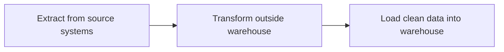

### ELT

**Extract → Load → Transform**

Data is loaded first, then transformed inside the warehouse.

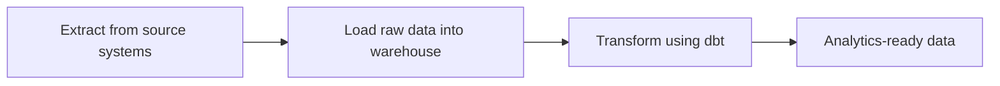

---

## Where dbt fits

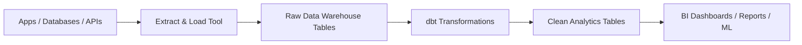

Example:

|Step|Example|
|---|---|
|Source|Shopify, Stripe, CRM|
|Load|Airbyte loads data to Snowflake|
|Raw table|`raw.orders`|
|dbt model|`stg_orders`, `fct_orders`|
|BI|Dashboard showing revenue|

---

## Example before dbt

Raw table: `raw.orders`

|id|cust_id|order_date|stat|amt|
|--:|--:|---|---|--:|
|1|101|2026-01-01|paid|100|
|2|102|2026-01-02|cancelled|50|
|3|101|2026-01-03|paid|75|

This raw table has unclear column names:

|Bad name|Better name|
|---|---|
|`id`|`order_id`|
|`cust_id`|`customer_id`|
|`stat`|`status`|
|`amt`|`amount`|

---

## dbt model example

```sql
select
    id as order_id,
    cust_id as customer_id,
    order_date,
    stat as status,
    amt as amount
from raw.orders
```

This creates a cleaner model:

|order_id|customer_id|order_date|status|amount|
|--:|--:|---|---|--:|
|1|101|2026-01-01|paid|100|
|2|102|2026-01-02|cancelled|50|
|3|101|2026-01-03|paid|75|

---

## What to remember

|Question|Answer|
|---|---|
|What is dbt?|SQL transformation tool|
|Where does it run?|Inside the data warehouse|
|Which part of ELT?|Transform|
|Main user|Analytics engineer / data analyst / data engineer|
|Main language|SQL|

---

# 2. dbt Core vs dbt Cloud / dbt Platform

## dbt Core

**dbt Core** is the open-source command-line version of dbt.

You install it locally and run commands like:

```bash
dbt run
dbt test
dbt build
```

You usually write code in:

|Tool|Purpose|
|---|---|
|VS Code|Write SQL and YAML|
|Terminal|Run dbt commands|
|Git|Version control|
|Warehouse|Store final tables/views|

---

## dbt Cloud / dbt Platform

**dbt Cloud / dbt Platform** is the hosted version. It adds browser-based development, scheduling, jobs, CI/CD, documentation hosting, monitoring, and team features. ([dbt Developer Hub](https://docs.getdbt.com/docs/local/profiles.yml?utm_source=chatgpt.com "About profiles.yml | dbt Developer Hub"))

---

## Comparison

|Area|dbt Core|dbt Cloud / Platform|
|---|---|---|
|Interface|Terminal / CLI|Browser UI|
|Setup|More manual|Easier|
|Scheduling|External tool needed|Built-in jobs|
|Docs hosting|Manual|Built-in|
|CI/CD|Manual setup|Easier built-in setup|
|Best for|Learning and custom workflows|Teams and production|

---

## Which one should you start with?

For learning, start with **dbt Core** because it teaches the real fundamentals.

Use dbt Cloud later when you want:

|Need|Why dbt Cloud helps|
|---|---|
|Scheduled jobs|Run dbt automatically|
|Team collaboration|Multiple developers|
|Hosted docs|Share documentation|
|Production deployment|Easier environment management|

---

## What to remember

|Question|Answer|
|---|---|
|Best for learning?|dbt Core|
|Best for teams?|dbt Cloud / Platform|
|Does dbt Core have UI?|No, mainly CLI|
|Does dbt Cloud replace SQL?|No, you still write SQL|

---

# 3. Project setup: `dbt init`, `profiles.yml`, `dbt_project.yml`

## Basic setup flow

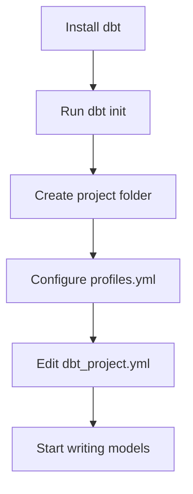

---

## `dbt init`

The command:

```bash
dbt init my_project
```

This creates a new dbt project folder. `dbt init` can also help configure a connection profile, and common options include using an existing profile or skipping profile setup. ([dbt Developer Hub](https://docs.getdbt.com/reference/commands/init?utm_source=chatgpt.com "About dbt init command | dbt Developer Hub - dbt Labs"))

Example output structure:

```text
my_project/
├── dbt_project.yml
├── models/
├── seeds/
├── snapshots/
├── macros/
└── tests/
```

---

## `profiles.yml`

### What is it?

`profiles.yml` tells dbt **how to connect to your data warehouse**.

It stores things like:

|Setting|Meaning|
|---|---|
|`type`|Warehouse type, like Postgres, Snowflake, BigQuery|
|`host`|Server address|
|`user`|Username|
|`password`|Password|
|`dbname`|Database name|
|`schema`|Schema where dbt creates models|
|`threads`|Number of parallel threads|

For local CLI use, dbt needs a `profiles.yml` file containing data platform connection details. The recommended common location is `~/.dbt/profiles.yml`, which keeps credentials separate from project code. ([dbt Developer Hub](https://docs.getdbt.com/docs/local/profiles.yml?utm_source=chatgpt.com "About profiles.yml | dbt Developer Hub"))

---

## Example `profiles.yml`

```yaml
my_profile:
  target: dev

  outputs:
    dev:
      type: postgres
      host: localhost
      user: my_user
      password: my_password
      port: 5432
      dbname: analytics
      schema: dbt_dev
      threads: 4
```

---

## How to read it

```yaml
my_profile:
```

This is the profile name.

```yaml
target: dev
```

This means dbt will use the `dev` connection by default.

```yaml
outputs:
  dev:
```

This defines the `dev` environment.

```yaml
schema: dbt_dev
```

This is where dbt will create your views/tables.

---

## Multiple environments example

```yaml
my_profile:
  target: dev

  outputs:
    dev:
      type: postgres
      host: localhost
      user: dev_user
      password: dev_password
      port: 5432
      dbname: analytics
      schema: dbt_dev
      threads: 4

    prod:
      type: postgres
      host: prod-server
      user: prod_user
      password: prod_password
      port: 5432
      dbname: analytics
      schema: analytics_prod
      threads: 8
```

Then you can run:

```bash
dbt run --target dev
```

or:

```bash
dbt run --target prod
```

The `--target` flag can override the default target from `profiles.yml`, which is useful for running the same project against dev, staging, or production. ([dbt Developer Hub](https://docs.getdbt.com/reference/dbt-jinja-functions/target?utm_source=chatgpt.com "About target variables | dbt Developer Hub"))

---

## `dbt_project.yml`

### What is it?

`dbt_project.yml` is the main project configuration file.

It tells dbt:

|Setting|Meaning|
|---|---|
|Project name|What your dbt project is called|
|Profile|Which `profiles.yml` connection to use|
|Model paths|Where SQL models are stored|
|Materializations|Whether models become views or tables|
|Folder configs|Settings for staging/marts/etc.|

dbt projects use `dbt_project.yml` to define project context and transformation settings. dbt also expects a top-level project structure with folders such as `models` and `snapshots`. ([dbt Developer Hub](https://docs.getdbt.com/docs/build/projects?utm_source=chatgpt.com "About dbt projects | dbt Developer Hub - dbt Labs"))

---

## Example `dbt_project.yml`

```yaml
name: 'my_project'
version: '1.0.0'
config-version: 2

profile: 'my_profile'

model-paths: ["models"]

models:
  my_project:
    staging:
      +materialized: view

    marts:
      +materialized: table
```

---

## How this connects to `profiles.yml`

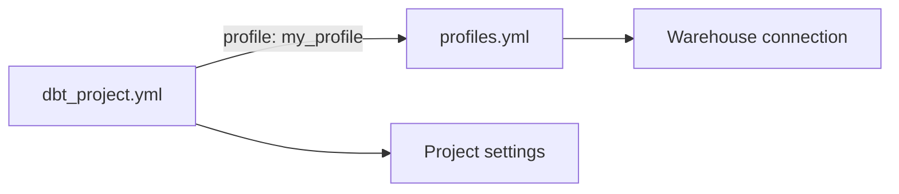

Important connection:

```yaml
profile: 'my_profile'
```

This must match:

```yaml
my_profile:
```

in `profiles.yml`.

---

## What to remember

|File|Main job|
|---|---|
|`profiles.yml`|Connect dbt to warehouse|
|`dbt_project.yml`|Configure the dbt project|
|`models/*.sql`|Your transformation logic|
|`schema.yml`|Tests and documentation|

---

# 4. Basic project structure

## Typical dbt project

```text
my_project/
│
├── dbt_project.yml
│
├── models/
│   ├── staging/
│   │   ├── stg_orders.sql
│   │   ├── stg_customers.sql
│   │   └── schema.yml
│   │
│   ├── intermediate/
│   │   └── int_customer_orders.sql
│   │
│   └── marts/
│       ├── fct_orders.sql
│       ├── dim_customers.sql
│       └── schema.yml
│
├── seeds/
├── snapshots/
├── macros/
└── tests/
```

---

## Folder meanings

|Folder|Meaning|Example|
|---|---|---|
|`models/`|SQL models|`stg_orders.sql`|
|`staging/`|Clean raw source tables|rename columns, cast types|
|`intermediate/`|Helper transformations|joins, calculations|
|`marts/`|Final business tables|revenue, customers, orders|
|`seeds/`|CSV files loaded by dbt|country codes|
|`snapshots/`|Historical tracking|customer status changes|
|`macros/`|Reusable SQL/Jinja|reusable date logic|
|`tests/`|Custom data tests|advanced validations|

---

## Recommended layering

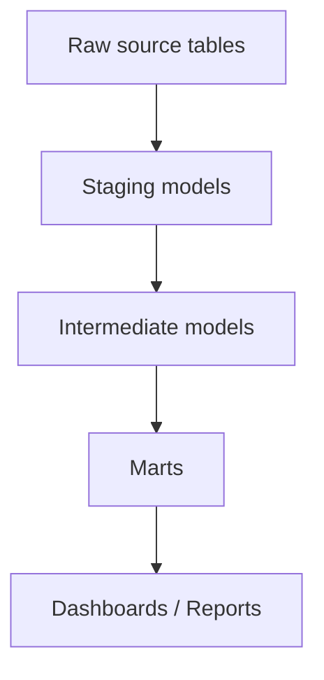

---

## Layer explanation

### Staging

Staging models clean source data.

Example:

```text
raw.orders → stg_orders
```

Common staging tasks:

|Task|Example|
|---|---|
|Rename columns|`id as order_id`|
|Cast types|`cast(order_date as date)`|
|Basic filtering|remove test records|
|Standardize values|lowercase status|

---

### Intermediate

Intermediate models help organize complex logic.

Example:

```text
stg_orders + stg_payments → int_order_payments
```

Use intermediate models when the SQL becomes too complex.

---

### Marts

Marts are final models used by business users.

Examples:

|Model|Meaning|
|---|---|
|`fct_orders`|Fact table for orders|
|`dim_customers`|Dimension table for customers|
|`fct_daily_revenue`|Daily revenue table|

---

## What to remember

|Layer|Purpose|
|---|---|
|Staging|Clean raw data|
|Intermediate|Prepare logic|
|Marts|Final analytics tables|

---

# 5. Models using SQL `SELECT`

## What is a dbt model?

A dbt model is usually a `.sql` file inside the `models/` folder.

Example:

```text
models/staging/stg_orders.sql
```

Inside the file, you write a SQL `SELECT` statement:

```sql
select
    id as order_id,
    customer_id,
    order_date,
    status,
    amount
from raw.orders
```

dbt takes this SQL and builds it in your warehouse as a **view** or **table**.

---

## Model name

The file name becomes the model name.

|File|Model name in dbt|
|---|---|
|`stg_orders.sql`|`stg_orders`|
|`fct_orders.sql`|`fct_orders`|
|`dim_customers.sql`|`dim_customers`|

---

## Example raw table

`raw.orders`

|id|customer_id|order_date|status|amount|
|--:|--:|---|---|--:|
|1|101|2026-01-01|paid|100|
|2|102|2026-01-02|cancelled|50|
|3|101|2026-01-03|paid|75|

---

## Staging model

File:

```text
models/staging/stg_orders.sql
```

Code:

```sql
select
    id as order_id,
    customer_id,
    cast(order_date as date) as order_date,
    lower(status) as status,
    amount
from raw.orders
```

Result:

|order_id|customer_id|order_date|status|amount|
|--:|--:|---|---|--:|
|1|101|2026-01-01|paid|100|
|2|102|2026-01-02|cancelled|50|
|3|101|2026-01-03|paid|75|

---

## Final model

File:

```text
models/marts/fct_customer_orders.sql
```

Code:

```sql
select
    customer_id,
    count(*) as total_orders,
    sum(amount) as total_amount
from {{ ref('stg_orders') }}
where status = 'paid'
group by customer_id
```

Result:

|customer_id|total_orders|total_amount|
|--:|--:|--:|
|101|2|175|

---

## Model naming convention

Common naming pattern:

|Prefix|Meaning|Example|
|---|---|---|
|`stg_`|Staging model|`stg_orders`|
|`int_`|Intermediate model|`int_customer_orders`|
|`fct_`|Fact table|`fct_orders`|
|`dim_`|Dimension table|`dim_customers`|

---

## What to remember

|Idea|Explanation|
|---|---|
|Model|SQL file|
|SQL style|Usually one `SELECT` query|
|File name|Becomes model name|
|Output|View or table in warehouse|

---

# 6. `ref()` and model dependencies

## What is `ref()`?

`ref()` is a dbt function used to reference another dbt model.

Instead of this:

```sql
select *
from analytics.stg_orders
```

You write this:

```sql
select *
from {{ ref('stg_orders') }}
```

---

## Why `ref()` is important

`ref()` gives dbt the ability to understand dependencies between models.

Example:

```text
fct_customer_orders depends on stg_orders
```

dbt will know:

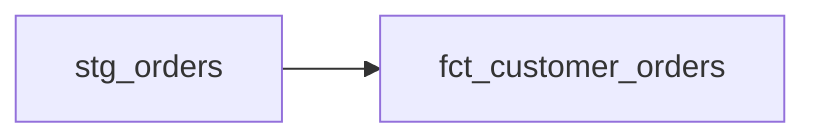

---

## Example

### Model 1

File:

```text
models/staging/stg_orders.sql
```

```sql
select
    id as order_id,
    customer_id,
    status,
    amount
from raw.orders
```

### Model 2

File:

```text
models/marts/fct_customer_orders.sql
```

```sql
select
    customer_id,
    count(*) as total_orders,
    sum(amount) as total_amount
from {{ ref('stg_orders') }}
where status = 'paid'
group by customer_id
```

Because of this line:

```sql
from {{ ref('stg_orders') }}
```

dbt knows `fct_customer_orders` depends on `stg_orders`.

---

## What happens during `dbt run`

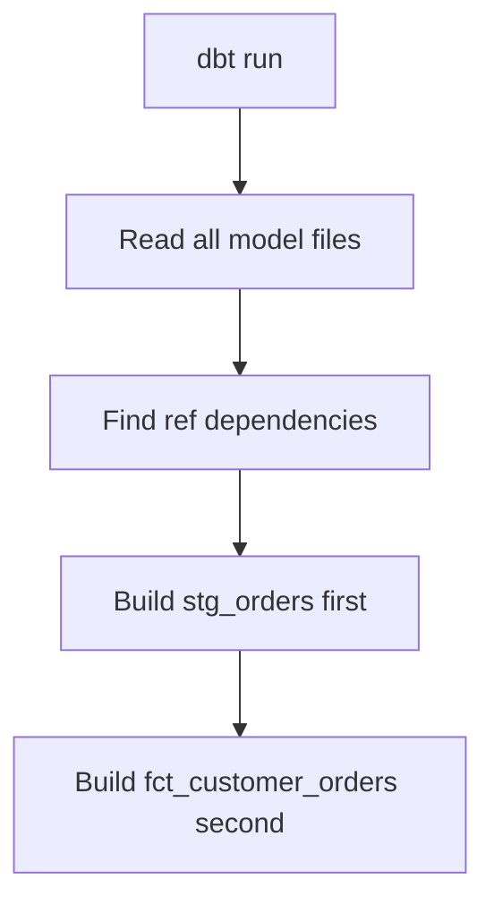

---

## Why not write the table name directly?

Bad style:

```sql
from analytics.stg_orders
```

Better style:

```sql
from {{ ref('stg_orders') }}
```

|Without `ref()`|With `ref()`|
|---|---|
|dbt does not know dependency|dbt knows dependency|
|Hardcoded schema/table|Flexible across environments|
|Harder to maintain|Easier to maintain|
|No clean lineage|Clear lineage graph|

---

## What to remember

|Question|Answer|
|---|---|
|What does `ref()` do?|References another dbt model|
|Why use it?|Dependency tracking|
|Does dbt build in correct order?|Yes, because of `ref()`|
|Should you hardcode model names?|Avoid it|

---

# 7. Basic materializations: view and table

## What is materialization?

A materialization tells dbt **how to create the model in the warehouse**.

dbt supports materializations such as `view`, `table`, `incremental`, `ephemeral`, and materialized views. For this stage, focus on `view` and `table`. ([dbt Developer Hub](https://docs.getdbt.com/best-practices/materializations/5-best-practices?utm_source=chatgpt.com "Best practices for materializations | dbt Developer Hub"))

---

## View vs table

|Type|Meaning|
|---|---|
|View|Stored SQL query|
|Table|Stored physical data|

---

## View materialization

Example:

```sql
{{ config(materialized='view') }}

select
    id as order_id,
    customer_id,
    status,
    amount
from raw.orders
```

This creates a warehouse view.

### View behavior

|Feature|View|
|---|---|
|Stores data?|No|
|Stores SQL?|Yes|
|Build speed|Fast|
|Query speed|Can be slower|
|Freshness|Always reflects source query|
|Good for|Staging models|

Views return the fresh state of their input data when queried, which makes them useful building blocks for larger models. ([dbt Developer Hub](https://docs.getdbt.com/best-practices/materializations/5-best-practices?utm_source=chatgpt.com "Best practices for materializations | dbt Developer Hub"))

---

## Table materialization

Example:

```sql
{{ config(materialized='table') }}

select
    customer_id,
    sum(amount) as total_amount
from {{ ref('stg_orders') }}
where status = 'paid'
group by customer_id
```

This creates a physical table.

### Table behavior

|Feature|Table|
|---|---|
|Stores data?|Yes|
|Build speed|Slower than view|
|Query speed|Usually faster|
|Freshness|Updated when dbt runs|
|Good for|Final marts|

---

## When to use each

|Situation|Use|
|---|---|
|Simple cleaning model|View|
|Used only by other models|View|
|Final dashboard table|Table|
|Expensive aggregation|Table|
|Many users query it|Table|

---

## Example strategy

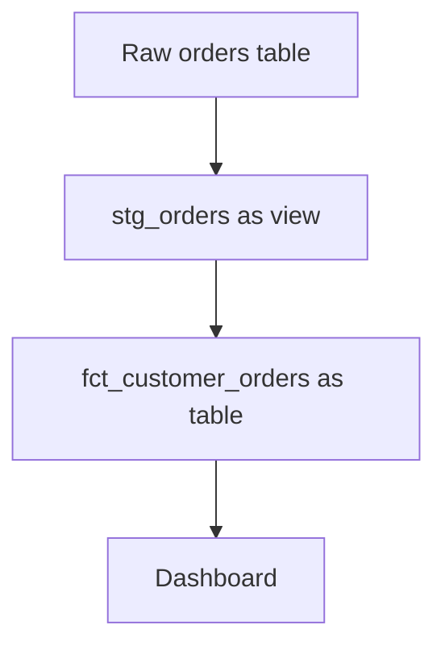

---

## Project-level materialization

Instead of writing config inside every SQL file, you can set defaults in `dbt_project.yml`.

```yaml
models:
  my_project:
    staging:
      +materialized: view

    marts:
      +materialized: table
```

This means:

|Folder|Default materialization|
|---|---|
|`models/staging/`|View|
|`models/marts/`|Table|

Using `dbt_project.yml` to set default configurations at the folder level is a common balanced approach for projects. ([dbt Developer Hub](https://docs.getdbt.com/best-practices/how-we-structure/5-the-rest-of-the-project?utm_source=chatgpt.com "The rest of the project | dbt Developer Hub - dbt Labs"))

---

## What to remember

|Question|Answer|
|---|---|
|What is a materialization?|How dbt builds the model|
|Best for staging?|View|
|Best for final marts?|Table|
|Can config be in SQL file?|Yes|
|Can config be in `dbt_project.yml`?|Yes|

---

# 8. Running dbt commands: `dbt run`, `dbt test`, `dbt build`

## Main commands

|Command|Purpose|
|---|---|
|`dbt run`|Builds models|
|`dbt test`|Runs tests|
|`dbt build`|Runs full workflow|

---

## `dbt run`

`dbt run` builds your models in the warehouse.

```bash
dbt run
```

This builds all selected models.

Example:

```bash
dbt run --select stg_orders
```

This builds only:

```text
stg_orders
```

---

## What happens during `dbt run`

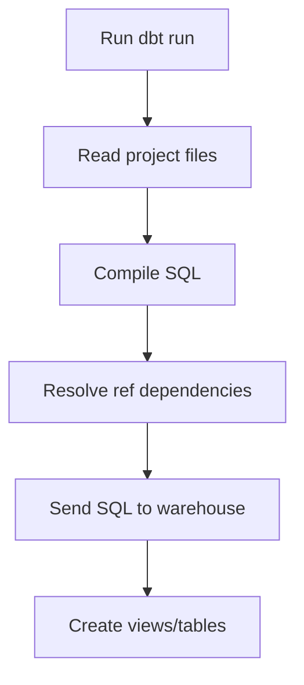

---

## Example compiled idea

You write:

```sql
select *
from {{ ref('stg_orders') }}
```

dbt compiles it into something like:

```sql
select *
from analytics_dev.stg_orders
```

The exact final database/schema/table depends on your warehouse and profile.

---

## `dbt test`

`dbt test` runs data quality checks.

Example test file:

```yaml
version: 2

models:
  - name: stg_orders
    columns:
      - name: order_id
        tests:
          - unique
          - not_null
```

Run:

```bash
dbt test
```

This checks:

|Test|Meaning|
|---|---|
|`unique`|No duplicate order IDs|
|`not_null`|No missing order IDs|

---

## Example test result

If this data exists:

|order_id|customer_id|
|--:|--:|
|1|101|
|1|102|
|null|103|

Then tests fail because:

|Problem|Why|
|---|---|
|Duplicate `1`|Fails `unique`|
|`null` order ID|Fails `not_null`|

---

## Common beginner tests

|Test|Use when|
|---|---|
|`not_null`|A column must always have a value|
|`unique`|IDs must not repeat|
|`accepted_values`|Only specific values are allowed|
|`relationships`|Foreign key should exist in another model|

Example:

```yaml
version: 2

models:
  - name: stg_orders
    columns:
      - name: status
        tests:
          - accepted_values:
              values: ['paid', 'cancelled', 'pending']
```

---

## `dbt build`

`dbt build` is a broader command. It runs resources such as models, tests, seeds, snapshots, and more in dependency order. ([dbt Developer Hub](https://docs.getdbt.com/reference/commands/init?utm_source=chatgpt.com "About dbt init command | dbt Developer Hub - dbt Labs"))

```bash
dbt build
```

Use it when you want the full workflow.

---

## `run` vs `test` vs `build`

|Command|Builds models?|Runs tests?|Good for|
|---|--:|--:|---|
|`dbt run`|Yes|No|Building models|
|`dbt test`|No|Yes|Checking quality|
|`dbt build`|Yes|Yes|Full validation|

---

## Selection examples

Run one model:

```bash
dbt run --select stg_orders
```

Run one model and its children:

```bash
dbt run --select stg_orders+
```

Run one model and its parents:

```bash
dbt run --select +fct_customer_orders
```

Run one model, parents, and children:

```bash
dbt run --select +stg_orders+
```

---

## Selection symbols

|Selector|Meaning|
|---|---|
|`stg_orders`|Only this model|
|`stg_orders+`|This model and downstream models|
|`+fct_orders`|This model and upstream models|
|`+model+`|Upstream, model, and downstream|

---

# Study mini-project

Use this small project to understand the full flow.

## Business question

> How much has each customer paid?

---

## Raw table

`raw.orders`

|id|customer_id|order_date|status|amount|
|--:|--:|---|---|--:|
|1|101|2026-01-01|paid|100|
|2|102|2026-01-02|cancelled|50|
|3|101|2026-01-03|paid|75|
|4|103|2026-01-04|paid|200|

---

## Step 1: Create staging model

File:

```text
models/staging/stg_orders.sql
```

Code:

```sql
{{ config(materialized='view') }}

select
    id as order_id,
    customer_id,
    cast(order_date as date) as order_date,
    lower(status) as status,
    amount
from raw.orders
```

Purpose:

|Logic|Why|
|---|---|
|Rename `id`|Make it clear as `order_id`|
|Cast `order_date`|Ensure correct date type|
|Lowercase `status`|Standardize values|
|Keep amount|Needed for revenue|

---

## Step 2: Create final mart model

File:

```text
models/marts/fct_customer_orders.sql
```

Code:

```sql
{{ config(materialized='table') }}

select
    customer_id,
    count(*) as paid_orders,
    sum(amount) as total_paid_amount
from {{ ref('stg_orders') }}
where status = 'paid'
group by customer_id
```

Purpose:

|Logic|Why|
|---|---|
|`where status = 'paid'`|Ignore cancelled orders|
|`count(*)`|Count paid orders|
|`sum(amount)`|Calculate paid amount|
|`group by customer_id`|One row per customer|

---

## Step 3: Add tests

File:

```text
models/staging/schema.yml
```

Code:

```yaml
version: 2

models:
  - name: stg_orders
    description: Cleaned order data from the raw orders table.

    columns:
      - name: order_id
        description: Unique identifier for each order.
        tests:
          - unique
          - not_null

      - name: customer_id
        description: Customer who placed the order.
        tests:
          - not_null

      - name: status
        description: Current order status.
        tests:
          - accepted_values:
              values: ['paid', 'cancelled', 'pending']
```

---

## Step 4: Run the project

Build models:

```bash
dbt run
```

Run tests:

```bash
dbt test
```

Or run both together:

```bash
dbt build
```

---

## Final dependency graph

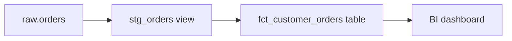

---

# Final Stage 1 cheat sheet

## Core concepts

|Concept|Meaning|
|---|---|
|dbt|Tool for SQL transformations|
|ELT|Extract, Load, Transform|
|Model|SQL file in `models/`|
|`ref()`|Reference another dbt model|
|Materialization|How dbt creates model|
|View|Stored query|
|Table|Stored data|
|Test|Data quality check|

---

## Important files

|File|Purpose|
|---|---|
|`dbt_project.yml`|Project settings|
|`profiles.yml`|Warehouse connection|
|`*.sql`|dbt models|
|`schema.yml`|Tests and documentation|

---

## Important commands

|Command|Purpose|
|---|---|
|`dbt init project_name`|Create project|
|`dbt run`|Build models|
|`dbt test`|Run tests|
|`dbt build`|Build and test|
|`dbt run --select model_name`|Run one model|
|`dbt run --select model_name+`|Run model and downstream dependencies|

---

## Best beginner rule

Use this structure:

```text
models/
├── staging/
│   └── stg_orders.sql
└── marts/
    └── fct_customer_orders.sql
```

Use this materialization strategy:

|Folder|Materialization|
|---|---|
|`staging`|View|
|`marts`|Table|

Use this development workflow:

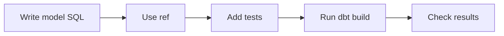

This is enough to understand the foundation before moving to sources, seeds, snapshots, tests, and docs.