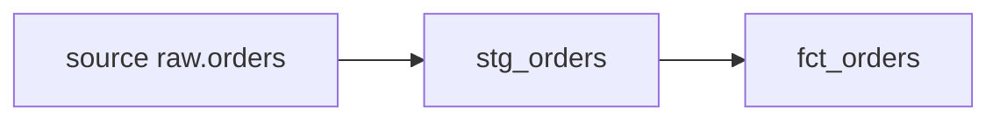
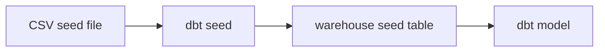
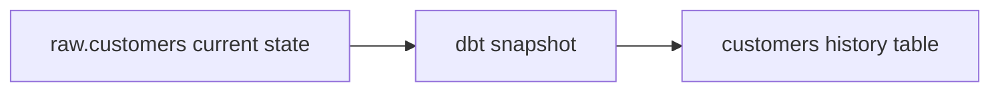
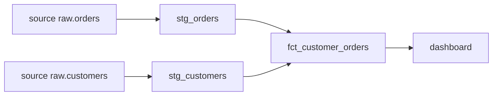
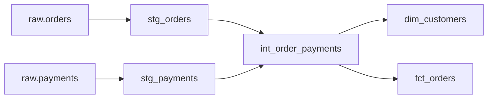
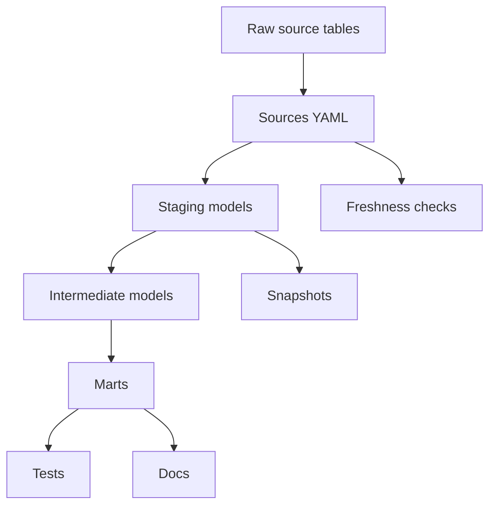
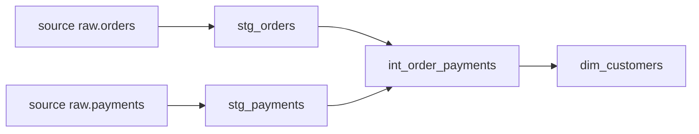

# Building a Practical dbt Project

Once you understand models, `ref()`, materializations, and basic commands, the next step is learning how to make your dbt project feel like a real analytics project.

In this part, we will cover:

|Topic|Why it matters|
|---|---|
|Sources|Define raw tables properly|
|Source freshness|Check if raw data is updated|
|Seeds|Use small CSV reference files|
|Snapshots|Track historical changes|
|Tests|Validate your data|
|Custom generic tests|Create reusable business checks|
|Documentation|Explain models and columns|
|Lineage graph|See data flow visually|
|Model layers|Organize the project cleanly|

---

# 1. Sources: describing raw data properly

In the first part, we wrote directly from a raw table:

```sql
select *
from raw.orders
```

This works, but in dbt we usually avoid hardcoding raw table names everywhere.

Instead, we define raw tables as **sources**.

A source tells dbt:

> “This table already exists in the warehouse, and my dbt project will use it as input.”

Sources are usually defined in YAML files, and they can be tested and documented like models. dbt sources are also used for freshness checks. ([dbt Developer Hub](https://docs.getdbt.com/docs/deploy/source-freshness?utm_source=chatgpt.com "Source freshness | dbt Developer Hub"))

---

## Example source file

File:

```text
models/staging/sources.yml
```

Code:

```yaml
version: 2

sources:
  - name: raw
    database: analytics
    schema: raw

    tables:
      - name: orders
      - name: customers
      - name: payments
```

Now instead of writing:

```sql
from raw.orders
```

You write:

```sql
from {{ source('raw', 'orders') }}
```


---

## Why use `source()`?

|Without source|With source|
|---|---|
|Raw table is hardcoded|Raw table is managed in YAML|
|Harder to document|Easy to document|
|Harder to test|Can add source tests|
|No freshness check|Can check freshness|

---

## Example model using source

File:

```text
models/staging/stg_orders.sql
```

Code:


```sql
select
    id as order_id,
    customer_id,
    order_date,
    status,
    amount
from {{ source('raw', 'orders') }}
```


---

## Simple flow



---

## What to remember

|Concept|Meaning|
|---|---|
|`source()`|References raw warehouse tables|
|`ref()`|References dbt models|
|Source YAML|Defines raw data inputs|

Simple rule:


```sql
-- Raw table
{{ source('raw', 'orders') }}

-- dbt model
{{ ref('stg_orders') }}
```


---

# 2. Source freshness: checking if raw data is updated

Source freshness checks whether your raw data is arriving on time.

Example question:

> Did the `raw.orders` table receive new data recently?

This is useful because your dbt models may run correctly, but still use old data if the raw source stopped updating.

dbt source freshness is designed to help determine whether source data is meeting the freshness SLA you define. ([dbt Developer Hub](https://docs.getdbt.com/docs/deploy/source-freshness?utm_source=chatgpt.com "Source freshness | dbt Developer Hub"))

---

## Example freshness config

```yaml
version: 2

sources:
  - name: raw
    schema: raw

    tables:
      - name: orders
        loaded_at_field: updated_at

        freshness:
          warn_after:
            count: 12
            period: hour
          error_after:
            count: 24
            period: hour
```

---

## Meaning

|Config|Meaning|
|---|---|
|`loaded_at_field`|Column used to check latest data time|
|`warn_after`|Show warning if data is late|
|`error_after`|Fail if data is too late|

---

## Example

If the newest `updated_at` value is:

```text
2026-07-01 08:00:00
```

And now it is:

```text
2026-07-02 09:00:00
```

Then the table is more than 24 hours old, so freshness can fail.

---

## Run freshness check

```bash
dbt source freshness
```

Important note: `dbt build` does not automatically include source freshness checks, so you usually run freshness separately or configure it in a dbt Cloud job. ([dbt Developer Hub](https://docs.getdbt.com/docs/deploy/source-freshness?utm_source=chatgpt.com "Source freshness | dbt Developer Hub"))

---

## What to remember

|Question|Answer|
|---|---|
|What does freshness check?|Whether raw data is updated|
|Which field is needed?|A timestamp column|
|Common command|`dbt source freshness`|
|Does `dbt build` include it by default?|No|

---

# 3. Seeds: using small CSV files

A **seed** is a CSV file that dbt can load into your warehouse.

Seeds are useful for small reference data.

Examples:

|Seed file|Use|
|---|---|
|`country_codes.csv`|Map country codes to names|
|`currency_rates.csv`|Small manual exchange rate table|
|`status_mapping.csv`|Map business status labels|
|`employee_targets.csv`|Sales targets|

---

## Example seed file

File:

```text
seeds/order_status_mapping.csv
```

Content:

```csv
status,status_group
paid,successful
cancelled,failed
pending,in_progress
refunded,failed
```

---

## Load seeds

```bash
dbt seed
```

After running this, dbt creates a table from the CSV.

You can use it in models with `ref()`:

```sql
select
    orders.order_id,
    orders.status,
    mapping.status_group
from {{ ref('stg_orders') }} as orders
left join {{ ref('order_status_mapping') }} as mapping
    on orders.status = mapping.status
```

---

## When to use seeds

|Good use|Bad use|
|---|---|
|Small CSV files|Millions of rows|
|Static reference data|Frequently changing data|
|Manual mappings|Sensitive credentials|
|Simple business rules|Large operational tables|

---

## Flow



---

## What to remember

|Concept|Meaning|
|---|---|
|Seed|CSV loaded by dbt|
|Command|`dbt seed`|
|Reference seed|`{{ ref('seed_name') }}`|
|Best for|Small reference tables|

---

# 4. Snapshots: tracking historical changes

A normal dbt model shows the current state of data.

A **snapshot** helps track how data changes over time.

Example:

A customer table today:

|customer_id|name|status|
|--:|---|---|
|101|Sara|active|

Tomorrow:

|customer_id|name|status|
|--:|---|---|
|101|Sara|inactive|

Without snapshots, you only see the latest value.

With snapshots, you can see history:

|customer_id|status|dbt_valid_from|dbt_valid_to|
|--:|---|---|---|
|101|active|2026-01-01|2026-02-01|
|101|inactive|2026-02-01|null|

---

## Why snapshots matter

Snapshots are useful for questions like:

|Business question|Why snapshot helps|
|---|---|
|When did a customer become inactive?|Tracks status changes|
|What was the price last month?|Keeps old price values|
|When did an employee change department?|Stores historical versions|

---

## Snapshot example

File:

```text
snapshots/customers_snapshot.sql
```

Code:


```sql


{{
    config(
      target_schema='snapshots',
      unique_key='customer_id',
      strategy='timestamp',
      updated_at='updated_at'
    )
}}

select
    customer_id,
    name,
    status,
    updated_at
from {{ source('raw', 'customers') }}


```


---

## Run snapshots

```bash
dbt snapshot
```

---

## Important fields

|Field|Meaning|
|---|---|
|`unique_key`|Identifies each record|
|`strategy`|How dbt detects changes|
|`updated_at`|Timestamp used to detect updates|
|`target_schema`|Where snapshot table is stored|

---

## Snapshot flow



---

## What to remember

|Concept|Meaning|
|---|---|
|Snapshot|Tracks row changes over time|
|Best for|Historical analysis|
|Command|`dbt snapshot`|
|Common strategy|`timestamp`|

---

# 5. Tests: making sure your data is trusted

Tests are one of the most important parts of dbt.

A dbt test checks whether your data follows rules.

dbt ships with four common generic data tests: `unique`, `not_null`, `accepted_values`, and `relationships`. ([dbt Developer Hub](https://docs.getdbt.com/docs/build/data-tests?utm_source=chatgpt.com "Add data tests to your DAG | dbt Developer Hub"))

---

## Common tests

|Test|Meaning|Example|
|---|---|---|
|`not_null`|Value cannot be empty|`order_id` must exist|
|`unique`|Value cannot repeat|`order_id` must be unique|
|`accepted_values`|Only allowed values|status must be paid/cancelled/pending|
|`relationships`|Value must exist in another table|customer_id must exist in customers|

---

## Example test file

File:

```text
models/staging/schema.yml
```

Code:

```yaml
version: 2

models:
  - name: stg_orders
    columns:
      - name: order_id
        tests:
          - unique
          - not_null

      - name: customer_id
        tests:
          - not_null

      - name: status
        tests:
          - accepted_values:
              values: ['paid', 'cancelled', 'pending']
```

---

## Relationship test example

This checks that every `customer_id` in orders exists in customers.

```yaml
models:
  - name: stg_orders
    columns:
      - name: customer_id
        tests:
          - relationships:
              to: ref('stg_customers')
              field: customer_id
```

---

## Run tests

```bash
dbt test
```

Or:

```bash
dbt build
```

---

## How to think about tests

Tests should protect important assumptions.

|Column|Test|
|---|---|
|Primary key|`unique`, `not_null`|
|Foreign key|`relationships`|
|Status/category|`accepted_values`|
|Required business field|`not_null`|

---

## What to remember

|Question|Answer|
|---|---|
|Why test?|To trust your data|
|Where define tests?|YAML files|
|How run tests?|`dbt test`|
|Most common tests?|unique, not_null, relationships, accepted_values|

---

# 6. Custom generic tests: reusable business checks

Built-in tests are useful, but sometimes you need your own rule.

Example:

> Amount should never be negative.

You could write this logic once and reuse it on many columns.

Custom generic tests are defined with a special `test` block and can be referenced by name inside YAML files. A generic test usually accepts `model`, and if it is column-level, also accepts `column_name`. ([dbt Developer Hub](https://docs.getdbt.com/best-practices/writing-custom-generic-tests?utm_source=chatgpt.com "Writing custom generic data tests | dbt Developer Hub"))

---

## Example custom generic test

File:

```text
tests/generic/not_negative.sql
```

Code:


```sql


select *
from {{ model }}
where {{ column_name }} < 0


```


The test should return bad rows.

If it returns zero rows, the test passes.

---

## Use the custom test

```yaml
version: 2

models:
  - name: stg_orders
    columns:
      - name: amount
        tests:
          - not_negative
```

---

## Example data

|order_id|amount|
|--:|--:|
|1|100|
|2|-20|
|3|50|

The test finds this row:

|order_id|amount|
|--:|--:|
|2|-20|

So the test fails.

---

## Another custom test idea

Check that a percentage is between 0 and 100.


```sql


select *
from {{ model }}
where {{ column_name }} < 0
   or {{ column_name }} > 100


```


Use it:

```yaml
models:
  - name: fct_marketing
    columns:
      - name: conversion_rate
        tests:
          - percentage_between_0_and_100
```

---

## What to remember

|Concept|Meaning|
|---|---|
|Generic test|Reusable test|
|Test passes when|Query returns zero rows|
|Test fails when|Query returns bad rows|
|Good for|Business rules|

---

# 7. Documentation with YAML

Documentation makes your dbt project understandable.

You can document:

|Item|Example|
|---|---|
|Source|What raw table means|
|Model|What the model is used for|
|Column|What each column means|
|Tests|What rules are applied|

dbt documentation can use resource descriptions from YAML files, and docs configuration controls whether resources appear in generated documentation. ([dbt Developer Hub](https://docs.getdbt.com/reference/resource-configs/docs?utm_source=chatgpt.com "docs | dbt Developer Hub"))

---

## Example model documentation

File:

```text
models/marts/schema.yml
```

Code:

```yaml
version: 2

models:
  - name: fct_customer_orders
    description: One row per customer showing paid order activity.

    columns:
      - name: customer_id
        description: Unique identifier for the customer.
        tests:
          - not_null
          - unique

      - name: paid_orders
        description: Number of paid orders placed by the customer.

      - name: total_paid_amount
        description: Total amount paid by the customer.
```

---

## Good description vs weak description

|Weak|Better|
|---|---|
|Customer ID|Unique identifier for the customer|
|Amount|Total paid order amount in USD|
|Date|Date when the order was created|
|Status|Current payment status of the order|

---

## Generate docs

```bash
dbt docs generate
```

Open locally:

```bash
dbt docs serve
```

---

## What docs usually show

|Section|Meaning|
|---|---|
|Models|List of dbt models|
|Columns|Column names and descriptions|
|Tests|Data quality checks|
|SQL|Model SQL|
|Lineage|Dependency graph|

---

## What to remember

|Question|Answer|
|---|---|
|Where write docs?|YAML files|
|Why docs matter?|Help users trust and understand data|
|Generate command|`dbt docs generate`|
|View command|`dbt docs serve`|

---

# 8. dbt docs and lineage graph

The lineage graph shows how data moves through your dbt project.

Example:



The graph is created from your project structure, especially `source()` and `ref()` relationships.

---

## Why lineage is useful

|Use case|Example|
|---|---|
|Debugging|Find what broke upstream|
|Impact analysis|See what depends on a model|
|Documentation|Explain data flow visually|
|Onboarding|Help new team members understand project|

---

## Example problem

A dashboard looks wrong.

Lineage helps you trace:

```text
Dashboard
→ fct_customer_orders
→ stg_orders
→ raw.orders
```

So you can check each layer.

---

## What to remember

|Concept|Meaning|
|---|---|
|Lineage|Visual dependency graph|
|Built from|`ref()` and `source()`|
|Useful for|Debugging and understanding flow|
|Seen in|dbt docs|

---

# 9. Model layers: staging, intermediate, marts

A real dbt project should not put all SQL in one huge model.

Instead, organize your logic into layers.

---

## Recommended structure

```text
models/
├── staging/
│   ├── stg_orders.sql
│   ├── stg_customers.sql
│   └── stg_payments.sql
│
├── intermediate/
│   └── int_order_payments.sql
│
└── marts/
    ├── fct_orders.sql
    └── dim_customers.sql
```

---

## Layer purpose

|Layer|Purpose|Example|
|---|---|---|
|Staging|Clean raw data|Rename columns, cast types|
|Intermediate|Prepare complex logic|Join orders and payments|
|Marts|Final business tables|Revenue, customers, orders|

---

## Staging model example


```sql
select
    id as order_id,
    customer_id,
    order_date,
    status
from {{ source('raw', 'orders') }}
```


---

## Intermediate model example


```sql
select
    orders.order_id,
    orders.customer_id,
    orders.order_date,
    payments.payment_amount
from {{ ref('stg_orders') }} as orders
left join {{ ref('stg_payments') }} as payments
    on orders.order_id = payments.order_id
```


---

## Mart model example


```sql
select
    customer_id,
    count(order_id) as total_orders,
    sum(payment_amount) as lifetime_value
from {{ ref('int_order_payments') }}
group by customer_id
```



---

## Full project flow



---

# Mini practical project

Now let’s combine everything.

## Business goal

Build a small dbt project that answers:

> How much revenue did each customer generate?

---

## Source tables

|Source table|Meaning|
|---|---|
|`raw.orders`|Order records|
|`raw.customers`|Customer information|
|`raw.payments`|Payment records|

---

## Project structure

```text
models/
├── staging/
│   ├── sources.yml
│   ├── stg_orders.sql
│   ├── stg_customers.sql
│   ├── stg_payments.sql
│   └── schema.yml
│
├── intermediate/
│   └── int_order_payments.sql
│
└── marts/
    ├── dim_customers.sql
    └── schema.yml

seeds/
└── order_status_mapping.csv

snapshots/
└── customers_snapshot.sql

tests/
└── generic/
    └── not_negative.sql
```

---

## Step 1: Define sources

```yaml
version: 2

sources:
  - name: raw
    schema: raw

    tables:
      - name: orders
        loaded_at_field: updated_at
        freshness:
          warn_after:
            count: 12
            period: hour
          error_after:
            count: 24
            period: hour

      - name: customers

      - name: payments
```

---

## Step 2: Create staging models

### `stg_orders.sql`


```sql
select
    id as order_id,
    customer_id,
    cast(order_date as date) as order_date,
    lower(status) as status
from {{ source('raw', 'orders') }}
```


### `stg_payments.sql`


```sql
select
    id as payment_id,
    order_id,
    amount as payment_amount,
    payment_method
from {{ source('raw', 'payments') }}
```


### `stg_customers.sql`


```sql
select
    id as customer_id,
    first_name,
    last_name,
    email,
    status,
    updated_at
from {{ source('raw', 'customers') }}
```


---

## Step 3: Create intermediate model

### `int_order_payments.sql`


```sql
select
    orders.order_id,
    orders.customer_id,
    orders.order_date,
    payments.payment_amount
from {{ ref('stg_orders') }} as orders
left join {{ ref('stg_payments') }} as payments
    on orders.order_id = payments.order_id
where orders.status = 'paid'
```


---

## Step 4: Create final mart

### `dim_customers.sql`


```sql
select
    customers.customer_id,
    customers.first_name,
    customers.last_name,
    customers.email,
    count(order_payments.order_id) as total_orders,
    sum(order_payments.payment_amount) as lifetime_value
from {{ ref('stg_customers') }} as customers
left join {{ ref('int_order_payments') }} as order_payments
    on customers.customer_id = order_payments.customer_id
group by
    customers.customer_id,
    customers.first_name,
    customers.last_name,
    customers.email
```


---

## Step 5: Add tests and documentation

```yaml
version: 2

models:
  - name: dim_customers
    description: One row per customer with order and revenue summary.

    columns:
      - name: customer_id
        description: Unique customer identifier.
        tests:
          - unique
          - not_null

      - name: email
        description: Customer email address.

      - name: total_orders
        description: Total number of paid orders for the customer.

      - name: lifetime_value
        description: Total paid amount from the customer.
        tests:
          - not_negative
```

---

## Step 6: Add custom test

File:

```text
tests/generic/not_negative.sql
```

Code:


```sql


select *
from {{ model }}
where {{ column_name }} < 0


```


---

## Step 7: Add snapshot


```sql


{{
    config(
      target_schema='snapshots',
      unique_key='customer_id',
      strategy='timestamp',
      updated_at='updated_at'
    )
}}

select
    customer_id,
    first_name,
    last_name,
    email,
    status,
    updated_at
from {{ ref('stg_customers') }}


```


---

## Step 8: Run everything

```bash
dbt seed
dbt snapshot
dbt build
dbt source freshness
dbt docs generate
dbt docs serve
```

---

# Final mental model



---

# Quick cheat sheet

|Feature|Purpose|Command|
|---|---|---|
|Sources|Define raw tables|Used with `source()`|
|Freshness|Check raw data recency|`dbt source freshness`|
|Seeds|Load CSV files|`dbt seed`|
|Snapshots|Track historical changes|`dbt snapshot`|
|Tests|Validate data quality|`dbt test`|
|Docs|Generate project documentation|`dbt docs generate`|
|Lineage|Visualize dependencies|`dbt docs serve`|

---

# What you should practice

Build this small flow:



Add:

|Item|Practice|
|---|---|
|Source|Define `raw.orders` and `raw.payments`|
|Freshness|Add freshness to `raw.orders`|
|Seed|Add a status mapping CSV|
|Snapshot|Track customer status changes|
|Tests|Add `unique`, `not_null`, `accepted_values`|
|Docs|Add model and column descriptions|
|Custom test|Add `not_negative` for amounts|

This is enough to move from “I can run dbt” to “I can build a small real dbt project.”
