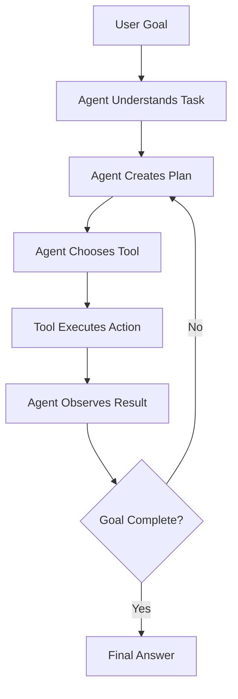
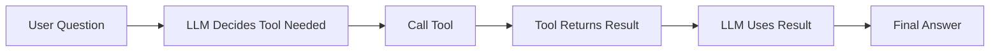
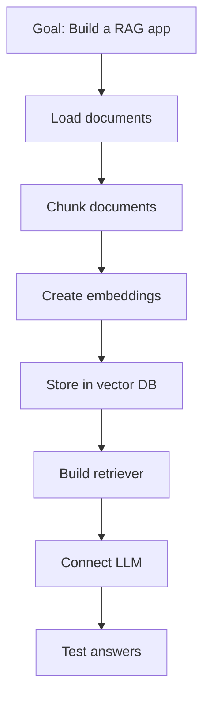
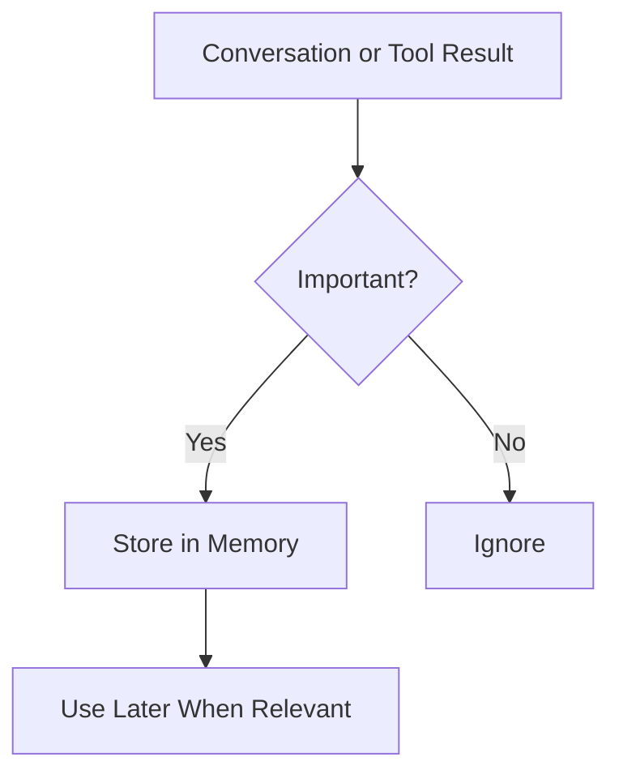
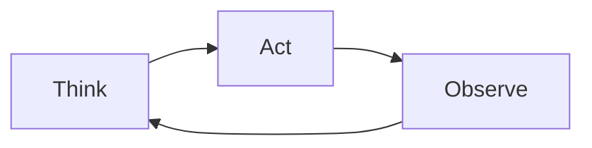
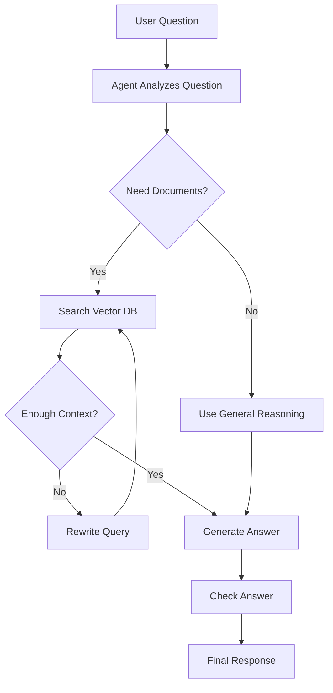
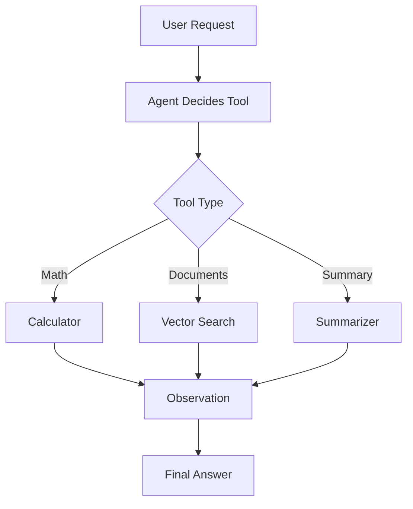

# Agentic AI Basics — Tools, Planning, Memory, and Actions

## 1. Introduction

**Agentic AI** means an AI system that can do more than just answer questions.

A normal LLM usually responds to a prompt.

An AI agent can:

```text
Think about the task
Choose tools
Take actions
Observe results
Continue until the goal is completed
```

Simple idea:

```text
LLM = answers
Agent = answers + actions
```

---

## 2. Normal LLM vs AI Agent

|Feature|Normal LLM|AI Agent|
|---|---|---|
|Answers questions|Yes|Yes|
|Uses tools|Usually no|Yes|
|Plans steps|Limited|Yes|
|Takes actions|No|Yes|
|Uses memory|Limited|Often yes|
|Can call APIs|No|Yes|
|Can complete workflows|No|Yes|

Example:

|User Request|Normal LLM|AI Agent|
|---|---|---|
|“What is 240 × 18?”|Predicts answer from text|Uses calculator tool|
|“Summarize this PDF”|Needs text pasted in prompt|Reads file, extracts text, summarizes|
|“Book a meeting”|Gives instructions|Checks calendar and creates event|
|“Analyze sales data”|Explains process|Reads spreadsheet and calculates results|

---

## 3. Simple Agent Flow



The key point is that an agent works in a loop.

It does not only answer once. It can decide what to do next based on the result.

---

## 4. Core Parts of an AI Agent

|Part|Meaning|Example|
|---|---|---|
|LLM|The reasoning engine|GPT, Claude, Gemini, Llama|
|Tools|Functions the agent can use|Calculator, search, database|
|Planning|Deciding steps|“Search docs, compare results, summarize”|
|Memory|Remembering useful info|User preferences or previous results|
|Actions|Real tasks performed|Send email, query API, create file|
|Observation|Result from a tool|Search result, API response|
|Guardrails|Safety and rules|Ask before sending money/email|

---

## 5. What Are Tools?

A **tool** is something the agent can call to complete a task.

Examples:

|Tool|What It Does|
|---|---|
|Calculator|Solves math accurately|
|Web search|Finds current information|
|File reader|Reads PDFs, CSVs, docs|
|Database query|Gets data from database|
|Email tool|Creates or sends emails|
|Calendar tool|Reads or creates events|
|Code executor|Runs Python or scripts|

Tool example:

```python
def calculator(expression):
    return eval(expression)
```

User asks:

```text
What is 240 * 18?
```

The agent can call:

```python
calculator("240 * 18")
```

Then answer:

```text
240 × 18 = 4,320.
```

---

## 6. Tool Calling Flow



Tool use makes agents more reliable because they do not need to guess everything.

---

## 7. What Is Planning?

Planning means breaking a goal into smaller steps.

Example user request:

```text
Compare three laptops and recommend the best one for programming.
```

Possible agent plan:

```text
1. Search laptop specs.
2. Compare CPU, RAM, storage, battery, price.
3. Rank the options.
4. Recommend the best choice.
```

Planning is useful for multi-step tasks.

|Task Type|Needs Planning?|
|---|--:|
|Translate one sentence|No|
|Summarize a paragraph|Maybe|
|Research a topic|Yes|
|Build a report|Yes|
|Analyze files|Yes|
|Book a meeting|Yes|

---

## 8. Planning Example



A good agent can create and follow a plan, but it should also change the plan when new information appears.

---

## 9. What Is Memory?

Memory means storing information that may be useful later.

There are different types of memory:

|Memory Type|Meaning|Example|
|---|---|---|
|Short-term memory|Current conversation context|User’s current task|
|Long-term memory|Saved information for future sessions|User prefers Python|
|Tool memory|Results from previous tool calls|Search result or database output|
|Vector memory|Stored knowledge as embeddings|Past notes or documents|

Memory helps agents become more personalized and useful.

But memory must be controlled carefully because it may contain private information.

---

## 10. Memory Flow



Example:

```text
User: I prefer short answers with tables.
```

An agent with memory may use that preference in future answers.

---

## 11. What Are Actions?

Actions are real tasks the agent performs.

Examples:

|Action|Risk Level|
|---|---|
|Summarize a file|Low|
|Search a database|Low|
|Create a draft email|Medium|
|Send an email|High|
|Delete files|High|
|Make a payment|Very high|

Agents should be more careful with high-risk actions.

A safe agent may create a draft first instead of sending directly.

---

## 12. Agent Loop: Think, Act, Observe

Many agents follow a loop:

```text
Think → Act → Observe → Think again
```

Example:

```text
Goal: Answer a question from documents.

Think: I need relevant information.
Act: Search vector database.
Observe: Found 3 chunks.
Think: I can answer from chunk 2.
Act: Generate final response.
```



This loop is what makes agents different from simple chatbots.

---

## 13. Agentic RAG

Agentic RAG combines RAG with agents.

Normal RAG:

```text
Question → Retrieve chunks → Generate answer
```

Agentic RAG:

```text
Question → Decide search strategy → Retrieve chunks → Check quality → Search again if needed → Generate answer
```

|Feature|Normal RAG|Agentic RAG|
|---|---|---|
|Retrieves once|Usually yes|Not always|
|Can reformulate query|Limited|Yes|
|Can use multiple tools|Limited|Yes|
|Can verify answer|Limited|Yes|
|Can retry search|Limited|Yes|
|Better for complex tasks|Sometimes|Yes|

---

## 14. Agentic RAG Flow



Agentic RAG is useful when one simple retrieval step is not enough.

---

## 15. Example Agentic RAG Task

User asks:

```text
Compare the refund policy and cancellation policy in these documents.
```

A normal RAG system may retrieve only one section.

An agentic RAG system can:

```text
1. Search for refund policy.
2. Search for cancellation policy.
3. Compare both sections.
4. Generate a structured answer.
5. Include sources.
```

This is more powerful for multi-part questions.

---

## 16. Basic Agent Pseudo-Code

```python
tools = {
    "search_docs": search_vector_database,
    "calculator": calculator,
    "summarizer": summarize_text
}

def agent(user_goal):
    plan = llm.plan(user_goal)

    for step in plan:
        tool_name = llm.choose_tool(step, tools)
        tool_result = tools[tool_name](step)
        observation = tool_result

    final_answer = llm.generate_answer(
        goal=user_goal,
        observations=observation
    )

    return final_answer
```

This is simplified, but it shows the idea.

The agent receives a goal, creates a plan, uses tools, observes results, and gives a final answer.

---

## 17. Safer Agent Design

Agents can be powerful, but they need safety rules.

|Risk|Safety Rule|
|---|---|
|Sending wrong email|Draft first, ask approval|
|Deleting data|Require confirmation|
|Using bad sources|Cite sources|
|Hallucinating|Use retrieved context|
|Infinite loops|Set max steps|
|Tool misuse|Limit available tools|

Example safety rule:

```text
The agent may create a draft email, but it must ask before sending.
```

---

## 18. Agent Limits

AI agents are not magic.

They can still fail.

|Limit|Explanation|
|---|---|
|Bad planning|Agent chooses wrong steps|
|Wrong tool choice|Agent uses the wrong tool|
|Weak retrieval|Agent gets bad context|
|Hallucination|Agent invents unsupported details|
|Tool errors|APIs or databases may fail|
|Cost|Multiple tool calls can be expensive|
|Latency|Multi-step agents can be slower|

That is why testing and guardrails are important.

---

## 19. Beginner Agent Project

Build a simple **Tool-Using Assistant**.

Features:

|Feature|Description|
|---|---|
|Calculator tool|Solves math|
|Document search tool|Finds text chunks|
|Summarizer tool|Summarizes retrieved text|
|Final answer|Combines tool results|

Example user requests:

```text
1. What is 450 * 12?
2. Search my notes for refund policy.
3. Summarize the retrieved section.
```

Project flow:



---

## 20. Simple Tool Schema Example

Many agent frameworks describe tools using schemas.

Example:

```json
{
  "name": "search_documents",
  "description": "Search user documents for relevant information",
  "parameters": {
    "query": "string",
    "top_k": "integer"
  }
}
```

This tells the agent:

```text
What the tool does
What inputs it needs
How to call it
```

---

## 21. Frameworks to Learn Later

|Framework|Use|
|---|---|
|LangChain|Agents, tools, workflows, RAG|
|LlamaIndex|RAG and document agents|
|CrewAI|Multi-agent workflows|
|AutoGen|Multi-agent collaboration|
|Semantic Kernel|Enterprise-style AI orchestration|
|LangGraph|Graph-based agent workflows|

For beginners:

```text
Start with simple tool calling.
Then learn LangChain or LangGraph.
Then learn multi-agent systems.
```

---

## 22. Key Terms

|Term|Meaning|
|---|---|
|Agent|AI system that can plan and act|
|Tool|Function or API the agent can use|
|Planning|Breaking goal into steps|
|Action|Tool call or task execution|
|Observation|Result returned from a tool|
|Memory|Stored information for later use|
|Guardrails|Rules that keep the agent safe|
|Agentic RAG|RAG system controlled by an agent|

---

## 23. Key Takeaway

Agentic AI gives an LLM the ability to use tools and take actions.

The simple formula is:

```text
Agent = LLM + Tools + Planning + Memory + Actions + Guardrails
```

Normal LLMs answer.

Agents work toward goals.

Agentic RAG is especially powerful because it combines:

```text
RAG knowledge retrieval + agent planning and tool use
```

Once you understand tools, planning, memory, and actions, you are ready to learn **tool calling and function calling in detail**.