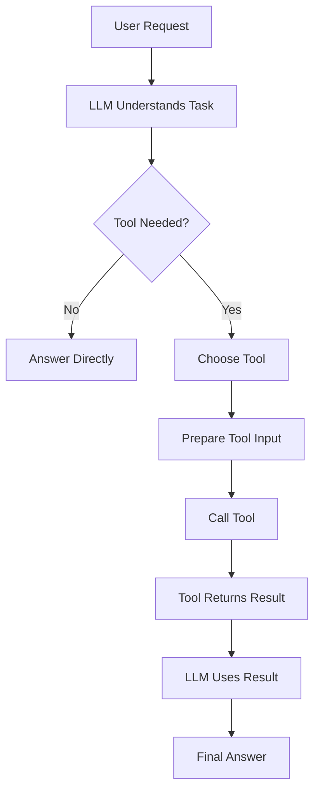
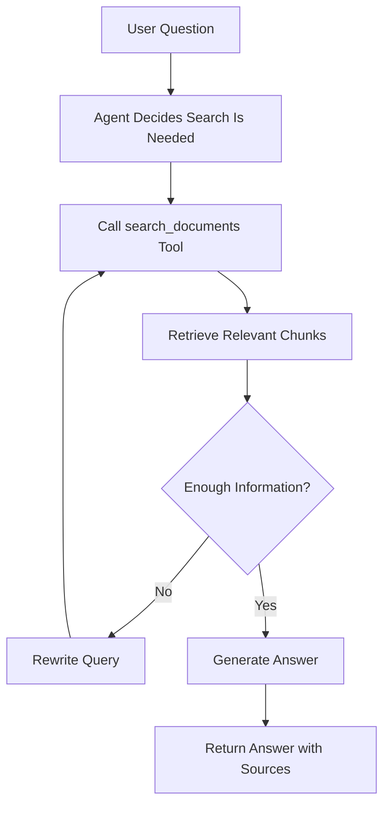
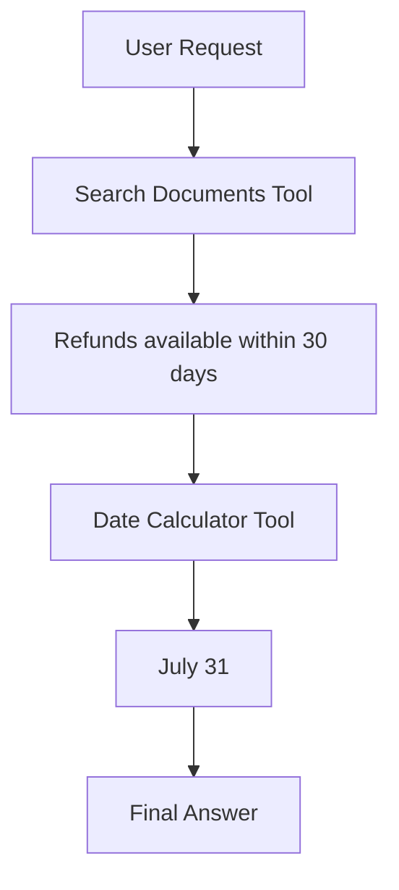
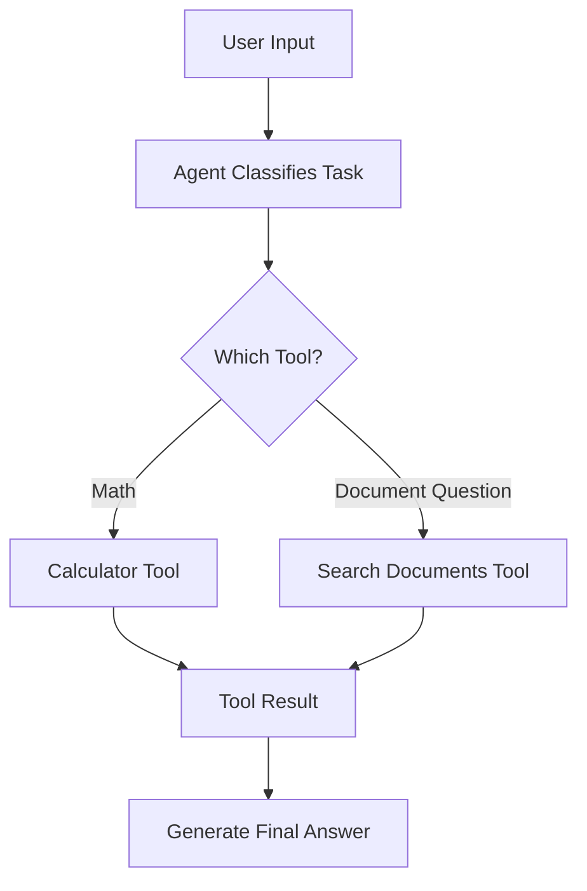

# Tool Calling and Function Calling for AI Agents

## 1. Introduction

Tool calling is one of the most important ideas in Agentic AI.

A normal LLM can generate text, but it cannot directly do real actions by itself.

Tool calling allows the LLM to use external functions, APIs, databases, calculators, search engines, file readers, or other systems.

Simple idea:

```text
LLM thinks.
Tool acts.
LLM explains the result.
```

Example:

```text
User: What is 245 * 89?
```

A normal LLM may try to answer from prediction.

An agent with tools can call a calculator function and return the exact result.

---

## 2. What Is a Tool?

A tool is a function that the AI agent can use.

Examples:

|Tool|Purpose|
|---|---|
|Calculator|Solve math|
|Search tool|Find information|
|File reader|Read PDFs, DOCX, TXT files|
|Database tool|Query structured data|
|Email tool|Draft or send emails|
|Calendar tool|Create or check events|
|Code runner|Execute code|
|Vector search|Search documents in RAG|

A tool usually has:

|Part|Meaning|
|---|---|
|Name|What the tool is called|
|Description|What the tool does|
|Parameters|Inputs the tool needs|
|Output|Result returned by the tool|

---

## 3. Simple Tool Calling Flow



Example:

```text
User: What is 245 * 89?
```

Flow:

```text
1. LLM sees math question.
2. LLM chooses calculator tool.
3. Tool calculates 245 * 89.
4. Tool returns 21805.
5. LLM answers: 245 × 89 = 21,805.
```

---

## 4. Function Calling vs Tool Calling

These terms are often used together.

|Term|Simple Meaning|
|---|---|
|Function calling|The model returns structured arguments for a function|
|Tool calling|The model uses one or more external tools|
|API calling|The tool connects to an external service|
|Action|The real operation performed by the tool|

Example:

```python
def calculator(expression: str):
    return eval(expression)
```

The function is:

```text
calculator
```

The tool call is:

```text
calculator("245 * 89")
```

The action is:

```text
Actually calculating the result
```

---

## 5. Why Tool Calling Matters

Tool calling makes AI agents more useful and reliable.

|Without Tools|With Tools|
|---|---|
|Model guesses math|Calculator gives exact result|
|Model may have outdated info|Search tool can retrieve current info|
|Model cannot read private files|File tool can read documents|
|Model cannot query company data|Database tool can fetch records|
|Model only talks|Agent can take actions|

Tool calling turns the LLM from a text generator into a task assistant.

---

## 6. Tool Schema

A tool schema describes how the tool should be used.

Example tool schema:

```json
{
  "name": "search_documents",
  "description": "Search company documents for relevant information",
  "parameters": {
    "query": {
      "type": "string",
      "description": "The user question or search phrase"
    },
    "top_k": {
      "type": "integer",
      "description": "Number of results to return"
    }
  }
}
```

The schema helps the model understand:

```text
What the tool does
When to use it
What inputs are required
What format the inputs should have
```

---

## 7. Simple Python Tool Example

Here is a basic calculator tool:

```python
def calculator(expression: str) -> str:
    try:
        result = eval(expression)
        return str(result)
    except Exception as error:
        return f"Error: {error}"
```

Example use:

```python
answer = calculator("245 * 89")
print(answer)
```

Output:

```text
21805
```

In a real AI agent, the LLM decides when to call this tool.

---

## 8. Safer Calculator Example

Using `eval()` can be dangerous in real applications.

A safer beginner version:

```python
import operator

def safe_calculator(a: float, b: float, operation: str) -> float:
    operations = {
        "add": operator.add,
        "subtract": operator.sub,
        "multiply": operator.mul,
        "divide": operator.truediv
    }

    if operation not in operations:
        raise ValueError("Unsupported operation")

    return operations[operation](a, b)
```

Example:

```python
result = safe_calculator(245, 89, "multiply")
print(result)
```

Output:

```text
21805
```

---

## 9. Tool Input and Output

Every tool needs clear input and output.

Example search tool:

```python
def search_documents(query: str, top_k: int = 3):
    results = vector_db.search(query=query, top_k=top_k)
    return results
```

Input:

```json
{
  "query": "refund policy",
  "top_k": 3
}
```

Output:

```json
[
  {
    "text": "Refunds are available within 30 days.",
    "source": "policy.pdf",
    "page": 4
  }
]
```

The LLM then uses the output to write the final answer.

---

## 10. Tool Calling in RAG

In RAG, retrieval can be treated as a tool.

Tool:

```text
search_documents
```

User asks:

```text
What is the refund policy?
```

Agent action:

```json
{
  "tool": "search_documents",
  "input": {
    "query": "refund policy",
    "top_k": 3
  }
}
```

Tool result:

```json
{
  "text": "Refunds are available within 30 days of purchase.",
  "source": "company_policy.pdf",
  "page": 4
}
```

Final answer:

```text
Refunds are available within 30 days of purchase.

Source: company_policy.pdf, page 4
```

---

## 11. Tool Calling Flow in Agentic RAG



This is more flexible than normal RAG because the agent can search again if the first results are weak.

---

## 12. Common Tool Types for AI Agents

|Tool Type|Example Use|
|---|---|
|Retrieval tool|Search documents|
|Calculator tool|Accurate math|
|Web search tool|Current information|
|Database tool|Query business data|
|API tool|Get weather, payments, CRM data|
|File tool|Read or write files|
|Code tool|Analyze data or run scripts|
|Communication tool|Draft email or message|

A good agent does not need many tools at first.

Start with two or three simple tools.

---

## 13. Tool Selection

Tool selection means the model decides which tool to use.

Example:

|User Request|Best Tool|
|---|---|
|“What is 95 × 34?”|Calculator|
|“Search my notes for refund policy”|Document search|
|“Summarize this PDF”|File reader + summarizer|
|“How many orders did we get last month?”|Database query|
|“Draft an email to the client”|Email draft tool|

Tool descriptions are important because the model uses them to choose correctly.

Bad tool description:

```text
Tool for data.
```

Better tool description:

```text
Searches company policy documents and returns relevant text chunks with source metadata.
```

---

## 14. Tool Result Handling

The agent should not blindly trust every tool result.

It should check:

|Check|Question|
|---|---|
|Relevance|Does the result answer the question?|
|Completeness|Is important information missing?|
|Source|Where did the result come from?|
|Error|Did the tool fail?|
|Safety|Is this action allowed?|

Example:

```text
Tool result:
No matching documents found.
```

Good agent response:

```text
I could not find the answer in the available documents.
```

Bad agent response:

```text
The refund period is probably 30 days.
```

---

## 15. Tool Errors

Tools can fail.

Example errors:

|Error|Possible Cause|
|---|---|
|Timeout|Tool took too long|
|Empty result|No matching data|
|Permission error|Agent lacks access|
|Invalid input|Bad arguments|
|API error|External service failed|

The agent should handle errors clearly.

Example:

```text
I could not access the document search tool, so I cannot verify the answer from your files.
```

---

## 16. Multi-Tool Example

User request:

```text
Find the refund policy in my document and calculate the last refund date for a purchase made on July 1.
```

Agent plan:

```text
1. Use document search tool to find refund policy.
2. Extract refund window.
3. Use date calculator tool.
4. Generate final answer.
```

Flow:



Final answer:

```text
The document says refunds are available within 30 days.
For a purchase made on July 1, the last refund date is July 31.
```

---

## 17. Simple Multi-Tool Pseudo-Code

```python
def search_documents(query):
    return vector_db.search(query, top_k=3)

def date_calculator(start_date, days):
    from datetime import datetime, timedelta
    date = datetime.strptime(start_date, "%Y-%m-%d")
    return date + timedelta(days=days)

def agent(user_request):
    policy = search_documents("refund policy")
    refund_days = 30

    last_date = date_calculator("2026-07-01", refund_days)

    return f"The refund window is {refund_days} days. Last refund date: {last_date.date()}"
```

This is simplified, but it shows how agents combine tools.

---

## 18. Guardrails for Tool Calling

Tool calling can be risky because tools can perform real actions.

|Tool Action|Guardrail|
|---|---|
|Send email|Ask user before sending|
|Delete file|Require confirmation|
|Make payment|Require strict approval|
|Update database|Validate input|
|Search web|Cite sources|
|Run code|Use sandboxing|
|Access private data|Check permissions|

Important rule:

```text
The more powerful the tool, the stronger the guardrail should be.
```

---

## 19. Read-Only vs Write Tools

Tools can be divided into read-only and write/action tools.

|Tool Type|Example|Risk|
|---|---|---|
|Read-only|Search documents|Lower|
|Read-only|Query database|Lower to medium|
|Write tool|Create calendar event|Medium|
|Write tool|Send email|High|
|Write tool|Delete records|Very high|

Beginner agents should start with read-only tools.

Then add write tools carefully.

---

## 20. Tool Calling Best Practices

|Best Practice|Why It Matters|
|---|---|
|Use clear tool names|Helps model choose correctly|
|Write strong descriptions|Reduces wrong tool calls|
|Validate inputs|Prevents bad actions|
|Handle errors|Avoids broken workflows|
|Return structured outputs|Easier for the LLM to use|
|Add guardrails|Improves safety|
|Log tool calls|Helps debugging|
|Limit tools|Reduces confusion|

---

## 21. Example Tool Registry

A tool registry is a list of available tools.

```python
tools = {
    "calculator": {
        "description": "Performs basic arithmetic operations.",
        "function": safe_calculator
    },
    "search_documents": {
        "description": "Searches indexed documents and returns relevant chunks with sources.",
        "function": search_documents
    },
    "summarize_text": {
        "description": "Summarizes long text into short bullet points.",
        "function": summarize_text
    }
}
```

The agent uses this list to know what it can do.

---

## 22. Tool Calling Debugging

When an agent gives a bad answer, ask:

```text
Did it choose the correct tool?
Did it pass the correct input?
Did the tool return useful output?
Did the LLM interpret the output correctly?
Did the final answer follow the rules?
```

Debugging table:

|Problem|Example|Fix|
|---|---|---|
|Wrong tool|Uses calculator for document search|Improve tool description|
|Bad input|Searches “money” instead of “refund policy”|Rewrite query|
|Bad output|Tool returns irrelevant chunks|Improve retrieval|
|Bad interpretation|LLM misunderstands result|Improve prompt|
|Unsafe action|Sends email immediately|Add approval step|

---

## 23. Mini Project

Build a simple agent with two tools.

Project name:

```text
basic-tool-agent
```

Tools:

|Tool|Purpose|
|---|---|
|Calculator|Solve arithmetic|
|Document search|Search text chunks|

Example commands:

```text
"What is 120 * 45?"
"Find the refund policy."
"Search for vacation rules."
```

Folder structure:

```text
basic-tool-agent/
│
├── app.py
├── tools.py
├── data/
│   └── company_policy.txt
└── README.md
```

---

## 24. Mini Project Flow



Simple pseudo-code:

```python
def agent(user_input):
    if "calculate" in user_input or "*" in user_input:
        result = calculator(user_input)
        return f"The answer is {result}"

    elif "policy" in user_input or "document" in user_input:
        result = search_documents(user_input)
        return f"According to the document: {result}"

    else:
        return "I am not sure which tool to use."
```

This is not advanced, but it is a good first step.

---

## 25. Key Terms

|Term|Meaning|
|---|---|
|Tool|Function the agent can use|
|Function calling|Model preparing structured function inputs|
|Tool schema|Description of tool name, purpose, and parameters|
|Tool result|Output returned from a tool|
|Tool registry|List of available tools|
|Tool selection|Choosing the correct tool|
|Guardrail|Safety rule around tool use|
|Read-only tool|Tool that retrieves information|
|Write tool|Tool that changes something|

---

## 26. Key Takeaway

Tool calling is what allows AI agents to move from simple answering to real task completion.

The simple formula is:

```text
Tool Calling = LLM decides + function executes + LLM explains
```

In Agentic AI:

```text
LLM = brain
Tools = hands
Guardrails = safety rules
```

Once you understand tool calling, you can start learning **agent workflows and LangGraph-style agent design**.