# Agent Workflows and LangGraph-Style Design

## 1. Introduction

After learning **tool calling**, the next important topic is **agent workflows**.

A workflow is a structured process that tells an AI agent:

```text
What to do first
What to do next
When to use tools
When to stop
What to do if something fails
```

A simple agent may just choose tools freely.

A workflow-based agent follows a more controlled path.

Simple idea:

```text
Agent = can think and use tools
Workflow = controls how the agent moves through steps
```

---

## 2. Why Agent Workflows Matter

Without a workflow, an agent may become unpredictable.

Example user task:

```text
Research a topic and create a summary.
```

A weak agent may:

```text
Search once
Use weak sources
Forget to summarize properly
Miss important details
```

A workflow-based agent can:

```text
Search
Evaluate results
Search again if needed
Summarize
Check quality
Return final answer
```

|Without Workflow|With Workflow|
|---|---|
|More unpredictable|More controlled|
|Harder to debug|Easier to debug|
|May skip steps|Follows defined steps|
|May loop too much|Has stopping rules|
|Hard to scale|Easier to improve|

---

## 3. Simple Workflow Example

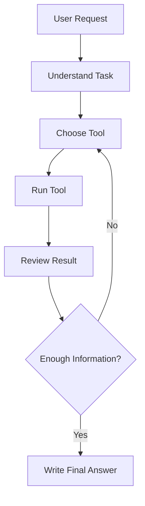

This workflow gives the agent a clear process.

The agent can repeat tool use if the result is not enough, but it also has a final stopping point.

---

## 4. Workflow vs Free Agent

|Feature|Free Agent|Workflow Agent|
|---|---|---|
|Structure|Low|High|
|Predictability|Lower|Higher|
|Debugging|Harder|Easier|
|Good for simple tasks|Yes|Yes|
|Good for business tasks|Risky|Better|
|Control over steps|Limited|Strong|
|Safety|Harder to enforce|Easier to enforce|

A free agent is flexible.

A workflow agent is safer and more reliable.

---

## 5. What Is LangGraph-Style Design?

LangGraph-style design means building an agent as a **graph**.

A graph has:

|Part|Meaning|
|---|---|
|Node|A step in the workflow|
|Edge|Connection between steps|
|State|Information passed between steps|
|Condition|Rule that decides next step|
|Loop|Repeating steps until a goal is met|

Simple idea:

```text
Workflow = graph of steps
```

---

## 6. Basic Graph Example

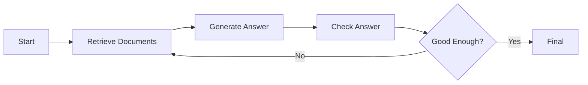

In this graph:

|Graph Part|Example|
|---|---|
|Node|Retrieve Documents|
|Node|Generate Answer|
|Node|Check Answer|
|Condition|Good enough?|
|Loop|Check Answer → Retrieve Documents|

---

## 7. Agent State

**State** is the data the workflow carries between steps.

Example state:

```json
{
  "user_question": "What is the refund policy?",
  "retrieved_chunks": [],
  "draft_answer": "",
  "final_answer": "",
  "sources": [],
  "attempts": 0
}
```

Each node reads and updates the state.

Example:

|Node|Reads|Updates|
|---|---|---|
|Retrieve Documents|user_question|retrieved_chunks, sources|
|Generate Answer|user_question, retrieved_chunks|draft_answer|
|Check Answer|draft_answer, retrieved_chunks|quality_score|
|Final|draft_answer|final_answer|

---

## 8. Nodes

A **node** is one step in the workflow.

Examples of nodes:

|Node|Purpose|
|---|---|
|Classify Task|Decide what kind of task it is|
|Retrieve Documents|Search vector database|
|Use Calculator|Perform math|
|Generate Answer|Create response|
|Check Answer|Verify quality|
|Ask Human|Request approval|
|Final Response|Return answer to user|

Simple node pseudo-code:

```python
def retrieve_documents(state):
    question = state["user_question"]
    chunks = vector_db.search(question, top_k=3)

    state["retrieved_chunks"] = chunks
    return state
```

---

## 9. Edges

An **edge** connects one node to another.

Example:

```text
Retrieve Documents → Generate Answer
```

Conditional edge:

```text
If answer is good → Final
If answer is bad → Retrieve Again
```

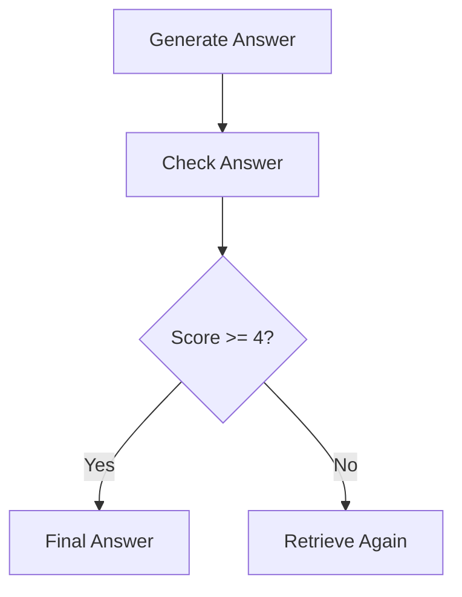

Edges control the movement of the agent.

---

## 10. Conditional Logic

Conditional logic decides which path the workflow should take.

Example:

```python
def route_after_check(state):
    if state["quality_score"] >= 4:
        return "final"
    elif state["attempts"] >= 3:
        return "final_with_warning"
    else:
        return "retrieve_again"
```

This prevents infinite loops.

Important rule:

```text
Every loop should have a maximum number of attempts.
```

---

## 11. Workflow for RAG

A basic RAG workflow:

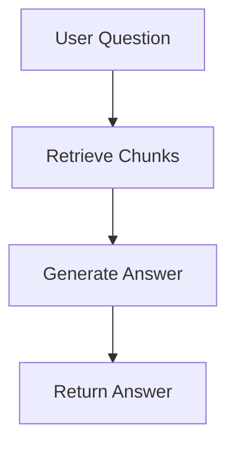

This is simple but limited.

A stronger RAG workflow:

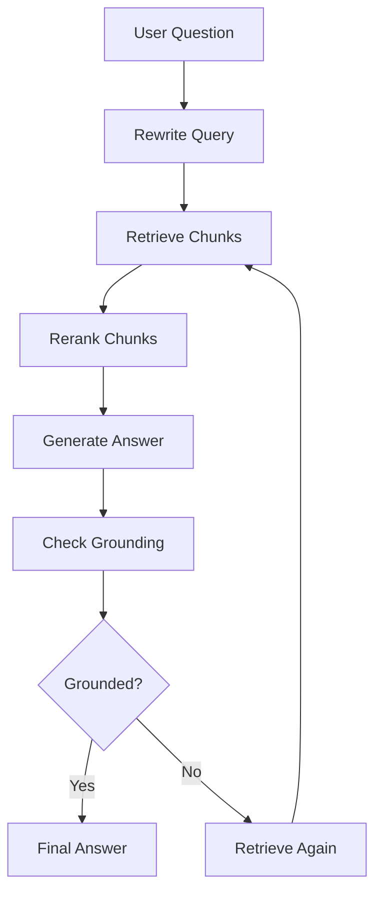

This is closer to agentic RAG.

---

## 12. Agentic RAG Workflow

Agentic RAG uses an agent to control retrieval.

Example user question:

```text
Compare the refund policy and cancellation policy.
```

The workflow may do:

```text
1. Identify sub-questions.
2. Search for refund policy.
3. Search for cancellation policy.
4. Compare both.
5. Generate final answer with sources.
```

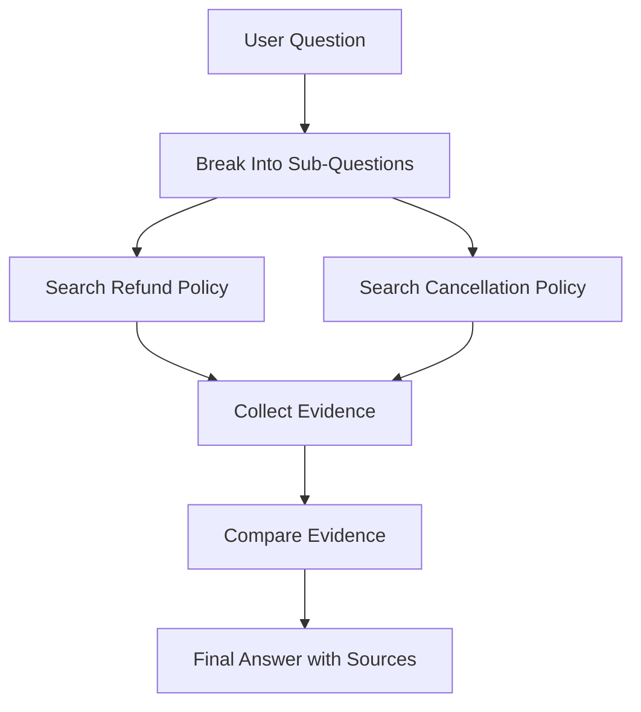

This is better than searching once.

---

## 13. Common Workflow Patterns

|Pattern|Meaning|Example|
|---|---|---|
|Linear workflow|Steps happen in order|Load → Retrieve → Answer|
|Router workflow|Choose path based on task|Math vs document search|
|Loop workflow|Repeat until good enough|Retrieve again if weak|
|Human-in-the-loop|Ask user approval|Before sending email|
|Multi-agent workflow|Multiple agents collaborate|Researcher + writer + reviewer|
|Evaluator workflow|One step checks another|Answer checker|

---

## 14. Router Workflow

A router decides where the task should go.

Example:

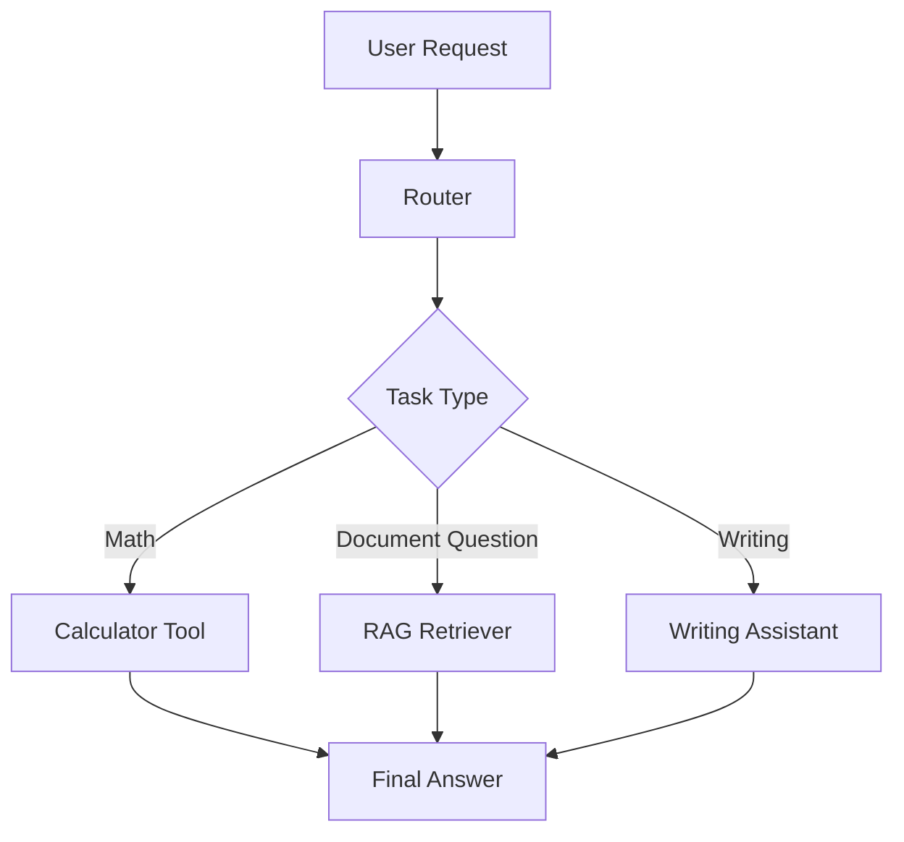

Router logic:

```python
def route_task(user_input):
    if "calculate" in user_input or "*" in user_input:
        return "calculator"
    elif "document" in user_input or "policy" in user_input:
        return "rag"
    else:
        return "general"
```

Routers are useful when your agent has many tools.

---

## 15. Human-in-the-Loop Workflow

Some actions should not happen automatically.

Example high-risk actions:

```text
Send email
Delete file
Update database
Make payment
Book appointment
```

Safe workflow:

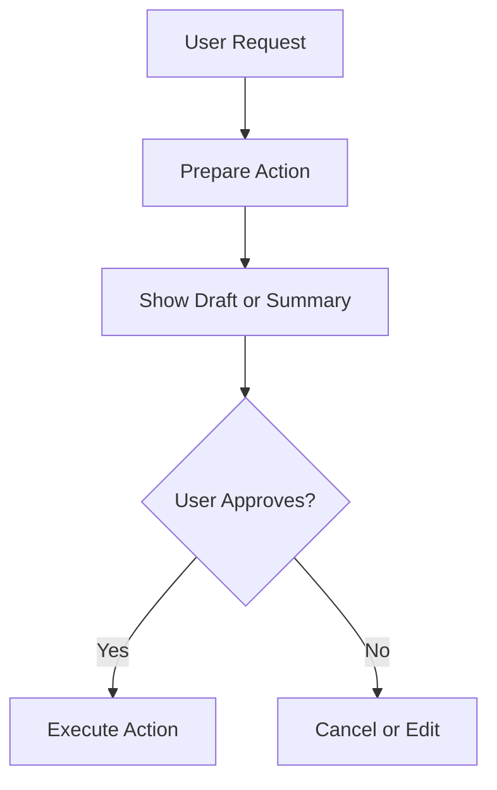

Important rule:

```text
For high-risk actions, ask for approval before execution.
```

---

## 16. Evaluator Workflow

An evaluator checks the output before final answer.

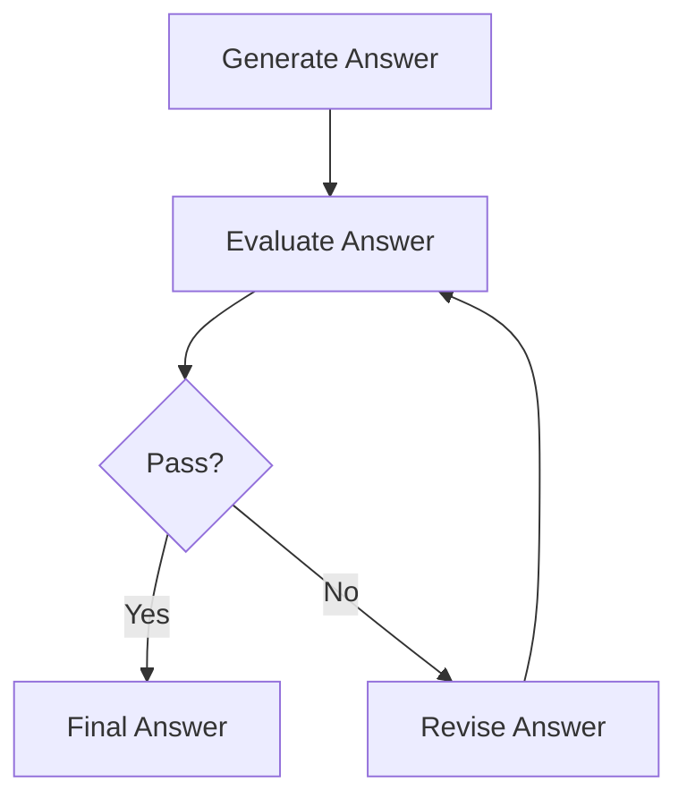

The evaluator can check:

|Check|Question|
|---|---|
|Grounding|Is answer supported by context?|
|Relevance|Does it answer the question?|
|Completeness|Is anything missing?|
|Safety|Is the action safe?|
|Format|Does it follow requested format?|

---

## 17. Multi-Agent Workflow

In a multi-agent system, different agents have different roles.

Example:

|Agent|Role|
|---|---|
|Research Agent|Finds information|
|RAG Agent|Searches documents|
|Writer Agent|Writes final response|
|Reviewer Agent|Checks quality|

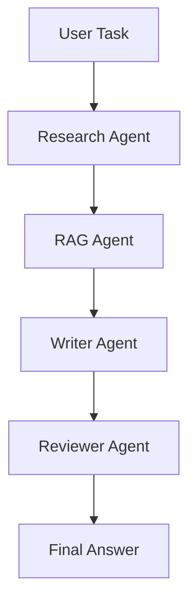

For beginners, do not start with multi-agent systems.

Start with one agent and a clear workflow.

---

## 18. Workflow Memory

Workflows often need memory inside the current run.

Example:

```json
{
  "steps_completed": ["retrieval", "generation"],
  "attempts": 2,
  "last_error": null,
  "retrieved_sources": ["policy.pdf page 4"],
  "quality_score": 4
}
```

This memory is not always long-term memory.

It can simply be temporary state used while the workflow runs.

---

## 19. Error Handling

Good workflows handle errors.

|Error|Workflow Response|
|---|---|
|Tool returns no results|Rewrite query and retry|
|API fails|Try again or show error|
|Answer is unsupported|Retrieve more context|
|User input unclear|Ask a short clarification|
|Too many attempts|Stop and explain limitation|

Example:

```python
def handle_retrieval_result(state):
    if len(state["retrieved_chunks"]) == 0:
        state["attempts"] += 1
        return "rewrite_query"

    return "generate_answer"
```

---

## 20. Max Steps and Stopping Rules

Agents can get stuck in loops.

So every workflow needs stopping rules.

Examples:

|Stopping Rule|Purpose|
|---|---|
|Max 3 retrieval attempts|Prevent endless searching|
|Max 5 tool calls|Control cost|
|Stop if confidence is high|Finish when enough|
|Stop if user approval denied|Prevent unwanted action|
|Stop on repeated error|Avoid useless retries|

Example:

```python
MAX_ATTEMPTS = 3

if state["attempts"] >= MAX_ATTEMPTS:
    return "final_with_note"
```

---

## 21. Simple LangGraph-Style Pseudo-Code

This is not full LangGraph code. It shows the design idea.

```python
workflow = Graph()

workflow.add_node("retrieve", retrieve_documents)
workflow.add_node("generate", generate_answer)
workflow.add_node("check", check_answer)
workflow.add_node("final", final_response)

workflow.add_edge("retrieve", "generate")
workflow.add_edge("generate", "check")

workflow.add_conditional_edge(
    "check",
    condition=route_after_check,
    paths={
        "good": "final",
        "bad": "retrieve"
    }
)

workflow.set_entry_point("retrieve")
workflow.run(initial_state)
```

The key idea:

```text
Define nodes.
Connect nodes.
Use conditions.
Pass state.
Stop safely.
```

---

## 22. Example Workflow State in Python

```python
state = {
    "user_question": "What is the refund policy?",
    "retrieved_chunks": [],
    "answer": "",
    "sources": [],
    "attempts": 0,
    "quality_score": None
}
```

Each step modifies this state.

Example:

```python
def generate_answer(state):
    context = state["retrieved_chunks"]
    question = state["user_question"]

    answer = llm.generate(
        question=question,
        context=context
    )

    state["answer"] = answer
    return state
```

---

## 23. Beginner Workflow Project

Build a simple **RAG Answer Checker Workflow**.

### Goal

Create a workflow that retrieves documents, generates an answer, checks the answer, and retries if needed.

### Features

|Feature|Description|
|---|---|
|Retrieve|Search document chunks|
|Generate|Create answer from context|
|Check|Verify answer uses context|
|Retry|Search again if answer is weak|
|Final|Return answer with sources|

### Flow

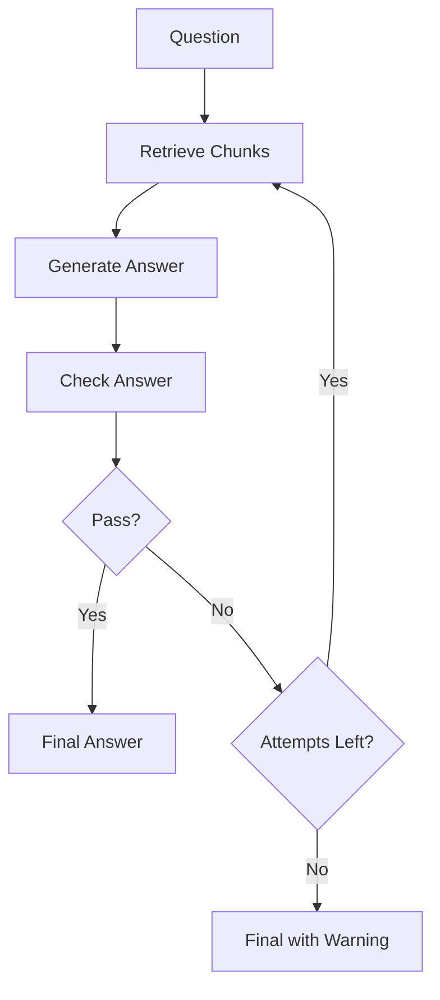

---

## 24. Folder Structure

```text
rag-workflow-agent/
│
├── app.py
├── workflow.py
├── tools.py
├── evaluator.py
├── data/
│   └── company_policy.txt
└── README.md
```

File roles:

|File|Purpose|
|---|---|
|app.py|Starts the application|
|workflow.py|Defines the graph/workflow|
|tools.py|Contains retrieval and utility tools|
|evaluator.py|Checks answer quality|
|data/|Stores documents|

---

## 25. Best Practices

|Best Practice|Why It Matters|
|---|---|
|Keep workflows simple first|Easier to debug|
|Use clear node names|Easier to understand|
|Store state clearly|Easier to track data|
|Add max attempts|Prevent infinite loops|
|Log each step|Helps debugging|
|Separate tools from workflow|Cleaner code|
|Add human approval for risky actions|Safer agents|
|Evaluate final answers|Improves quality|

---

## 26. Key Terms

|Term|Meaning|
|---|---|
|Workflow|Structured process for an agent|
|Graph|Nodes and edges representing steps|
|Node|One step in the workflow|
|Edge|Connection between steps|
|State|Data passed through the workflow|
|Router|Decides which path to follow|
|Conditional edge|Edge chosen by a rule|
|Loop|Repeating part of a workflow|
|Evaluator|Checks output quality|
|Human-in-the-loop|Human approval inside workflow|

---

## 27. Key Takeaway

Agent workflows make AI agents more reliable, controllable, and easier to debug.

Simple formula:

```text
Workflow Agent = Agent + Structured Steps + State + Conditions + Safety Rules
```

LangGraph-style design is useful because it treats the agent as a graph:

```text
Nodes = steps
Edges = paths
State = memory of the current run
Conditions = decisions
```

Once you understand workflows, you can design stronger agentic systems instead of relying on random tool use.