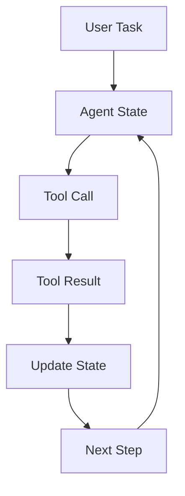
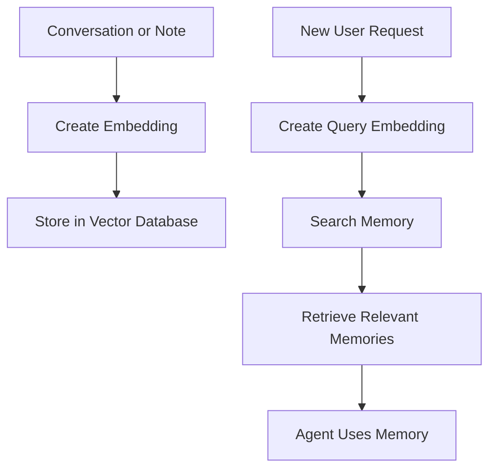
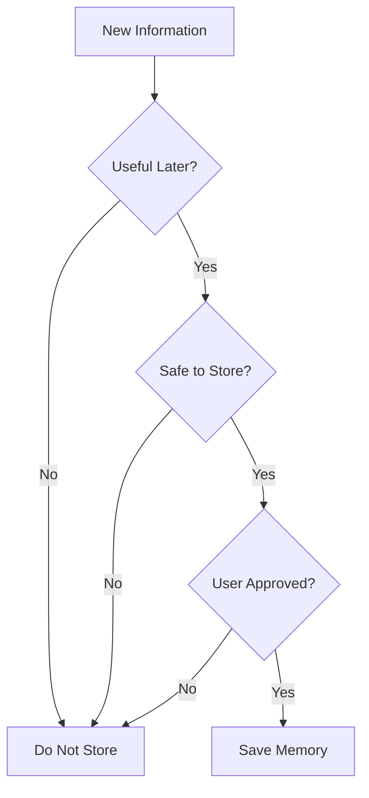
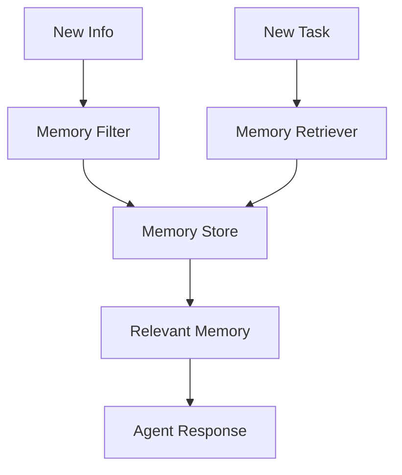
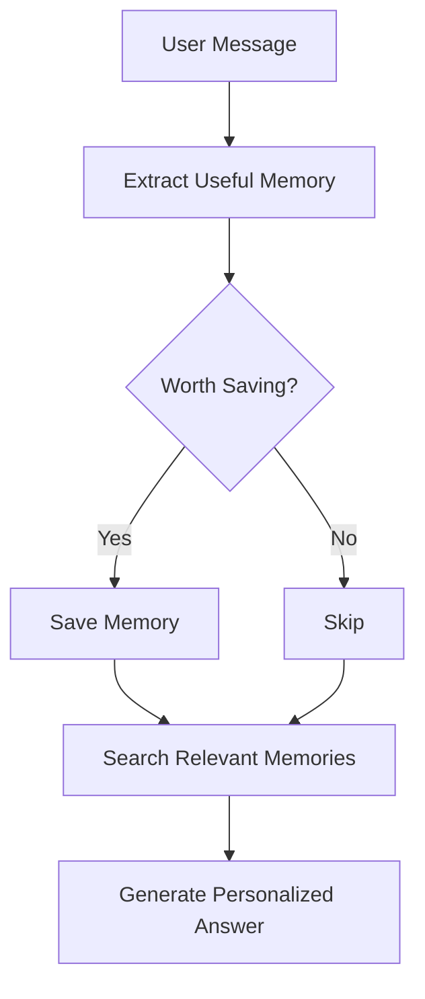

# Agent Memory - Short-Term, Long-Term, and Vector Memory

## 1. Introduction

Memory is one of the most important parts of Agentic AI.

A basic chatbot only responds to the current prompt.

An agent with memory can remember useful information during a task, across steps, or even across future sessions.

Simple idea:

```text
Memory helps an agent use past information to make better future decisions.
```

Memory is useful for:

```text
Personalization
Multi-step tasks
Document search
Long workflows
Previous decisions
User preferences
```

---

## 2. Why Memory Matters

Without memory, an agent may forget important details.

Example:

```text
User: My project is about building a RAG app for company policies.
User later: Add an evaluation step to it.
```

A memory-aware agent understands that “it” means the RAG app for company policies.

|Without Memory|With Memory|
|---|---|
|Forgets previous context|Remembers the current task|
|Repeats questions|Uses known information|
|Cannot personalize|Adapts to user preferences|
|Struggles with long workflows|Tracks completed steps|
|Cannot use past documents|Retrieves old relevant notes|

---

## 3. Types of Agent Memory

|Memory Type|Simple Meaning|Example|
|---|---|---|
|Short-term memory|Current conversation or task state|User question, retrieved chunks|
|Long-term memory|Saved useful facts for future use|User prefers short answers|
|Episodic memory|Past events or interactions|Previous project discussion|
|Semantic memory|General knowledge or facts|Company policy facts|
|Vector memory|Memory stored as embeddings|Searchable notes or chats|
|Tool memory|Results from tool calls|Last database result|

---

## 4. Short-Term Memory

Short-term memory is the information available during the current conversation or workflow.

Example:

```json
{
  "user_goal": "Build a RAG chatbot",
  "current_step": "Create embeddings",
  "retrieved_chunks": ["Refunds are available within 30 days"],
  "attempts": 2
}
```

Short-term memory is usually stored in the agent’s **state**.

It helps the agent know:

```text
What the user asked
What tools were already used
What results were found
What step comes next
```

---

## 5. Short-Term Memory Flow



The state keeps changing as the workflow continues.

---

## 6. Long-Term Memory

Long-term memory stores useful information beyond the current task.

Example:

```text
User prefers explanations with tables.
User is learning Agentic AI and RAG.
User usually wants short study articles.
```

Long-term memory can improve personalization.

But it should be used carefully.

|Good Long-Term Memory|Bad Long-Term Memory|
|---|---|
|User learning goals|Sensitive personal secrets|
|Preferred coding language|Passwords|
|Preferred explanation style|Credit card numbers|
|Current project name|Private medical details without need|

Important rule:

```text
Only remember useful, safe, and user-approved information.
```

---

## 7. Episodic Memory

Episodic memory means remembering past events or interactions.

Example:

```text
Last week, the user built a PDF Q&A app.
Yesterday, the user tested ChromaDB.
In the previous session, the user asked about evaluation.
```

This helps the agent continue a project naturally.

|Question|Episodic Memory Helps With|
|---|---|
|“Continue where we stopped”|Finds the last project state|
|“Use the same format as before”|Remembers previous style|
|“Improve that app”|Knows which app|

---

## 8. Semantic Memory

Semantic memory stores facts and knowledge.

Example:

```text
Refund policy: Refunds are available within 30 days.
Remote work policy: Employees can work remotely two days per week.
Vacation policy: Requests must be submitted 14 days early.
```

This type of memory is close to a knowledge base.

In RAG systems, document chunks often act like semantic memory.

---

## 9. Vector Memory

Vector memory stores information as embeddings so the agent can search it by meaning.

Example:

```text
Memory note:
"The user is building a RAG app for company policies."
```

Embedding:

```text
[0.14, -0.31, 0.77, 0.09, ...]
```

Later, the user asks:

```text
How can I improve my policy chatbot?
```

Vector memory can retrieve the earlier note because it is semantically related.

---

## 10. Vector Memory Flow



This is similar to RAG.

The difference is that the stored content may be past conversations, user preferences, project notes, or decisions.

---

## 11. Memory vs RAG

Memory and RAG are related but not exactly the same.

|Concept|Main Purpose|Example|
|---|---|---|
|RAG|Retrieve external knowledge|Search PDFs or docs|
|Memory|Retrieve past useful context|User preferences or project history|
|Vector DB|Storage/search method|ChromaDB, FAISS, Pinecone|
|Embeddings|Meaning representation|Convert notes into vectors|

Simple comparison:

```text
RAG = memory over documents
Agent memory = memory over interactions, tasks, and preferences
```

---

## 12. What Should an Agent Remember?

Good memory should be:

```text
Useful
Relevant
Safe
Not too detailed
Easy to update
Allowed by the user
```

Examples:

|Should Remember|Should Not Remember|
|---|---|
|User prefers Python examples|Passwords|
|Project uses ChromaDB|API keys|
|User is studying RAG|Sensitive private data|
|Preferred answer style|Temporary random details|
|Important project decisions|Unverified assumptions|

---

## 13. Memory Write Decision

Agents should not save everything.

They should decide whether something is worth remembering.



This prevents memory from becoming noisy or unsafe.

---

## 14. Memory Retrieval Decision

Agents should also decide when to use memory.

Example:

|User Request|Use Memory?|Why|
|---|--:|---|
|“What is 5 × 8?”|No|No memory needed|
|“Continue my RAG project”|Yes|Needs past project info|
|“Use my usual format”|Yes|Needs preference|
|“Explain embeddings”|Maybe|Could use learning level|
|“What is today’s weather?”|No|Needs current data, not memory|

---

## 15. Memory Problems

Memory can cause problems if poorly designed.

|Problem|Explanation|Fix|
|---|---|---|
|Too much memory|Agent retrieves irrelevant info|Filter and rank memories|
|Outdated memory|Old facts may be wrong|Add timestamps and update rules|
|Sensitive memory|Privacy risk|Avoid storing secrets|
|Wrong memory|Bad saved info affects answers|Allow editing/deleting memory|
|Memory conflict|Two memories disagree|Prefer recent or verified info|
|Over-personalization|Agent assumes too much|Ask when uncertain|

---

## 16. Memory With Metadata

Memory should include metadata.

Example:

```json
{
  "memory": "User is learning Agentic AI and RAG.",
  "type": "learning_goal",
  "created_at": "2026-07-04",
  "source": "conversation",
  "confidence": "high"
}
```

Useful metadata:

|Metadata|Why Useful|
|---|---|
|type|Groups memory|
|created_at|Handles freshness|
|source|Shows where it came from|
|confidence|Avoids trusting weak info|
|tags|Helps filtering|

---

## 17. Simple Memory Store Example

```python
memory_store = []

def save_memory(text, memory_type):
    memory = {
        "text": text,
        "type": memory_type
    }
    memory_store.append(memory)

def search_memory(keyword):
    results = []

    for memory in memory_store:
        if keyword.lower() in memory["text"].lower():
            results.append(memory)

    return results
```

Example:

```python
save_memory("User prefers short explanations with tables.", "preference")

results = search_memory("tables")
print(results)
```

This is basic keyword memory.

Vector memory is more powerful because it searches by meaning.

---

## 18. Vector Memory Pseudo-Code

```python
def save_vector_memory(text, metadata):
    embedding = embedding_model.embed(text)

    vector_db.add(
        documents=[text],
        embeddings=[embedding],
        metadatas=[metadata]
    )

def retrieve_memory(query, top_k=3):
    query_embedding = embedding_model.embed(query)

    results = vector_db.search(
        query_embedding=query_embedding,
        top_k=top_k
    )

    return results
```

This is similar to storing documents in RAG.

---

## 19. Memory in Workflows

In workflow agents, memory usually appears as state.

Example:

```json
{
  "question": "Compare refund and cancellation policies",
  "sub_questions": [
    "What is the refund policy?",
    "What is the cancellation policy?"
  ],
  "retrieved_evidence": [],
  "final_answer": null
}
```

Workflow memory helps the agent avoid forgetting steps.


---

## 20. Memory in Agentic RAG

Agentic RAG can use memory in several ways.

|Memory Use|Example|
|---|---|
|Remember user goal|Building a policy chatbot|
|Remember search attempts|Tried “refund”, then “money back”|
|Remember retrieved evidence|Refund section found|
|Remember final decision|Use top_k = 5|
|Remember evaluation results|Chunk size 500 worked better|

This helps the agent improve over time.

---

## 21. Memory Safety Rules

Memory should be controlled carefully.

|Rule|Why|
|---|---|
|Do not store secrets|Prevent privacy risk|
|Ask before saving sensitive info|User control|
|Store summaries, not full private data|Reduce exposure|
|Allow deletion or correction|Fix mistakes|
|Use memory only when relevant|Avoid weird assumptions|
|Prefer recent verified memory|Reduce outdated answers|

---

## 22. Memory Design Pattern

A simple memory system can have three steps:

```text
1. Decide whether to save memory.
2. Store memory with metadata.
3. Retrieve only relevant memory when needed.
```



---

## 23. Beginner Memory Project

Build a simple **Personal Learning Memory Agent**.

### Goal

The agent remembers what topic the user is studying and uses it in future answers.

### Features

|Feature|Description|
|---|---|
|Save preference|Store answer style|
|Save topic|Store current learning topic|
|Retrieve memory|Find relevant previous info|
|Use memory|Personalize response|
|Update memory|Change old preference|

Example memories:

```json
[
  {
    "text": "User is studying RAG and Agentic AI.",
    "type": "learning_goal"
  },
  {
    "text": "User prefers short articles with tables and Mermaid charts.",
    "type": "format_preference"
  }
]
```

---

## 24. Mini Project Flow



---

## 25. Folder Structure

```text
memory-agent/
│
├── app.py
├── memory.py
├── agent.py
├── data/
│   └── memory_store.json
└── README.md
```

File roles:

|File|Purpose|
|---|---|
|app.py|Runs the app|
|memory.py|Saves and retrieves memory|
|agent.py|Uses memory in responses|
|memory_store.json|Stores saved memories|
|README.md|Explains project|

---

## 26. Best Practices

|Best Practice|Why It Matters|
|---|---|
|Store only useful memories|Avoid noise|
|Use metadata|Improve filtering|
|Add timestamps|Handle old memories|
|Avoid sensitive data|Protect privacy|
|Retrieve only relevant memories|Avoid confusion|
|Allow memory updates|Fix mistakes|
|Keep memory summaries short|Reduce cost|
|Test memory behavior|Prevent wrong personalization|

---

## 27. Key Terms

|Term|Meaning|
|---|---|
|Short-term memory|Current task or conversation context|
|Long-term memory|Saved useful facts for future use|
|Episodic memory|Memory of past events/interactions|
|Semantic memory|Stored facts and knowledge|
|Vector memory|Memory stored as embeddings|
|State|Temporary workflow memory|
|Metadata|Extra information about memory|
|Memory retrieval|Finding relevant memories|
|Memory filter|Deciding what to save|

---

## 28. Key Takeaway

Memory helps agents become more useful, personalized, and consistent.

Simple formula:

```text
Agent Memory = Store useful context + Retrieve it when relevant + Use it safely
```

For beginners, remember this:

```text
Short-term memory = current task
Long-term memory = future personalization
Vector memory = searchable memory by meaning
```

Memory is powerful, but it must be designed with safety, privacy, and relevance in mind.