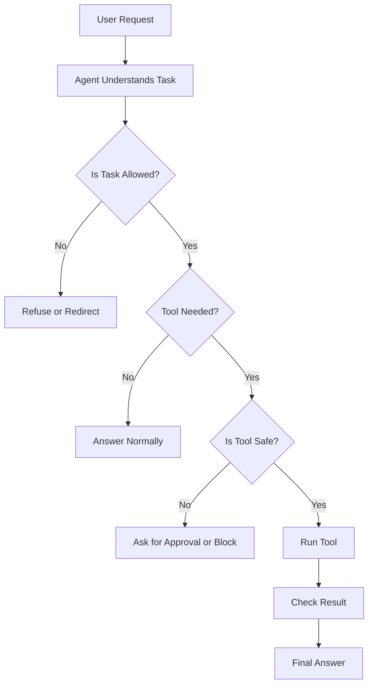
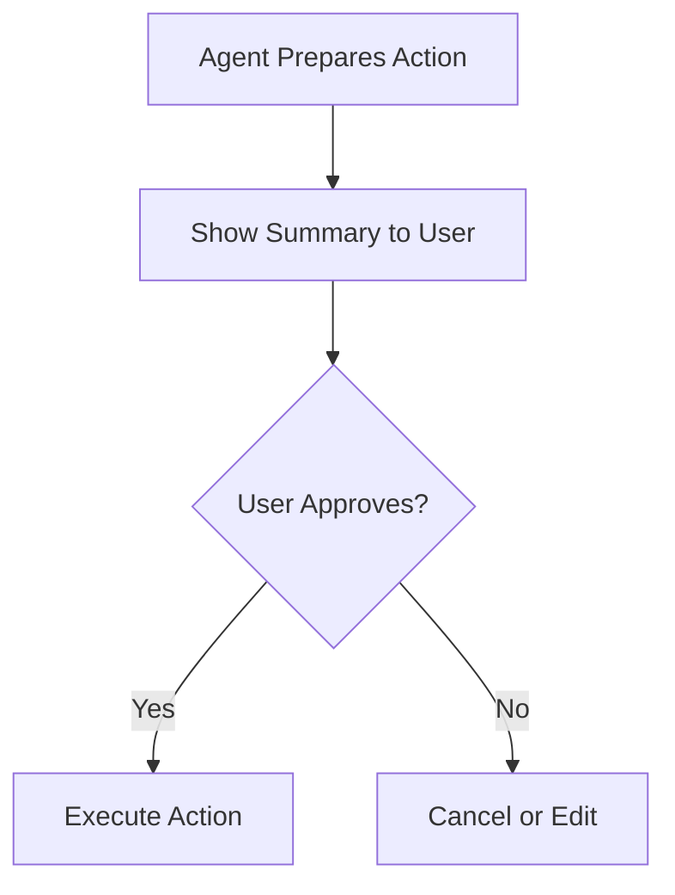
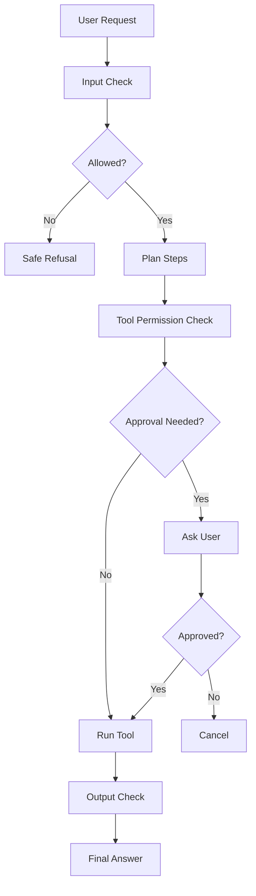
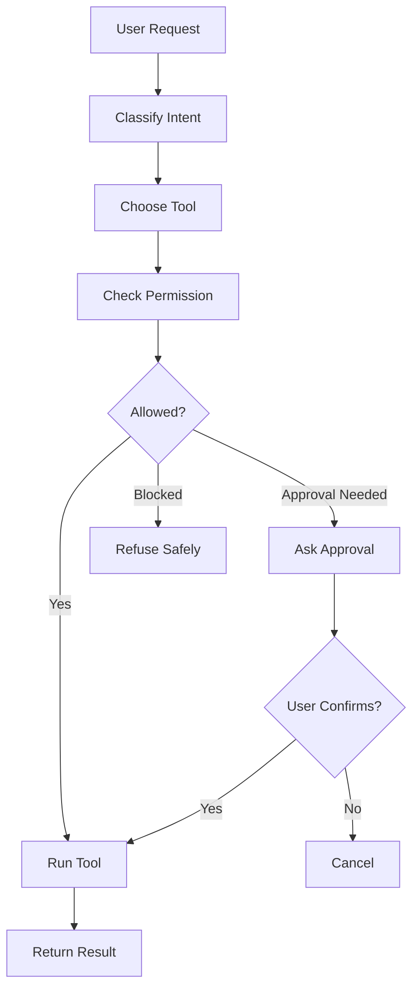

# Guardrails and Safety for AI Agents

## 1. Introduction

AI agents are powerful because they can use tools, make decisions, and take actions.

But this also creates risk.

A normal chatbot may only give a wrong answer.

An AI agent may:

```text
Send a wrong email
Delete important data
Use the wrong tool
Expose private information
Follow unsafe instructions
Make decisions without approval
```

That is why we need **guardrails**.

Simple idea:

```text
Guardrails = rules and controls that keep AI agents safe, reliable, and aligned with the user’s goal.
```

---

## 2. Why Guardrails Matter

The more power an agent has, the more safety it needs.

|Agent Ability|Risk|Needed Guardrail|
|---|---|---|
|Answer questions|Hallucination|Source checking|
|Search documents|Wrong retrieval|Relevance checking|
|Send emails|Sends wrong message|Human approval|
|Update database|Changes wrong data|Validation and permissions|
|Run code|Security risk|Sandbox execution|
|Access private files|Data leakage|Access control|
|Make purchases|Financial loss|Strong confirmation|

Important rule:

```text
More powerful tools need stronger guardrails.
```

---

## 3. Simple Guardrail Flow



Guardrails can happen before, during, and after tool use.

---

## 4. Types of Guardrails

|Guardrail Type|Purpose|Example|
|---|---|---|
|Input guardrail|Check user request|Block unsafe task|
|Tool guardrail|Control tool usage|Require approval before sending email|
|Output guardrail|Check final answer|Remove unsupported claims|
|Data guardrail|Protect private data|Hide sensitive fields|
|Workflow guardrail|Control process|Limit retries or tool calls|
|Policy guardrail|Follow rules/laws|Refuse illegal requests|

---

## 5. Input Guardrails

Input guardrails check the user request before the agent acts.

Example:

```text
User: Delete all customer records.
```

A safe agent should not immediately do this.

It should check:

```text
Is the user authorized?
Is this action reversible?
Is confirmation required?
Is this allowed by policy?
```

|Input Type|Safe Response|
|---|---|
|Normal question|Answer|
|Ambiguous request|Ask clarification|
|Dangerous request|Refuse or require approval|
|Sensitive request|Protect private data|
|Unsupported request|Explain limitation|

---

## 6. Tool Guardrails

Tool guardrails control how agents use tools.

Example:

```text
Tool: send_email
Risk: high
Guardrail: create draft first and ask user to approve
```

|Tool|Risk|Guardrail|
|---|---|---|
|Calculator|Low|Validate input|
|Document search|Low|Return sources|
|Web search|Medium|Cite sources|
|Email sender|High|Ask before sending|
|File deletion|High|Require confirmation|
|Payment API|Very high|Strong approval and limits|

A good rule:

```text
Read-only tools can be automatic.
Write/action tools need approval.
```

---

## 7. Output Guardrails

Output guardrails check the final answer before showing it to the user.

They help prevent:

```text
Hallucinated facts
Unsupported claims
Sensitive data leaks
Wrong format
Unsafe instructions
Overconfident answers
```

Example output rule:

```text
If the answer is not supported by the retrieved context, say:
"I do not know based on the provided documents."
```

---

## 8. Data Guardrails

Data guardrails protect private or sensitive information.

Sensitive data may include:

|Data Type|Example|
|---|---|
|Passwords|API keys, login credentials|
|Personal data|ID numbers, phone numbers|
|Financial data|Bank account, payment card|
|Health data|Medical records|
|Business secrets|Internal strategy, private contracts|
|Customer data|Names, emails, addresses|

Safe agent behavior:

```text
Do not expose sensitive data unless necessary and authorized.
Do not store secrets in memory.
Mask private fields when possible.
```

Example:

```text
Instead of showing full card number:
4111 1111 1111 1234

Show:
**** **** **** 1234
```

---

## 9. Workflow Guardrails

Workflow guardrails control the agent’s process.

Examples:

|Guardrail|Why It Helps|
|---|---|
|Max 3 retries|Prevents infinite loops|
|Max 5 tool calls|Controls cost and time|
|Require source before answer|Reduces hallucination|
|Stop on repeated error|Avoids useless loops|
|Require human approval|Prevents risky actions|
|Log each step|Helps debugging|

Example:

```python
MAX_TOOL_CALLS = 5

if tool_calls >= MAX_TOOL_CALLS:
    return "I stopped because the maximum number of tool calls was reached."
```

---

## 10. Human-in-the-Loop Guardrails

Human-in-the-loop means the agent asks the user before taking an important action.

Examples:

```text
Before sending an email
Before deleting a file
Before updating a database
Before booking an appointment
Before making a payment
```

Flow:



Example:

```text
I prepared this email draft. Please confirm before I send it.
```

This is one of the most important safety patterns.

---

## 11. Permission Levels

Different tools should have different permission levels.

|Permission Level|Meaning|Example|
|---|---|---|
|Read-only|Can only view/search|Search documents|
|Draft-only|Can prepare but not execute|Draft email|
|Approval-required|Needs confirmation|Send email|
|Restricted|Only admins can use|Delete database|
|Blocked|Not allowed|Illegal actions|

This makes the agent safer and easier to control.

---

## 12. Guardrails for RAG

RAG systems need special guardrails.

|RAG Risk|Guardrail|
|---|---|
|Wrong chunk retrieved|Relevance check|
|Missing answer|Say “I don’t know”|
|Hallucinated answer|Use context-only prompt|
|Wrong source citation|Track metadata|
|Too much context|Limit top_k|
|Conflicting documents|Mention conflict|
|Old document|Show date or version|

Strong RAG instruction:

```text
Answer only using the provided context.
If the answer is not in the context, say you do not know.
Cite the source when available.
```

---

## 13. Guardrails for Agentic RAG

Agentic RAG has extra risks because it can search multiple times and use tools.

|Agentic RAG Risk|Guardrail|
|---|---|
|Searches forever|Max search attempts|
|Uses wrong tool|Tool routing rules|
|Mixes sources badly|Source comparison|
|Overwrites context|Keep state carefully|
|Gives unsupported answer|Grounding check|
|Ignores uncertainty|Require confidence note|

Agentic RAG should check:

```text
Did I retrieve enough evidence?
Is the answer supported?
Are sources clear?
Do I need to search again?
Should I say I do not know?
```

---

## 14. Grounding Check

A grounding check verifies that the final answer is supported by the evidence.

Example:

```text
Context:
Refunds are available within 30 days.

Bad answer:
Refunds are available within 60 days.

Grounding check:
Fail. The answer says 60 days but the context says 30 days.
```

Simple pseudo-code:

```python
def grounding_check(answer, context):
    if answer_claims_supported_by_context(answer, context):
        return "pass"
    return "fail"
```

For beginners, you can manually check answers before automating this.

---

## 15. Validation

Validation means checking that tool inputs and outputs are correct.

Example:

```python
def send_email(to, subject, body):
    if "@" not in to:
        raise ValueError("Invalid email address")

    if len(subject) == 0:
        raise ValueError("Subject cannot be empty")

    return email_api.send(to, subject, body)
```

Validation helps avoid mistakes before actions happen.

|Validate|Example|
|---|---|
|Email address|Must contain valid format|
|Date|Must be real date|
|Amount|Must be positive and within limit|
|File path|Must be allowed|
|SQL query|Must not delete without approval|

---

## 16. Logging and Tracing

Logging means recording what the agent did.

Useful logs:

```text
User request
Chosen tool
Tool input
Tool output
Final answer
Errors
Approval decisions
```

Why logging matters:

|Benefit|Explanation|
|---|---|
|Debugging|Find why the agent failed|
|Evaluation|Measure quality|
|Safety|Review risky actions|
|Compliance|Keep records when needed|
|Improvement|Learn what to fix|

Example log:

```json
{
  "user_request": "What is the refund policy?",
  "tool_used": "search_documents",
  "tool_input": "refund policy",
  "source": "policy.pdf page 4",
  "answer": "Refunds are available within 30 days."
}
```

---

## 17. Safe Tool Design

Good tools should be limited and specific.

Bad tool:

```python
def run_any_command(command):
    execute(command)
```

This is risky because the agent can run anything.

Better tools:

```python
def search_documents(query):
    return vector_db.search(query)

def create_email_draft(to, subject, body):
    return email_client.create_draft(to, subject, body)
```

Specific tools are easier to control.

|Bad Design|Better Design|
|---|---|
|One powerful unrestricted tool|Many limited tools|
|No validation|Validate inputs|
|No approval|Require approval for risky actions|
|Hidden outputs|Return structured results|
|No logging|Log tool calls|

---

## 18. Common Safety Mistakes

|Mistake|Why It Is Bad|Fix|
|---|---|---|
|Letting agent send emails directly|May send wrong content|Draft first|
|No max loop limit|Agent may loop forever|Add max steps|
|No source checking|Hallucinations increase|Require citations|
|Storing everything in memory|Privacy risk|Filter memory|
|Giving broad database access|Data risk|Use limited queries|
|Ignoring tool errors|Bad final answers|Handle errors clearly|

---

## 19. Simple Guardrail Policy Example

```text
Agent Safety Policy:

1. The agent may answer general questions.
2. The agent may search documents automatically.
3. The agent may create drafts automatically.
4. The agent must ask before sending emails.
5. The agent must ask before deleting or editing data.
6. The agent must not reveal secrets or credentials.
7. The agent must cite sources for document-based answers.
8. The agent must stop after 3 failed attempts.
```

This kind of policy can guide the agent’s behavior.

---

## 20. Guardrail Pseudo-Code

```python
def should_allow_tool(tool_name, action_type):
    read_only_tools = ["search_documents", "calculator", "summarizer"]
    approval_required_tools = ["send_email", "delete_file", "update_database"]

    if tool_name in read_only_tools:
        return "allowed"

    if tool_name in approval_required_tools:
        return "approval_required"

    return "blocked"
```

Example use:

```python
decision = should_allow_tool("send_email", "write")

if decision == "approval_required":
    print("Ask user for approval before sending.")
```

---

## 21. Guardrails in a Workflow



Guardrails should be part of the workflow, not an afterthought.

---

## 22. Beginner Guardrail Project

Build a **Safe Tool Agent**.

### Goal

Create an agent that can use tools but follows safety rules.

### Tools

|Tool|Permission|
|---|---|
|Calculator|Allowed|
|Document search|Allowed|
|Email draft|Allowed|
|Send email|Approval required|
|Delete file|Blocked|

### Example Behavior

|User Request|Agent Behavior|
|---|---|
|“Calculate 50 × 12”|Uses calculator|
|“Find refund policy”|Searches documents|
|“Draft an email to support”|Creates draft|
|“Send this email now”|Asks for approval|
|“Delete all files”|Refuses or blocks|

---

## 23. Project Flow



---

## 24. Folder Structure

```text
safe-tool-agent/
│
├── app.py
├── tools.py
├── guardrails.py
├── permissions.py
├── logs/
│   └── agent_logs.json
└── README.md
```

File roles:

|File|Purpose|
|---|---|
|app.py|Runs the agent|
|tools.py|Contains tool functions|
|guardrails.py|Safety checks|
|permissions.py|Tool permission rules|
|logs/|Stores logs|
|README.md|Explains the project|

---

## 25. Best Practices

|Best Practice|Why It Matters|
|---|---|
|Start with read-only tools|Lower risk|
|Require approval for actions|Prevent mistakes|
|Validate tool inputs|Avoid bad operations|
|Limit tool power|Reduce damage|
|Add max attempts|Prevent loops|
|Use source-based answers|Reduce hallucination|
|Avoid storing secrets|Protect privacy|
|Log important actions|Help debugging|
|Test failure cases|Improve reliability|

---

## 26. Key Terms

|Term|Meaning|
|---|---|
|Guardrail|Safety rule or control|
|Input guardrail|Checks user request|
|Tool guardrail|Controls tool usage|
|Output guardrail|Checks final response|
|Data guardrail|Protects sensitive information|
|Human-in-the-loop|Human approval step|
|Validation|Checking inputs/outputs|
|Grounding|Ensuring answer is supported|
|Permission level|What a tool is allowed to do|
|Logging|Recording agent actions|

---

## 27. Key Takeaway

Guardrails make AI agents safer, more reliable, and easier to trust.

Simple formula:

```text
Safe Agent = Useful Tools + Clear Permissions + Human Approval + Validation + Logging
```

For beginners, remember:

```text
Read-only tools can be automatic.
Write tools need approval.
Dangerous tools should be blocked.
```

Guardrails are not optional. They are a core part of real Agentic AI systems.