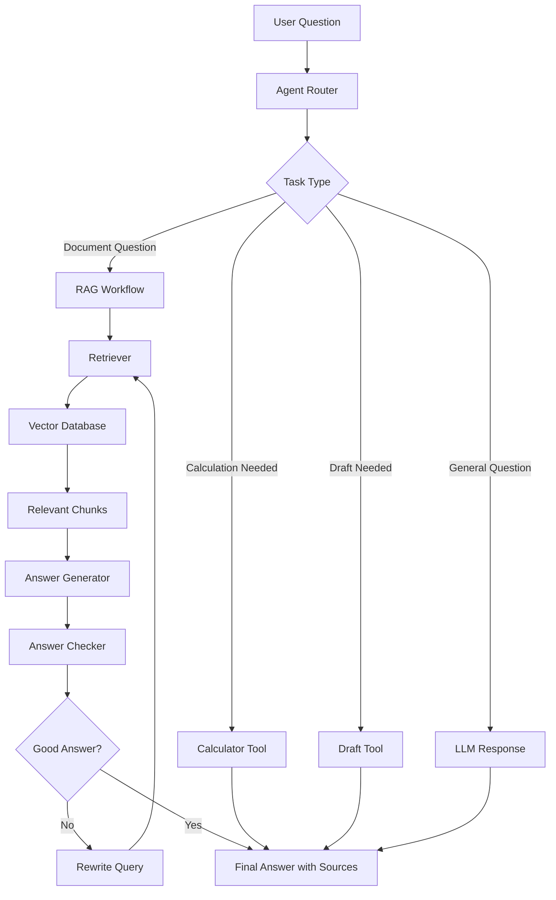
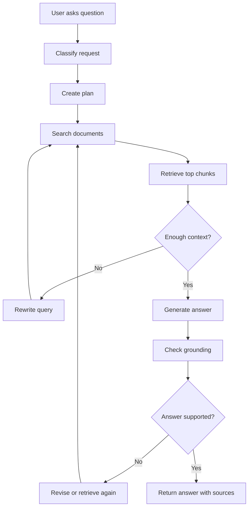
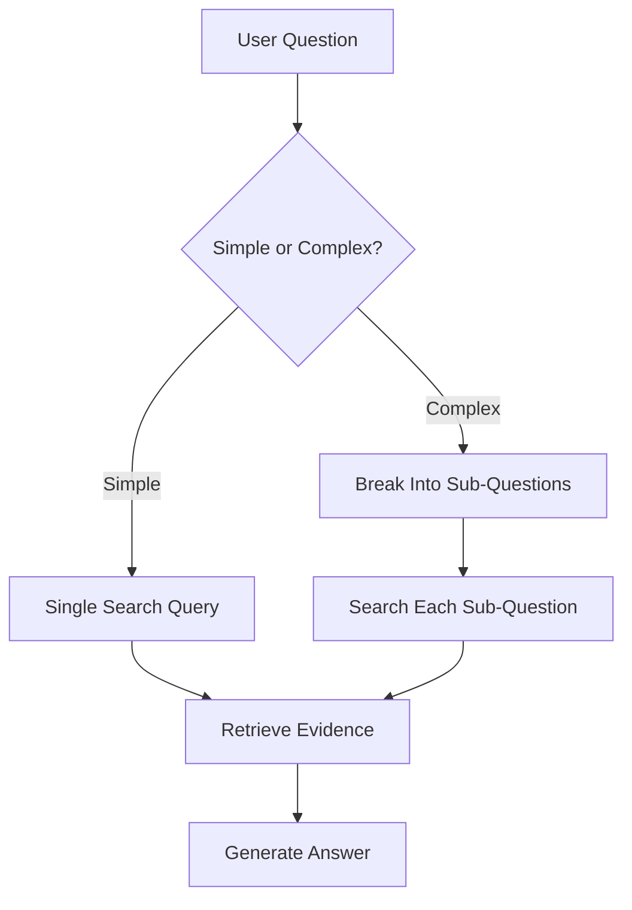
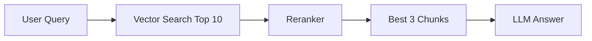
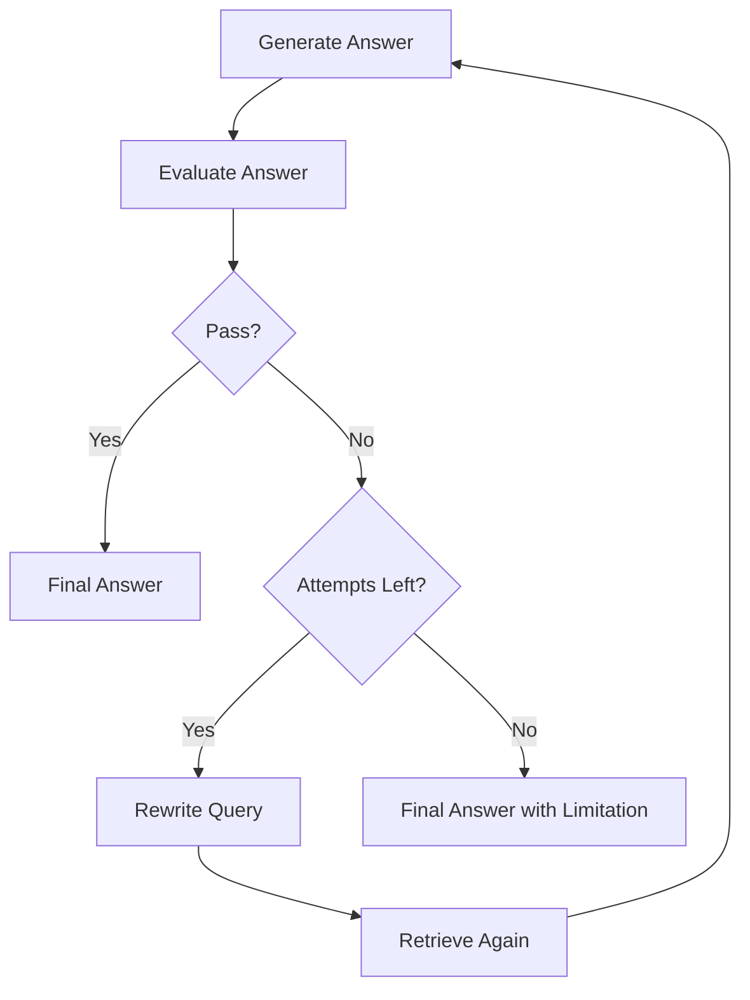
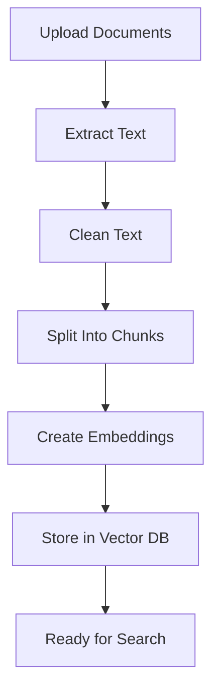
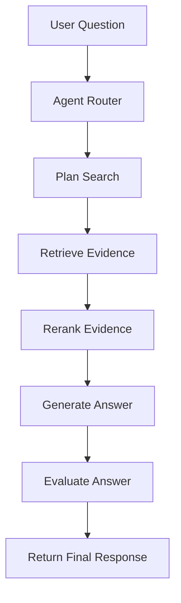

# Building an Agentic RAG App - Full System Design

## 1. Introduction

Now we combine everything:

```text
LLMs + RAG + Embeddings + Vector Databases + Tools + Workflows + Memory + Guardrails
```

This creates an **Agentic RAG App**.

A normal RAG app retrieves information once and answers.

An Agentic RAG app can:

```text
Understand the question
Decide what information is needed
Search documents
Rewrite the query if needed
Use tools
Check the answer
Retry when context is weak
Return a grounded answer with sources
```

Simple idea:

```text
Normal RAG = retrieve then answer
Agentic RAG = plan, retrieve, verify, then answer
```

---

## 2. What We Are Building

Example app:

```text
Company Policy Agent
```

The user can ask questions like:

```text
What is the refund policy?
Compare remote work and vacation rules.
Can I get a refund after 45 days?
Summarize the attendance policy.
Find the policy and draft an email to HR.
```

The app should answer using company documents and avoid guessing.

---

## 3. Normal RAG vs Agentic RAG

|Feature|Normal RAG|Agentic RAG|
|---|---|---|
|Retrieves context|Yes|Yes|
|Uses tools|Usually limited|Yes|
|Plans steps|No or simple|Yes|
|Searches multiple times|Rarely|Yes|
|Checks answer quality|Usually no|Yes|
|Handles complex questions|Limited|Better|
|Uses workflows|Simple|Stronger|
|Safer actions|Needs design|Uses guardrails|

---

## 4. High-Level System Architecture



The agent decides the path instead of always doing the same thing.

---

## 5. Main Components

|Component|Purpose|
|---|---|
|User interface|Where users ask questions|
|Agent router|Decides what kind of task it is|
|RAG retriever|Searches documents|
|Vector database|Stores document embeddings|
|LLM|Generates answers|
|Tools|Calculator, search, file reader, draft writer|
|Memory|Stores useful task or user context|
|Evaluator|Checks answer quality|
|Guardrails|Controls safety and permissions|
|Logger|Records steps for debugging|

---

## 6. Full Agentic RAG Flow



This flow is stronger than basic RAG because it includes checking and retrying.

---

## 7. Example User Request

User asks:

```text
Compare the refund policy and cancellation policy.
```

A simple RAG app may search once and return only refund information.

An Agentic RAG app should do this:

```text
1. Detect that this is a comparison task.
2. Break it into two searches:
   - refund policy
   - cancellation policy
3. Retrieve both sections.
4. Compare them.
5. Generate a table.
6. Cite sources.
```

---

## 8. Query Planning

Query planning means converting the user request into one or more search tasks.

Example:

|User Question|Search Plan|
|---|---|
|What is the refund policy?|Search “refund policy”|
|Compare refund and cancellation policy|Search “refund policy” + “cancellation policy”|
|Can I work remotely?|Search “remote work policy”|
|What changed in the latest policy?|Search current policy + previous policy|
|Summarize employee benefits|Search benefits sections|

Query planning is important for complex questions.

---

## 9. Query Planning Flow



---

## 10. Retrieval Layer

The retrieval layer searches documents.

It usually includes:

|Step|Description|
|---|---|
|Embed query|Convert question into vector|
|Search vector DB|Find similar chunks|
|Use metadata filters|Limit by file, date, section, etc.|
|Rerank results|Put best chunks first|
|Return evidence|Send chunks to the LLM|

Example retrieval output:

```json
[
  {
    "text": "Refunds are available within 30 days of purchase.",
    "source": "company_policy.pdf",
    "page": 4,
    "score": 0.91
  },
  {
    "text": "Cancellations must be requested at least 24 hours before service.",
    "source": "company_policy.pdf",
    "page": 5,
    "score": 0.88
  }
]
```

---

## 11. Reranking

Reranking improves retrieval quality.

First search may return 10 chunks.

Then reranker chooses the best 3.



Reranking is useful when:

```text
Documents are large
Many chunks are similar
The question is complex
The first retrieval is noisy
```

---

## 12. Answer Generation

After retrieval, the LLM generates an answer from the retrieved chunks.

Good prompt:

```text
You are a document assistant.

Use only the provided context to answer the question.

Context:
{retrieved_chunks}

Question:
{user_question}

Rules:
- Do not invent information.
- If the answer is missing, say you do not know.
- Include sources.
- Use a table if comparing multiple items.

Answer:
```

This keeps the answer grounded.

---

## 13. Grounding Check

The grounding check verifies that the answer is supported by the retrieved context.

Example:

```text
Context:
Refunds are available within 30 days.

Answer:
Refunds are available within 60 days.
```

Result:

```text
Fail. The answer is not grounded.
```

A checker can ask:

|Check|Question|
|---|---|
|Support|Is each claim supported by context?|
|Relevance|Does the answer address the question?|
|Completeness|Is important information missing?|
|Source accuracy|Are citations correct?|
|Refusal|Does it say “I don’t know” when needed?|

---

## 14. Agentic Retry Logic

If the answer is weak, the agent can retry.

Example:



Always add a max attempt limit.

Example:

```python
MAX_ATTEMPTS = 3
```

This prevents infinite loops.

---

## 15. Tools in Agentic RAG

An Agentic RAG app may use tools.

|Tool|Use|
|---|---|
|Document search|Retrieve policy sections|
|Calculator|Calculate dates, totals, percentages|
|Date tool|Add days or compare deadlines|
|Summarizer|Summarize long retrieved text|
|Draft writer|Create email drafts|
|Web search|Get current public information|
|Database tool|Query internal structured data|

Example:

```text
User:
If refunds are allowed within 30 days, what is the last refund date for a purchase on July 1?

Agent:
1. Search refund policy.
2. Find “30 days”.
3. Use date calculator.
4. Answer with source.
```

---

## 16. Tool Permission Table

|Tool|Permission|Reason|
|---|---|---|
|Document search|Automatic|Read-only|
|Calculator|Automatic|Low risk|
|Summarizer|Automatic|Low risk|
|Draft email|Automatic|Draft only|
|Send email|Approval required|Real-world action|
|Delete file|Blocked or approval required|High risk|
|Update database|Approval required|Changes data|

---

## 17. Memory in the App

Memory can improve the app.

Examples:

|Memory Type|Use|
|---|---|
|Short-term state|Track current question and retrieved chunks|
|User preference|Remember preferred answer style|
|Project memory|Remember selected chunk size or top_k|
|Query memory|Remember previous searches in a workflow|
|Evaluation memory|Remember which settings worked best|

Example state:

```json
{
  "question": "Compare refund and cancellation policy",
  "sub_questions": [
    "refund policy",
    "cancellation policy"
  ],
  "retrieved_chunks": [],
  "sources": [],
  "attempts": 0,
  "final_answer": null
}
```

---

## 18. Guardrails in the App

Guardrails are required.

|Risk|Guardrail|
|---|---|
|Hallucination|Use context-only prompt|
|Wrong retrieval|Reranking and evaluation|
|Unsupported answer|Grounding check|
|Too many retries|Max attempts|
|Sensitive data leak|Mask private fields|
|Risky action|Human approval|
|Wrong source|Metadata tracking|

Basic guardrail policy:

```text
1. Answer document questions only from retrieved context.
2. If context is missing, say the answer is not found.
3. Cite sources when available.
4. Ask before performing write actions.
5. Stop after 3 failed retrieval attempts.
```

---

## 19. Data Pipeline

Before users ask questions, documents must be prepared.



This is the indexing pipeline.

---

## 20. Query Pipeline

When the user asks a question:



This is the runtime pipeline.

---

## 21. Suggested Folder Structure

```text
agentic-rag-app/
│
├── app.py
├── config.py
├── requirements.txt
├── README.md
│
├── data/
│   ├── raw/
│   └── processed/
│
├── ingestion/
│   ├── loader.py
│   ├── cleaner.py
│   ├── chunker.py
│   └── embedder.py
│
├── retrieval/
│   ├── vector_store.py
│   ├── retriever.py
│   └── reranker.py
│
├── agent/
│   ├── router.py
│   ├── planner.py
│   ├── workflow.py
│   └── memory.py
│
├── tools/
│   ├── calculator.py
│   ├── date_tool.py
│   └── draft_writer.py
│
├── safety/
│   ├── guardrails.py
│   ├── permissions.py
│   └── evaluator.py
│
└── tests/
    ├── test_questions.json
    └── evaluate_rag.py
```

---

## 22. Component Responsibilities

|File/Folder|Responsibility|
|---|---|
|ingestion/|Load, clean, chunk, and embed documents|
|retrieval/|Search vector database and rerank chunks|
|agent/|Decide steps and manage workflow|
|tools/|External functions the agent can use|
|safety/|Guardrails, permissions, and evaluation|
|tests/|Test questions and quality checks|
|data/|Raw and processed documents|

---

## 23. Basic Workflow Pseudo-Code

```python
def agentic_rag(question):
    state = {
        "question": question,
        "attempts": 0,
        "retrieved_chunks": [],
        "answer": None
    }

    task_type = classify_task(question)

    if task_type == "document_question":
        search_queries = plan_queries(question)

        while state["attempts"] < 3:
            chunks = retrieve_chunks(search_queries)
            ranked_chunks = rerank_chunks(question, chunks)

            answer = generate_answer(
                question=question,
                context=ranked_chunks
            )

            passed = grounding_check(answer, ranked_chunks)

            if passed:
                return answer

            state["attempts"] += 1
            search_queries = rewrite_queries(question, ranked_chunks)

        return "I could not find enough reliable context to answer."

    elif task_type == "calculation":
        return use_calculator(question)

    else:
        return general_response(question)
```

---

## 24. Simple Example: Policy Question

User:

```text
Can I get a refund after 45 days?
```

Retrieved context:

```text
Refunds are available within 30 days of purchase.
```

Good answer:

```text
No. Based on the policy, refunds are only available within 30 days of purchase.

Source: company_policy.pdf, page 4
```

Bad answer:

```text
Maybe, depending on the company’s flexibility.
```

Why bad?

```text
The answer is not grounded in the document.
```

---

## 25. Simple Example: Comparison Question

User:

```text
Compare refund and cancellation policies.
```

Answer format:

|Policy|Rule|Source|
|---|---|---|
|Refund|Refunds are available within 30 days of purchase|company_policy.pdf, page 4|
|Cancellation|Cancellations must be requested 24 hours before service|company_policy.pdf, page 5|

Short summary:

```text
Refunds focus on getting money back after purchase.
Cancellations focus on stopping a service before it happens.
```

---

## 26. Testing the App

Create test questions:

```json
[
  {
    "question": "What is the refund policy?",
    "expected_source": "Refund Policy",
    "expected_keyword": "30 days"
  },
  {
    "question": "Can employees work remotely?",
    "expected_source": "Remote Work",
    "expected_keyword": "two days"
  },
  {
    "question": "What is the dress code?",
    "expected_answer": "not found"
  }
]
```

---

## 27. Evaluation Checklist

|Question|Check|
|---|---|
|Retrieval|Did the app find the correct chunks?|
|Grounding|Is the answer supported by context?|
|Completeness|Did it answer all parts?|
|Citation|Are sources correct?|
|Safety|Did it avoid risky actions?|
|Unknown handling|Did it say “not found” when needed?|
|Format|Did it follow the requested format?|

---

## 28. Beginner Tech Stack

|Layer|Beginner Option|
|---|---|
|Language|Python|
|LLM|Any chat model API|
|Embeddings|OpenAI embeddings or sentence-transformers|
|Vector DB|ChromaDB|
|Framework|Start without framework, then try LangChain/LlamaIndex|
|Workflow|Simple Python functions first|
|UI|Streamlit|
|Evaluation|Manual test set|

Recommended beginner path:

```text
Python + ChromaDB + Streamlit + simple functions
```

Then later:

```text
LangChain / LlamaIndex + LangGraph-style workflow
```

---

## 29. Minimum Version to Build First

Do not start too complex.

Build version 1 like this:

```text
1. Load one text file.
2. Split it into chunks.
3. Store chunks in ChromaDB.
4. Ask a question.
5. Retrieve top 3 chunks.
6. Generate answer.
7. Show source.
```

Then version 2:

```text
Add query rewriting, answer checking, and retry logic.
```

Then version 3:

```text
Add tools, memory, guardrails, and UI.
```

---

## 30. Common Mistakes

|Mistake|Problem|Fix|
|---|---|---|
|Building full agent first|Too complex|Start with basic RAG|
|No evaluation|Cannot measure quality|Add test questions|
|No metadata|Cannot cite sources|Store file/page/section|
|Weak prompts|More hallucination|Use context-only prompt|
|Too many tools|Agent gets confused|Start with 2–3 tools|
|No guardrails|Unsafe actions|Add permissions|
|No logs|Hard to debug|Log tool calls and outputs|
|Bad chunking|Wrong retrieval|Test chunk sizes|

---

## 31. Final Mental Model

Think of Agentic RAG like a smart research assistant.

|Human Research Assistant|Agentic RAG App|
|---|---|
|Understands the question|Agent router|
|Searches documents|Retriever|
|Reads relevant pages|Retrieved chunks|
|Checks if evidence is enough|Evaluator|
|Searches again if needed|Retry workflow|
|Writes final answer|LLM|
|Shows references|Source citations|
|Asks before risky actions|Guardrails|

---

## 32. Key Terms

|Term|Meaning|
|---|---|
|Agentic RAG|RAG system controlled by an agent|
|Router|Chooses the task path|
|Planner|Breaks task into steps|
|Retriever|Searches documents|
|Reranker|Reorders retrieved chunks|
|Evaluator|Checks answer quality|
|Grounding|Ensuring answer is supported|
|State|Data tracked during workflow|
|Guardrails|Safety controls|
|Human approval|User confirms risky actions|

---

## 33. Key Takeaway

An Agentic RAG app is not just a chatbot.

It is a system that can:

```text
Plan
Search
Retrieve
Use tools
Check itself
Retry
Answer with sources
Follow safety rules
```

Simple formula:

```text
Agentic RAG = RAG + Agent Workflow + Tools + Memory + Guardrails + Evaluation
```

Start small, test often, and improve step by step.