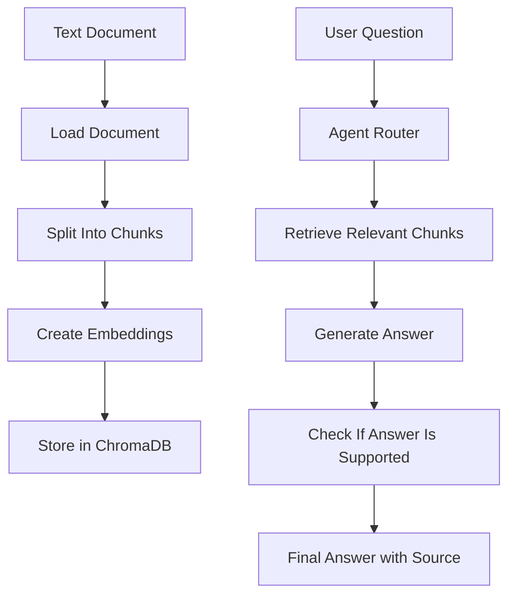
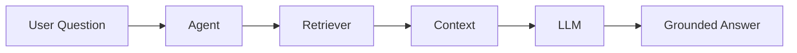

# Mini Project - Build a Beginner Agentic RAG App with Python, ChromaDB, and Streamlit

## 1. Introduction

Now it is time to build a small project.

This project will help you understand how RAG and Agentic AI work together.

We will build a beginner-friendly app called:

```text
Agentic RAG Policy Assistant
```

The app will:

```text
Load a document
Split it into chunks
Store chunks in ChromaDB
Retrieve relevant chunks
Answer questions using an LLM
Use simple agent logic
Show sources
Avoid unsupported answers
```

---

## 2. What the App Does

The user uploads or provides a document, then asks questions.

Example document:

```text
Company Policy:
Employees can work remotely two days per week.
Vacation requests must be submitted 14 days in advance.
Refunds are available within 30 days of purchase.
Customer support is available Monday to Friday.
```

Example question:

```text
Can I get my money back?
```

Expected answer:

```text
Yes. Refunds are available within 30 days of purchase.

Source: company_policy.txt
```

---

## 3. Project Architecture



---

## 4. Main Components

|Component|Purpose|
|---|---|
|Python|Main programming language|
|ChromaDB|Stores and searches document chunks|
|Streamlit|Creates a simple web interface|
|Embedding model|Converts text into vectors|
|LLM|Generates the final answer|
|Agent logic|Decides how to handle the question|
|Guardrail prompt|Prevents hallucination|

---

## 5. Folder Structure

```text
agentic-rag-policy-assistant/
│
├── app.py
├── requirements.txt
├── README.md
│
├── data/
│   └── company_policy.txt
│
├── src/
│   ├── loader.py
│   ├── chunker.py
│   ├── vector_store.py
│   ├── agent.py
│   └── prompts.py
```

---

## 6. Requirements File

Create a file called:

```text
requirements.txt
```

Add:

```text
streamlit
chromadb
openai
python-dotenv
```

Optional later:

```text
pypdf
sentence-transformers
```

---

## 7. Example Document

Create:

```text
data/company_policy.txt
```

Add:

```text
Employees can work remotely two days per week.

Vacation requests must be submitted 14 days in advance.

Refunds are available within 30 days of purchase.

Customer support is available from Monday to Friday.

Employees must report technical issues to the IT department.
```

---

## 8. Step 1: Load the Document

Create:

```text
src/loader.py
```

Code:

```python
def load_text_file(file_path: str) -> str:
    with open(file_path, "r", encoding="utf-8") as file:
        return file.read()
```

This reads the document and returns the text.

---

## 9. Step 2: Split Text Into Chunks

Create:

```text
src/chunker.py
```

Code:

```python
def split_text(text: str, chunk_size: int = 300, overlap: int = 50) -> list[str]:
    chunks = []
    start = 0

    while start < len(text):
        end = start + chunk_size
        chunk = text[start:end].strip()

        if chunk:
            chunks.append(chunk)

        start = end - overlap

    return chunks
```

Explanation:

|Parameter|Meaning|
|---|---|
|chunk_size|Maximum characters in each chunk|
|overlap|Repeated text between chunks|
|chunks|Smaller pieces of the document|

---

## 10. Step 3: Store Chunks in ChromaDB

Create:

```text
src/vector_store.py
```

Code:

```python
import chromadb


def create_collection(collection_name: str = "company_policy"):
    client = chromadb.Client()

    try:
        client.delete_collection(collection_name)
    except Exception:
        pass

    collection = client.create_collection(name=collection_name)
    return collection


def add_chunks_to_collection(collection, chunks: list[str], source: str):
    ids = []
    metadatas = []

    for index, chunk in enumerate(chunks):
        ids.append(f"chunk_{index}")
        metadatas.append({
            "source": source,
            "chunk_id": index
        })

    collection.add(
        documents=chunks,
        ids=ids,
        metadatas=metadatas
    )


def search_collection(collection, query: str, top_k: int = 3):
    results = collection.query(
        query_texts=[query],
        n_results=top_k
    )

    return results
```

ChromaDB can create embeddings automatically in simple local examples.

---

## 11. Step 4: Create the RAG Prompt

Create:

```text
src/prompts.py
```

Code:

```python
RAG_PROMPT = """
You are a document question-answering assistant.

Use only the provided context to answer the question.

Context:
{context}

Question:
{question}

Rules:
- Answer only from the context.
- If the answer is not in the context, say:
  "I do not know based on the provided document."
- Do not invent information.
- Keep the answer short and clear.
- Include the source if available.

Answer:
"""
```

This prompt is a guardrail.

It tells the model not to guess.

---

## 12. Step 5: Create Simple Agent Logic

Create:

```text
src/agent.py
```

Code:

```python
from src.prompts import RAG_PROMPT


def build_context(search_results):
    documents = search_results.get("documents", [[]])[0]
    metadatas = search_results.get("metadatas", [[]])[0]

    context_parts = []

    for document, metadata in zip(documents, metadatas):
        source = metadata.get("source", "unknown source")
        chunk_id = metadata.get("chunk_id", "unknown chunk")

        context_parts.append(
            f"Source: {source}, Chunk: {chunk_id}\n{document}"
        )

    return "\n\n".join(context_parts)


def classify_question(question: str) -> str:
    lower_question = question.lower()

    if any(word in lower_question for word in ["calculate", "sum", "multiply", "+", "-", "*", "/"]):
        return "calculation"

    return "document_question"


def answer_question(question: str, collection, llm_function):
    task_type = classify_question(question)

    if task_type == "calculation":
        return {
            "answer": "This beginner version focuses on document questions. Calculator tool can be added later.",
            "context": ""
        }

    search_results = collection.query(
        query_texts=[question],
        n_results=3
    )

    context = build_context(search_results)

    prompt = RAG_PROMPT.format(
        context=context,
        question=question
    )

    answer = llm_function(prompt)

    return {
        "answer": answer,
        "context": context
    }
```

This is simple agent behavior.

It classifies the request, retrieves context, builds a prompt, and asks the LLM.

---

## 13. Step 6: Create the Streamlit App

Create:

```text
app.py
```

Code:

```python
import os
import streamlit as st
from dotenv import load_dotenv
from openai import OpenAI

from src.loader import load_text_file
from src.chunker import split_text
from src.vector_store import create_collection, add_chunks_to_collection
from src.agent import answer_question


load_dotenv()

client = OpenAI(api_key=os.getenv("OPENAI_API_KEY"))


def call_llm(prompt: str) -> str:
    response = client.chat.completions.create(
        model="gpt-4.1-mini",
        messages=[
            {"role": "user", "content": prompt}
        ],
        temperature=0.2
    )

    return response.choices[0].message.content


st.set_page_config(page_title="Agentic RAG Policy Assistant")

st.title("Agentic RAG Policy Assistant")

st.write("Ask questions about the company policy document.")

if "collection" not in st.session_state:
    document_text = load_text_file("data/company_policy.txt")
    chunks = split_text(document_text)

    collection = create_collection()
    add_chunks_to_collection(
        collection=collection,
        chunks=chunks,
        source="company_policy.txt"
    )

    st.session_state.collection = collection
    st.success("Document loaded and indexed.")

question = st.text_input("Ask a question:")

if st.button("Ask") and question:
    result = answer_question(
        question=question,
        collection=st.session_state.collection,
        llm_function=call_llm
    )

    st.subheader("Answer")
    st.write(result["answer"])

    with st.expander("Retrieved Context"):
        st.write(result["context"])
```

---

## 14. Environment File

Create:

```text
.env
```

Add your API key:

```text
OPENAI_API_KEY=your_api_key_here
```

Do not upload this file to GitHub.

Add this to `.gitignore`:

```text
.env
```

---

## 15. Run the App

Install packages:

```bash
pip install -r requirements.txt
```

Run:

```bash
streamlit run app.py
```

Then open the local Streamlit link in your browser.

---

## 16. Example Questions to Test

|Question|Expected Answer|
|---|---|
|Can I work remotely?|Remote work is allowed two days per week|
|Can I get a refund?|Refunds are available within 30 days|
|When should I request vacation?|14 days in advance|
|Is support available on Sunday?|No, support is Monday to Friday|
|What is the dress code?|Not found in the document|

---

## 17. Add a Simple Calculator Tool

Later, add this to:

```text
src/tools.py
```

Code:

```python
import operator


def calculator(a: float, b: float, operation: str) -> float:
    operations = {
        "add": operator.add,
        "subtract": operator.sub,
        "multiply": operator.mul,
        "divide": operator.truediv
    }

    if operation not in operations:
        raise ValueError("Unsupported operation")

    return operations[operation](a, b)
```

Then update the agent router to use the calculator for math questions.

---

## 18. Add Better Agent Routing

Simple routing example:

```python
def classify_question(question: str) -> str:
    lower_question = question.lower()

    if any(symbol in lower_question for symbol in ["+", "-", "*", "/"]):
        return "calculation"

    if any(word in lower_question for word in ["policy", "refund", "vacation", "remote", "support"]):
        return "document_question"

    return "general"
```

This is not perfect, but it is good for beginners.

Later, you can use an LLM router.

---

## 19. Add Grounding Check

A simple grounding check can look for whether the answer says “I do not know” or whether relevant context exists.

```python
def has_context(context: str) -> bool:
    return len(context.strip()) > 0
```

More advanced grounding check:

```text
Ask another LLM to compare the answer with the retrieved context and decide if it is supported.
```

Beginner rule:

```text
If retrieval is empty, do not answer.
```

---

## 20. Better Final Answer Format

You can ask the LLM to answer in this format:

```text
Answer:
<short answer>

Source:
<file name and chunk number>
```

Update the prompt:

```text
Return the answer in this format:

Answer:
...

Source:
...
```

This makes the output easier to read.

---

## 21. Add Source Display

In `build_context`, we already added:

```text
Source: company_policy.txt, Chunk: 0
```

The LLM can use that source in the final answer.

Example output:

```text
Answer:
Refunds are available within 30 days of purchase.

Source:
company_policy.txt, Chunk 2
```

---

## 22. Add Evaluation File

Create:

```text
test_questions.json
```

Example:

```json
[
  {
    "question": "Can I get a refund?",
    "expected_keyword": "30 days"
  },
  {
    "question": "Can employees work remotely?",
    "expected_keyword": "two days"
  },
  {
    "question": "When should vacation requests be submitted?",
    "expected_keyword": "14 days"
  }
]
```

---

## 23. Simple Evaluation Script

Create:

```text
evaluate.py
```

Pseudo-code:

```python
import json

from src.agent import answer_question


with open("test_questions.json", "r", encoding="utf-8") as file:
    tests = json.load(file)

for test in tests:
    result = answer_question(test["question"])
    answer = result["answer"]

    if test["expected_keyword"].lower() in answer.lower():
        print("PASS:", test["question"])
    else:
        print("FAIL:", test["question"])
        print("Answer:", answer)
```

This helps you check whether your app still works after changes.

---

## 24. Beginner Version vs Improved Version

|Feature|Beginner Version|Improved Version|
|---|---|---|
|Document type|TXT file|PDF, DOCX, webpages|
|Chunking|Character-based|Semantic or section-based|
|Retrieval|ChromaDB search|Hybrid search + reranking|
|Agent|Simple router|Workflow graph|
|Guardrails|Prompt rules|Grounding evaluator|
|UI|Streamlit text box|Upload files + chat history|
|Evaluation|Manual tests|Automated RAG metrics|

---

## 25. Common Errors

|Error|Cause|Fix|
|---|---|---|
|API key error|Missing `.env` key|Check `OPENAI_API_KEY`|
|Module not found|Package not installed|Run `pip install -r requirements.txt`|
|Chroma error|Collection already exists|Delete old collection or use get/create|
|Empty answer|No relevant chunks|Check chunking and document content|
|Hallucinated answer|Prompt too weak|Strengthen context-only rule|
|No source shown|Metadata missing|Store source in metadata|

---

## 26. Mini Project Checklist

```text
[ ] Create project folder
[ ] Add company_policy.txt
[ ] Create requirements.txt
[ ] Build loader.py
[ ] Build chunker.py
[ ] Build vector_store.py
[ ] Build prompts.py
[ ] Build agent.py
[ ] Build app.py
[ ] Add .env file
[ ] Run Streamlit app
[ ] Test with 5 questions
[ ] Add sources
[ ] Add evaluation file
```

---

## 27. What You Learned

By building this project, you learned:

|Concept|Where It Appears|
|---|---|
|Document loading|loader.py|
|Chunking|chunker.py|
|Embeddings|ChromaDB|
|Vector database|ChromaDB collection|
|Retrieval|collection.query|
|Prompting|RAG_PROMPT|
|Agent routing|classify_question|
|Guardrails|context-only prompt|
|Evaluation|test_questions.json|

---

## 28. Next Improvements

After the first version works, improve it step by step:

```text
1. Add PDF upload.
2. Add file metadata.
3. Add better chunking.
4. Add reranking.
5. Add calculator tool.
6. Add query rewriting.
7. Add answer evaluation.
8. Add LangGraph-style workflow.
9. Add memory.
10. Add logging.
```

---

## 29. Final Mental Model

This project teaches the core idea of Agentic RAG:

```text
The agent decides what to do.
The retriever finds useful evidence.
The LLM writes the answer.
The guardrails reduce hallucination.
The sources make the answer verifiable.
```



---

## 30. Key Takeaway

This mini project is your first practical Agentic RAG app.

Simple formula:

```text
Agentic RAG App = Documents + Chunks + Vector DB + Retriever + LLM + Agent Logic + Guardrails
```

Start with a small TXT file.

Make it work.

Then improve it into a real PDF-based assistant.