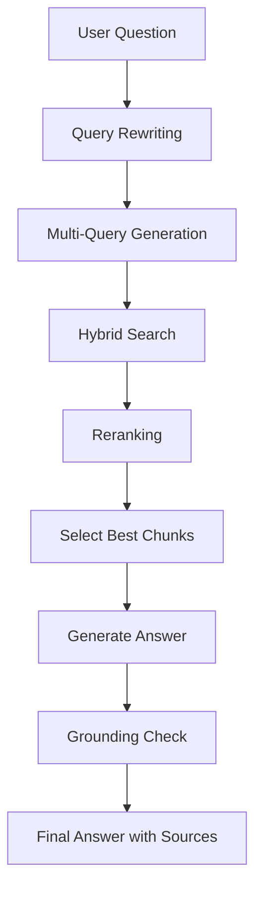
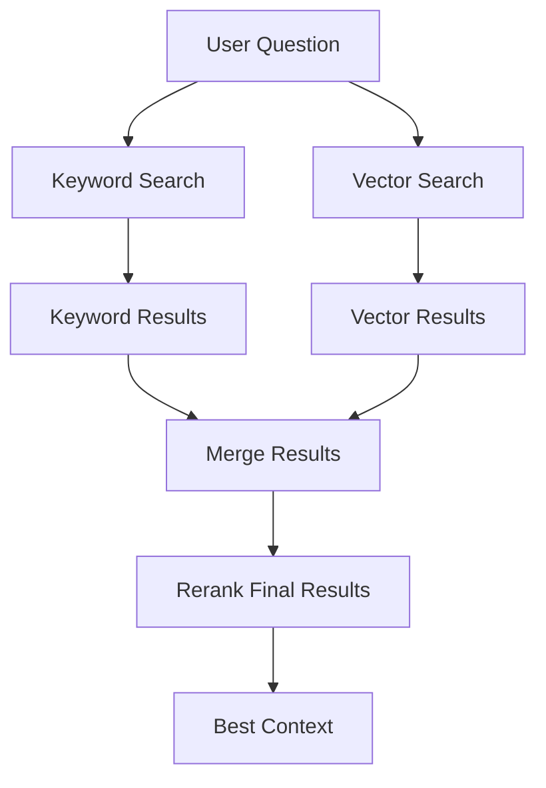
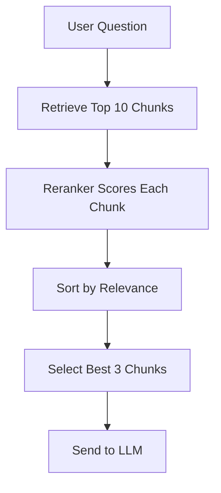
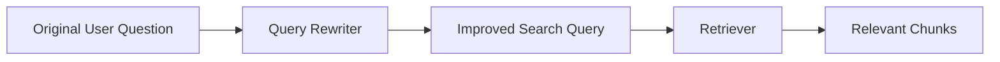
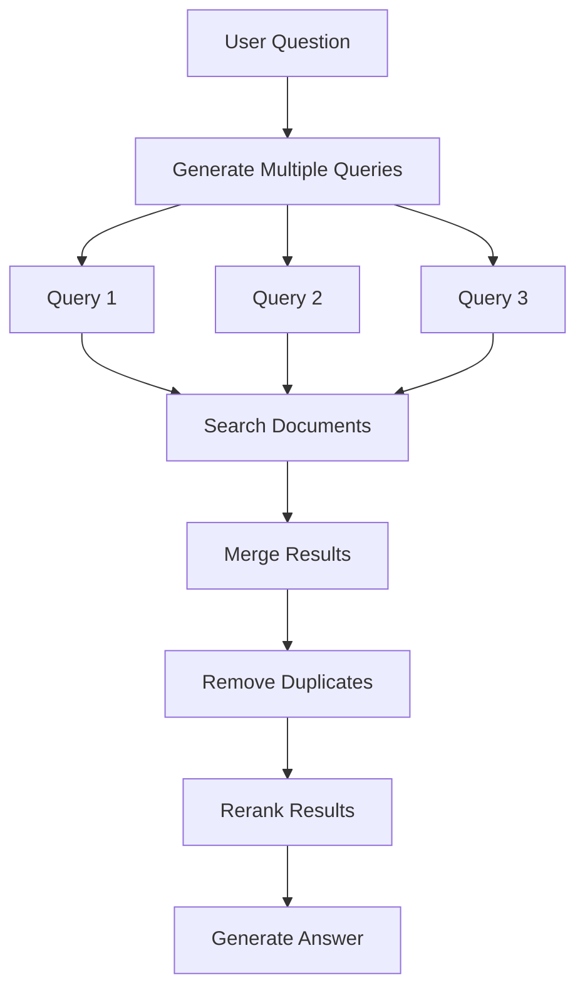
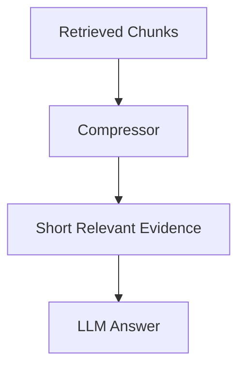
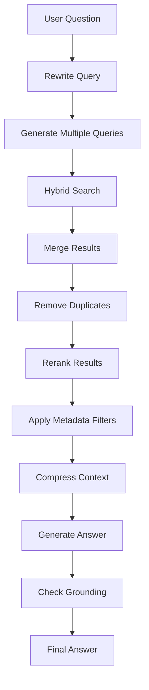
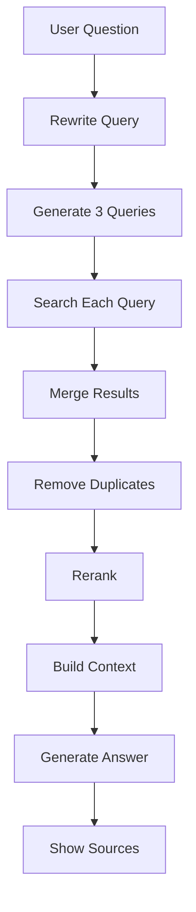

# Advanced RAG Techniques — Hybrid Search, Reranking, Query Rewriting, and Multi-Query Retrieval

## 1. Introduction

Basic RAG is simple:

```text
User question → Retrieve chunks → Send chunks to LLM → Generate answer
```

But sometimes basic RAG is not enough.

It may retrieve the wrong chunks, miss important information, or give weak answers.

Advanced RAG techniques improve the retrieval step so the LLM gets better context.

Simple idea:

```text
Better retrieval = better answers
```

---

## 2. Why Advanced RAG Is Needed

Basic RAG can fail for many reasons.

|Problem|Example|Advanced Fix|
|---|---|---|
|User uses different words|“money back” instead of “refund”|Embeddings or query rewriting|
|Exact term is important|“Policy ID HR-204”|Keyword search|
|Too many similar chunks|Many policy sections look alike|Reranking|
|Complex question|“Compare refund and cancellation rules”|Multi-query retrieval|
|Weak user query|“Tell me about it”|Query rewriting|
|Missing context|Retrieved only one part|Retrieve from multiple queries|

---

## 3. Basic RAG vs Advanced RAG

|Feature|Basic RAG|Advanced RAG|
|---|---|---|
|Search type|Usually vector search|Vector + keyword + filters|
|Query handling|Uses original question|Rewrites or expands query|
|Number of searches|Usually one|Can use multiple searches|
|Result quality|Depends on first retrieval|Improved with reranking|
|Good for complex questions|Limited|Better|
|Debugging|Basic|More measurable|

---

## 4. Advanced RAG Flow



This flow improves the quality of the context before the LLM answers.

---

# Part 1: Hybrid Search

## 5. What Is Hybrid Search?

Hybrid search combines:

```text
Keyword search + Vector search
```

Keyword search is good for exact words.

Vector search is good for meaning.

Together, they are stronger.

|Search Type|Best For|
|---|---|
|Keyword search|Exact terms, names, IDs, codes|
|Vector search|Meaning and similar concepts|
|Hybrid search|Real-world document search|

---

## 6. Keyword Search Example

User asks:

```text
What does policy HR-204 say?
```

Keyword search is useful because **HR-204** is an exact code.

A vector search might not treat the code as important enough.

```sql
SELECT * FROM documents
WHERE text LIKE '%HR-204%';
```

Keyword search is strong when exact matching matters.

---

## 7. Vector Search Example

User asks:

```text
Can I get my money back?
```

The document says:

```text
Refunds are available within 30 days.
```

Keyword search may miss this because the user did not say “refund.”

Vector search can understand that “money back” and “refund” are related.

---

## 8. Hybrid Search Flow



Hybrid search is common in production RAG systems.

---

## 9. Hybrid Search Example Table

|User Query|Keyword Search Helps?|Vector Search Helps?|
|---|--:|--:|
|What is HR-204?|Yes|Maybe|
|Can I get my money back?|Maybe|Yes|
|Explain refund policy|Yes|Yes|
|What did Sarah approve?|Yes|Maybe|
|How do I cancel service?|Maybe|Yes|

---

## 10. Simple Hybrid Search Pseudo-Code

```python
def hybrid_search(query, top_k=5):
    keyword_results = keyword_search(query, top_k=top_k)
    vector_results = vector_search(query, top_k=top_k)

    merged_results = merge_results(
        keyword_results,
        vector_results
    )

    ranked_results = rerank_results(
        query=query,
        results=merged_results
    )

    return ranked_results[:top_k]
```

The goal is to combine the strengths of both search methods.

---

# Part 2: Reranking

## 11. What Is Reranking?

Reranking means reordering retrieved chunks based on relevance.

Basic vector search may return 10 chunks.

A reranker checks those chunks again and chooses the best ones.

Simple idea:

```text
Retriever finds candidates.
Reranker chooses the best candidates.
```

---

## 12. Reranking Flow



Reranking usually improves answer quality because the LLM receives cleaner context.

---

## 13. Why Reranking Helps

|Without Reranking|With Reranking|
|---|---|
|Results may be noisy|Best chunks move to top|
|LLM sees weak context|LLM sees stronger context|
|More hallucination risk|Less hallucination risk|
|Harder to answer complex questions|Better evidence selection|

---

## 14. Reranking Example

User asks:

```text
Can I get a refund after 45 days?
```

Retrieved chunks:

|Chunk|Text|Initial Rank|
|---|---|--:|
|A|Refunds are available within 30 days.|2|
|B|Customer support is open Monday to Friday.|1|
|C|Vacation requests require 14 days notice.|3|

After reranking:

|Chunk|Text|New Rank|
|---|---|--:|
|A|Refunds are available within 30 days.|1|
|B|Customer support is open Monday to Friday.|2|
|C|Vacation requests require 14 days notice.|3|

The reranker moves the refund chunk to the top.

---

## 15. Simple Reranking Pseudo-Code

```python
def rerank_results(query, results):
    scored_results = []

    for result in results:
        score = reranker.score(
            query=query,
            document=result["text"]
        )

        scored_results.append({
            "text": result["text"],
            "source": result["source"],
            "score": score
        })

    scored_results.sort(
        key=lambda item: item["score"],
        reverse=True
    )

    return scored_results
```

---

## 16. When to Use Reranking

Use reranking when:

```text
Your document collection is large.
Many chunks look similar.
The first retrieved results are noisy.
The user asks complex questions.
You need higher answer accuracy.
```

Reranking adds extra cost and latency, so use it when quality matters.

---

# Part 3: Query Rewriting

## 17. What Is Query Rewriting?

Query rewriting means improving the user’s question before retrieval.

Users often ask short or unclear questions.

Example:

```text
What about refunds?
```

A query rewriter can turn it into:

```text
What is the company refund policy, refund period, and refund conditions?
```

This helps the retriever find better chunks.

---

## 18. Query Rewriting Flow



---

## 19. Query Rewriting Examples

|Original Question|Rewritten Query|
|---|---|
|Can I get my money back?|refund policy, return policy, money back|
|What about remote?|remote work policy, work from home rules|
|Tell me about vacation|vacation request policy, annual leave rules|
|Is it allowed?|clarify topic from conversation context|
|What changed?|compare current document with previous version|

---

## 20. Query Rewriting Prompt

```text
Rewrite the user question into a better search query for document retrieval.

Rules:
- Keep the original meaning.
- Add useful related terms.
- Do not answer the question.
- Return only the rewritten query.

User question:
{question}
```

Example output:

```text
refund policy, return window, money back, refund conditions
```

---

## 21. Query Rewriting Pseudo-Code

```python
def rewrite_query(question):
    prompt = f"""
    Rewrite this question as a clear search query.

    Question:
    {question}

    Rewritten query:
    """

    rewritten_query = llm.generate(prompt)
    return rewritten_query
```

Then use:

```python
query = rewrite_query(user_question)
chunks = retriever.search(query)
```

---

# Part 4: Multi-Query Retrieval

## 22. What Is Multi-Query Retrieval?

Multi-query retrieval means generating several search queries from one user question.

This is useful when the question has multiple parts or can be phrased in different ways.

Example user question:

```text
Compare refund and cancellation policies.
```

Search queries:

```text
refund policy
cancellation policy
refund rules vs cancellation rules
```

The system searches all of them and combines the results.

---

## 23. Multi-Query Flow



---

## 24. Multi-Query Examples

|User Question|Generated Queries|
|---|---|
|Compare refund and cancellation policy|refund policy; cancellation policy; refund vs cancellation|
|What are employee benefits?|health benefits; vacation benefits; remote work benefits|
|What changed in the policy?|current policy changes; previous policy; updated sections|
|Can I work from home and still get benefits?|remote work policy; employee benefits; eligibility rules|

---

## 25. Multi-Query Prompt

```text
Generate 3 search queries for retrieving relevant document chunks.

Rules:
- Keep queries short.
- Cover different parts of the user question.
- Do not answer the question.
- Return one query per line.

User question:
{question}
```

Example output:

```text
refund policy
cancellation policy
refund and cancellation comparison
```

---

## 26. Multi-Query Pseudo-Code

```python
def generate_queries(question):
    prompt = f"""
    Generate 3 search queries for this question:
    {question}
    """

    queries = llm.generate(prompt).splitlines()
    return queries


def multi_query_retrieve(question):
    queries = generate_queries(question)
    all_results = []

    for query in queries:
        results = retriever.search(query, top_k=5)
        all_results.extend(results)

    unique_results = remove_duplicates(all_results)
    ranked_results = rerank_results(question, unique_results)

    return ranked_results[:5]
```

---

# Part 5: Metadata Filtering

## 27. What Is Metadata Filtering?

Metadata filtering means searching only within specific documents, dates, pages, departments, or categories.

Example metadata:

```json
{
  "source": "company_policy.pdf",
  "page": 4,
  "department": "HR",
  "date": "2026-01-15",
  "section": "Refund Policy"
}
```

User asks:

```text
What does the HR policy say about remote work?
```

The system can filter:

```text
department = HR
```

Then search only HR documents.

---

## 28. Metadata Filtering Examples

|User Request|Metadata Filter|
|---|---|
|Search HR documents|department = HR|
|Use the latest policy|date = latest|
|Search page 4|page = 4|
|Search finance documents|department = Finance|
|Use only uploaded PDF|source = selected file|

---

## 29. Metadata Filtering Pseudo-Code

```python
results = collection.query(
    query_texts=["remote work policy"],
    n_results=3,
    where={
        "department": "HR"
    }
)
```

Metadata filtering reduces noise and improves relevance.

---

# Part 6: Context Compression

## 30. What Is Context Compression?

Context compression means shortening retrieved chunks before sending them to the LLM.

Sometimes retrieved chunks are too long.

The system can extract only the useful parts.

Simple idea:

```text
Retrieve large chunks → Compress useful info → Send smaller context to LLM
```

---

## 31. Context Compression Flow



Example:

Original chunk:

```text
This document contains many details about customer service, product availability,
shipping processes, warranty terms, refund rules, and escalation procedures.
Refunds are available within 30 days of purchase with a valid receipt.
Customers should contact support for refund requests.
```

Compressed context:

```text
Refunds are available within 30 days of purchase with a valid receipt.
Customers should contact support for refund requests.
```

---

## 32. Advanced RAG Techniques Summary

|Technique|What It Does|Best For|
|---|---|---|
|Hybrid search|Combines keyword and vector search|Exact terms + meaning|
|Reranking|Reorders retrieved chunks|Cleaner context|
|Query rewriting|Improves unclear questions|Short or vague queries|
|Multi-query retrieval|Searches from multiple angles|Complex questions|
|Metadata filtering|Limits search scope|Large document collections|
|Context compression|Shortens retrieved context|Long chunks|

---

## 33. Recommended Order to Learn

Learn these techniques in this order:

```text
1. Query rewriting
2. Multi-query retrieval
3. Reranking
4. Metadata filtering
5. Hybrid search
6. Context compression
```

Why?

|Order|Reason|
|---|---|
|Query rewriting|Easy to understand and implement|
|Multi-query|Useful for complex questions|
|Reranking|Improves result quality|
|Metadata filtering|Needed for many documents|
|Hybrid search|Strong but needs more setup|
|Context compression|Useful after retrieval is working|

---

## 34. Advanced RAG Pipeline



You do not need all of this at the beginning.

Add techniques only when you have a real problem to solve.

---

## 35. Beginner Implementation Plan

Start with your previous RAG app.

Add one improvement at a time.

|Version|Add This|
|---|---|
|V1|Basic RAG|
|V2|Query rewriting|
|V3|Multi-query retrieval|
|V4|Reranking|
|V5|Metadata filtering|
|V6|Hybrid search|
|V7|Context compression|

---

## 36. Practical Example

Original user question:

```text
Can I get my money back if I cancel late?
```

This question includes two ideas:

```text
refund
late cancellation
```

Basic RAG may only find refund information.

Advanced RAG should search:

```text
refund policy
cancellation policy
late cancellation fee
money back after cancellation
```

Then compare the evidence.

Final answer format:

|Topic|Retrieved Rule|Source|
|---|---|---|
|Refund|Refunds are available within 30 days|policy.pdf, page 4|
|Cancellation|Cancellations must be made 24 hours before service|policy.pdf, page 5|

Answer:

```text
You may be eligible for a refund only if the refund policy conditions are met.
However, late cancellation may have separate rules. Check both the refund and cancellation sections.
```

---

## 37. Mini Project

Improve your previous Agentic RAG app.

Project name:

```text
advanced-rag-retriever
```

Add these features:

|Feature|Description|
|---|---|
|Query rewriting|Improve user question before retrieval|
|Multi-query retrieval|Search multiple related queries|
|Reranking|Sort retrieved chunks by relevance|
|Metadata filters|Search within selected source|
|Context compression|Send only useful evidence to LLM|

---

## 38. Mini Project Flow



---

## 39. Suggested Folder Updates

```text
agentic-rag-policy-assistant/
│
├── src/
│   ├── query_rewriter.py
│   ├── multi_query.py
│   ├── reranker.py
│   ├── metadata_filter.py
│   └── context_compressor.py
```

---

## 40. Common Mistakes

|Mistake|Problem|Fix|
|---|---|---|
|Adding all techniques at once|Hard to debug|Add one at a time|
|Too many generated queries|More noise and cost|Start with 3 queries|
|No deduplication|Repeated chunks|Remove duplicates|
|Reranking too many chunks|Slower system|Rerank top 10–20|
|Bad metadata|Filtering does not work|Store clean metadata|
|Compressing too much|Important details removed|Keep source facts|

---

## 41. Key Terms

|Term|Meaning|
|---|---|
|Hybrid search|Keyword + vector search|
|Reranking|Reordering results by relevance|
|Query rewriting|Improving the search query|
|Multi-query retrieval|Searching with several queries|
|Metadata filtering|Searching only selected document groups|
|Context compression|Shortening retrieved context|
|Deduplication|Removing repeated chunks|
|Candidate chunks|Initial retrieved results before reranking|

---

## 42. Key Takeaway

Advanced RAG is about improving the information given to the LLM.

Simple formula:

```text
Advanced RAG = Better queries + better search + better ranking + better context
```

Do not make the system complex too early.

Start with basic RAG, test it, then add advanced techniques only when they solve a real problem.