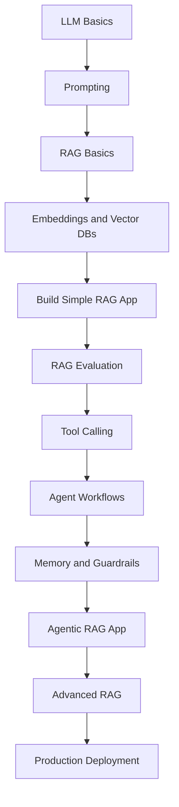
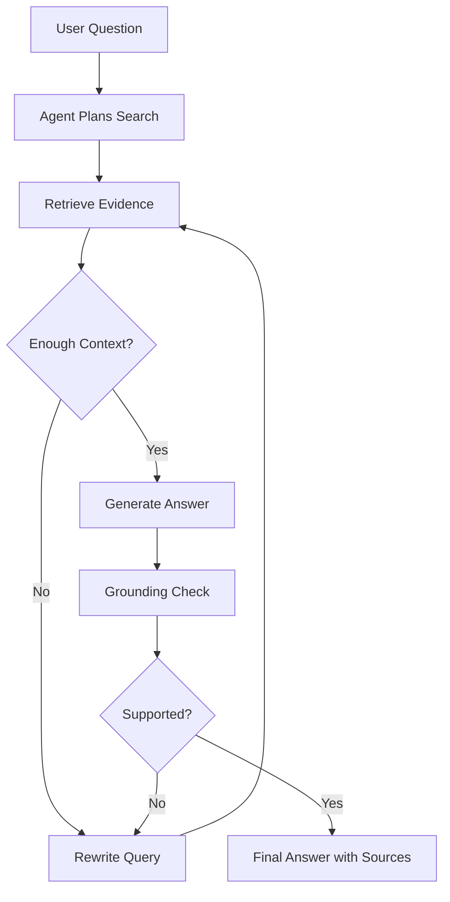
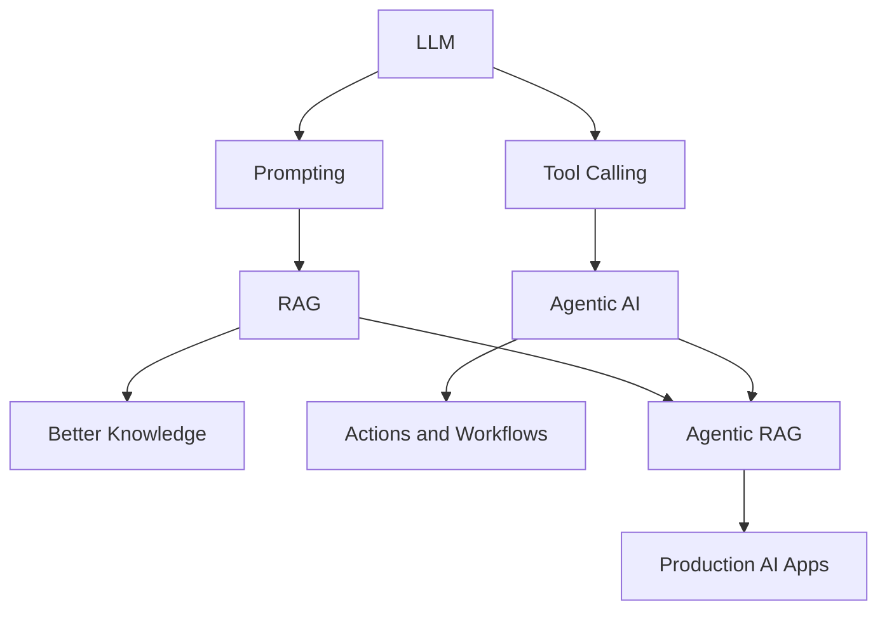

# Final Roadmap - How to Continue Learning Agentic AI and RAG

## 1. Introduction

You have now studied the main ideas behind **LLMs**, **RAG**, and **Agentic AI**.

Now you need a clear roadmap.

The goal is not to learn everything at once.

The goal is to move step by step:

```text
Understand basics → Build small projects → Improve quality → Add agents → Deploy safely
```

Simple idea:

```text
Learn by building.
```

---

## 2. Full Learning Path Overview



This is the full path from beginner to practical builder.

---

## 3. Recommended Study Order

|Order|Topic|Goal|
|--:|---|---|
|1|LLM basics|Understand prompts, tokens, context, hallucinations|
|2|Prompt engineering|Learn how to control model output|
|3|RAG basics|Understand retrieval before generation|
|4|Embeddings|Learn meaning-based search|
|5|Vector databases|Store and search document chunks|
|6|Simple RAG project|Build PDF or TXT Q&A|
|7|RAG evaluation|Test answer quality|
|8|Tool calling|Let the AI use functions|
|9|Agent workflows|Control multi-step behavior|
|10|Memory|Store useful context|
|11|Guardrails|Make agents safer|
|12|Agentic RAG|Combine RAG with agents|
|13|Advanced RAG|Improve retrieval quality|
|14|Production deployment|Build real apps safely|

---

## 4. Beginner Stage

### Goal

Understand the foundation.

Focus on:

```text
LLMs
Prompts
Tokens
Context windows
Hallucinations
Basic Python
APIs
JSON
```

|Skill|Why It Matters|
|---|---|
|Python basics|Needed to build apps|
|API calls|Needed to connect to LLMs|
|JSON|Used in tool calling and APIs|
|Prompting|Controls LLM behavior|
|Debugging|Helps fix broken pipelines|

Beginner project:

```text
Build a simple chatbot that answers questions from a text prompt.
```

---

## 5. RAG Stage

### Goal

Build systems that answer from documents.

Focus on:

```text
Document loading
Chunking
Embeddings
Vector databases
Retrieval
Prompt templates
Source citations
```

|Concept|Practice Task|
|---|---|
|Chunking|Split a TXT file into chunks|
|Embeddings|Convert chunks into vectors|
|Vector DB|Store chunks in ChromaDB|
|Retrieval|Search relevant chunks|
|Generation|Ask LLM using retrieved context|
|Citations|Show file name and page/chunk|

RAG project:

```text
Build a PDF or TXT question-answering assistant.
```

---

## 6. RAG Quality Stage

### Goal

Make your RAG app accurate.

Focus on:

```text
Evaluation
Top-k tuning
Chunk size tuning
Metadata
Grounding
Hallucination reduction
```

|Problem|Fix|
|---|---|
|Wrong chunks retrieved|Improve chunking or query rewriting|
|Answer is hallucinated|Use stronger context-only prompt|
|Missing source|Store metadata|
|Too much noise|Lower top_k or rerank|
|Weak answers|Add evaluation questions|

Quality project:

```text
Create 20 test questions and evaluate your RAG app.
```

---

## 7. Agentic AI Stage

### Goal

Let the AI use tools and follow workflows.

Focus on:

```text
Tool calling
Function schemas
Planning
Actions
Observations
Workflow state
Routers
Guardrails
```

|Agent Concept|Meaning|
|---|---|
|Tool|Function the AI can use|
|Router|Chooses the correct path|
|State|Stores current workflow info|
|Planner|Breaks goal into steps|
|Evaluator|Checks result quality|
|Guardrail|Prevents unsafe behavior|

Agent project:

```text
Build an assistant with a calculator tool and document search tool.
```

---

## 8. Agentic RAG Stage

### Goal

Combine RAG with agent workflows.

A normal RAG app does this:

```text
Retrieve → Answer
```

An Agentic RAG app does this:

```text
Plan → Retrieve → Check → Retry → Answer
```



Agentic RAG project:

```text
Build a policy assistant that can search documents, retry weak retrieval, and cite sources.
```

---

## 9. Advanced RAG Stage

### Goal

Improve retrieval performance.

Focus on:

|Technique|Purpose|
|---|---|
|Query rewriting|Improve weak user questions|
|Multi-query retrieval|Search from multiple angles|
|Hybrid search|Combine keyword + vector search|
|Reranking|Move best chunks to the top|
|Metadata filtering|Search only allowed or relevant documents|
|Context compression|Reduce long context before generation|

Advanced project:

```text
Upgrade your RAG app with query rewriting, reranking, and metadata filtering.
```

---

## 10. Production Stage

### Goal

Make the app usable by real users.

Focus on:

```text
FastAPI
Docker
Authentication
Authorization
Logging
Monitoring
Cost tracking
Rate limits
Security
Prompt injection defense
```

|Production Area|Why It Matters|
|---|---|
|API|Lets other apps use your system|
|Auth|Protects user accounts|
|Authorization|Prevents private data leaks|
|Logging|Helps debugging|
|Monitoring|Tracks failures and cost|
|Rate limits|Prevents abuse|
|Evaluation|Prevents quality regression|
|Security|Protects tools and data|

Production project:

```text
Deploy your Agentic RAG app as a FastAPI backend with logging and access control.
```

---

## 11. Suggested 8-Week Plan

|Week|Focus|Output|
|--:|---|---|
|1|LLM basics + prompting|Prompt examples and chatbot|
|2|Python APIs + JSON|Simple LLM API script|
|3|RAG basics|TXT document Q&A|
|4|Embeddings + ChromaDB|Semantic search app|
|5|RAG pipeline|PDF/TXT RAG assistant|
|6|RAG evaluation|Test set and scoring table|
|7|Tool calling + agents|Calculator + document search agent|
|8|Agentic RAG app|Workflow with retrieval, checking, and sources|

---

## 12. Suggested Project Roadmap

Build these projects in order:

|Project|Difficulty|What You Learn|
|---|---|---|
|Prompt playground|Easy|Prompting and outputs|
|TXT Q&A app|Easy|Basic RAG|
|PDF Q&A app|Medium|Document loading|
|Semantic search app|Medium|Embeddings and vector DBs|
|RAG evaluator|Medium|Quality testing|
|Tool-using assistant|Medium|Function calling|
|Agentic RAG assistant|Harder|Workflows and retry logic|
|Production RAG API|Harder|Deployment and monitoring|

---

## 13. Best First Real Project

The best first real project is:

```text
Personal Document Assistant
```

Features:

|Feature|Description|
|---|---|
|Upload document|Add PDF or TXT files|
|Ask questions|Query the uploaded documents|
|Retrieve chunks|Find relevant sections|
|Generate answer|Use LLM to answer|
|Show source|Display file/page/chunk|
|Say “not found”|Avoid hallucination|
|Save test questions|Evaluate quality|

This project teaches most RAG fundamentals.

---

## 14. Best First Agentic Project

The best first agentic project is:

```text
Agentic Study Assistant
```

Features:

|Feature|Description|
|---|---|
|Search notes|Uses RAG over study notes|
|Summarize topic|Creates short explanations|
|Quiz generator|Creates practice questions|
|Calculator|Solves simple math|
|Memory|Remembers current learning topic|
|Guardrails|Says unknown when notes do not contain answer|

This is useful and not too risky.

---

## 15. What to Learn in Python

You do not need advanced Python first.

Focus on:

```text
Functions
Dictionaries
Lists
Files
APIs
JSON
Error handling
Virtual environments
Environment variables
Basic classes
```

|Python Skill|Used For|
|---|---|
|Functions|Tools and pipeline steps|
|Dictionaries|State and JSON-like data|
|Files|Loading documents|
|APIs|Calling LLMs|
|Error handling|Production reliability|
|Environment variables|API keys|
|Classes|Cleaner app structure|

---

## 16. Tools to Practice

|Category|Beginner Tool|
|---|---|
|Coding|Python|
|UI|Streamlit|
|Backend|FastAPI|
|Vector DB|ChromaDB|
|Local vector search|FAISS|
|Document parsing|PyPDF|
|RAG framework|LlamaIndex or LangChain|
|Workflow framework|LangGraph|
|Evaluation|Manual tests first|
|Deployment|Docker|

Start simple:

```text
Python + ChromaDB + Streamlit
```

Then move to:

```text
FastAPI + Docker + LangGraph-style workflow
```

---

## 17. Important Concepts to Master

|Concept|Must Know?|
|---|--:|
|Prompting|Yes|
|Tokens|Yes|
|Context windows|Yes|
|Embeddings|Yes|
|Vector search|Yes|
|Chunking|Yes|
|Metadata|Yes|
|Retrieval evaluation|Yes|
|Tool calling|Yes|
|Agent workflow|Yes|
|Memory|Yes|
|Guardrails|Yes|
|Deployment|Later|
|Multi-agent systems|Later|

Do not start with multi-agent systems.

Start with one good workflow agent.

---

## 18. Mistakes to Avoid

|Mistake|Better Approach|
|---|---|
|Learning frameworks before concepts|Learn concepts first|
|Building complex agents too early|Build basic RAG first|
|Ignoring evaluation|Create test questions early|
|Adding too many tools|Start with 2–3 tools|
|No guardrails|Add safety rules from the start|
|No source citations|Store metadata early|
|No logging|Add simple logs while building|
|Copy-pasting code blindly|Understand each step|

---

## 19. How to Practice Daily

Use this simple daily practice plan:

```text
30 minutes reading
60 minutes coding
20 minutes debugging
10 minutes writing notes
```

Practice tasks:

|Day Type|Task|
|---|---|
|Learning day|Read one concept and summarize it|
|Coding day|Build one small function|
|Debugging day|Fix one weak part of your app|
|Evaluation day|Test 5 questions|
|Review day|Write what you learned|

---

## 20. Mini Learning Checklist

```text
[ ] I understand what an LLM is
[ ] I understand tokens and context windows
[ ] I can write clear prompts
[ ] I know what RAG means
[ ] I can explain chunking
[ ] I can explain embeddings
[ ] I can use a vector database
[ ] I can build simple document Q&A
[ ] I can evaluate RAG answers
[ ] I understand tool calling
[ ] I can design a simple agent workflow
[ ] I understand memory types
[ ] I understand guardrails
[ ] I can design an Agentic RAG system
[ ] I know basic production concerns
```

---

## 21. Final Mental Model

Think of the whole field like this:



Simple comparison:

|System|What It Does|
|---|---|
|LLM|Answers using learned patterns|
|RAG|Answers using external documents|
|Agent|Uses tools and takes steps|
|Agentic RAG|Searches, reasons, checks, and answers|
|Production AI app|Makes the system reliable and safe|

---

## 22. Final Key Takeaway

Your learning path should be:

```text
LLM basics → RAG → RAG evaluation → Tool calling → Agent workflows → Agentic RAG → Production
```

Do not rush.

Build small projects after every topic.

The best way to learn Agentic AI and RAG is:

```text
Study one concept.
Build one small project.
Test it.
Improve it.
Repeat.
```

That is how you move from beginner to real AI app builder.