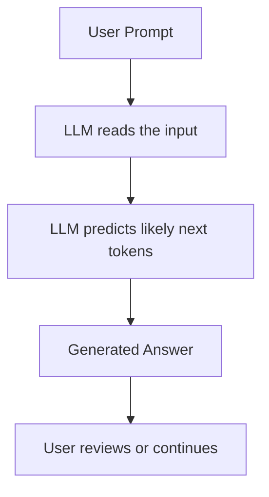
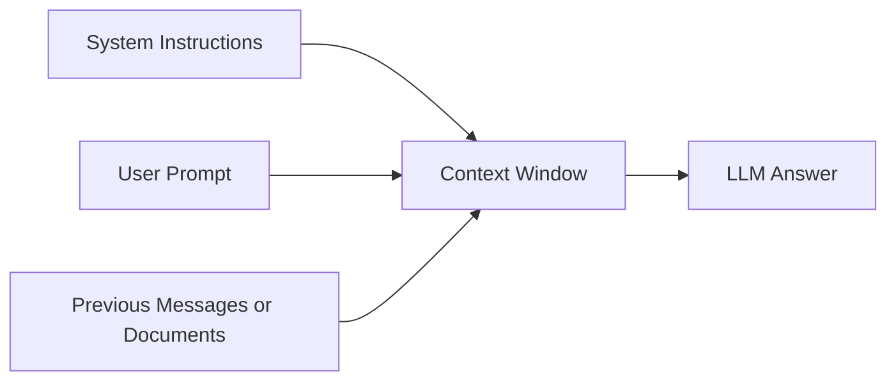
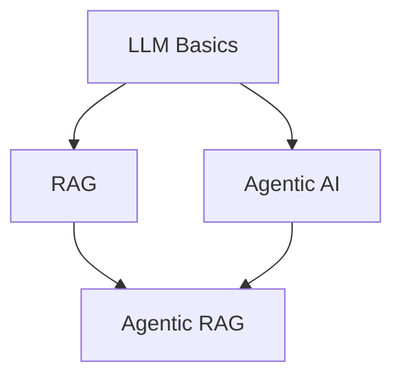
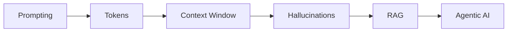

# LLM Basics - The Foundation of Agentic AI and RAG

Before learning **RAG** or **Agentic AI**, you need to understand how **Large Language Models**, or LLMs, work at a basic level.

An LLM is an AI model trained on a huge amount of text. It learns patterns in language and uses them to predict the next word, or more accurately, the next **token**.

Examples of LLMs include ChatGPT, Claude, Gemini, and Llama.

## 1. What is an LLM?

An LLM is like a very advanced text prediction system. You give it an input called a **prompt**, and it generates an output based on patterns it learned during training.

|Term|Simple Meaning|Example|
|---|---|---|
|LLM|Large Language Model|ChatGPT|
|Prompt|Your instruction or question|“Explain RAG simply”|
|Output|The model’s response|A paragraph, code, table, etc.|
|Token|A small piece of text|A word, part of a word, or symbol|
|Context window|How much text the model can remember at once|Your prompt + previous chat|
|Hallucination|When the model gives a wrong answer confidently|Fake sources or incorrect facts|

## 2. Simple LLM Flow



## 3. Prompting

A **prompt** is the instruction you give to the model.

Weak prompt:

```text
Explain AI.
```

Better prompt:

```text
Explain artificial intelligence in simple words for a beginner.
Use a table and give one real-life example.
```

Good prompts usually include:

|Prompt Element|Purpose|
|---|---|
|Task|What you want the model to do|
|Context|Background information|
|Format|Table, list, code, summary, etc.|
|Audience|Beginner, expert, student, manager|
|Constraints|Short, detailed, no jargon, etc.|

## 4. Tokens

LLMs do not exactly read text as humans do. They break text into **tokens**.

Example:

```text
"Agentic AI is powerful"
```

This may become something like:

```text
["Agent", "ic", " AI", " is", " powerful"]
```

Tokens matter because:

|Why Tokens Matter|Explanation|
|---|---|
|Cost|Many AI APIs charge by token usage|
|Speed|More tokens usually means slower responses|
|Memory|The model can only handle a limited number of tokens|
|Context|Long documents may need to be split into chunks|

## 5. Context Window

The **context window** is the amount of information the model can consider at one time.

Think of it like the model’s temporary memory.



If the context is too long, some information may be removed or ignored. This is one reason why **RAG** is useful: instead of putting everything into the prompt, RAG retrieves only the most relevant information.

## 6. Temperature

**Temperature** controls how creative or predictable the model is.

|Temperature|Behavior|Best For|
|---|---|---|
|0.0|Very focused and predictable|Facts, code, classification|
|0.3|Mostly stable|Business writing, summaries|
|0.7|More creative|Brainstorming, marketing|
|1.0+|Very creative, less predictable|Stories, ideas, experiments|

Example:

```python
response = client.chat.completions.create(
    model="gpt-4.1",
    messages=[
        {"role": "user", "content": "Explain RAG in one sentence"}
    ],
    temperature=0.3
)
```

## 7. Hallucinations

A hallucination happens when the model gives information that sounds correct but is actually wrong.

Example:

```text
User: Give me a research paper about XYZ method.
AI: The 2022 paper by John Smith proves...
```

The paper may not exist.

Common causes:

|Cause|Explanation|
|---|---|
|Missing knowledge|The model does not know the answer|
|Weak prompt|The instruction is unclear|
|No external data|The model is guessing from memory|
|Outdated training|The model may not know recent facts|

This is one of the main reasons we use **RAG**.

RAG helps by giving the model real documents to answer from.

## 8. Why This Matters for RAG and Agents

LLM basics are important because both RAG and Agentic AI are built on top of LLMs.



|Concept|Needed For RAG?|Needed For Agents?|
|---|--:|--:|
|Prompting|Yes|Yes|
|Tokens|Yes|Yes|
|Context window|Yes|Yes|
|Hallucinations|Yes|Yes|
|Temperature|Yes|Sometimes|
|Tool use|Later|Yes|
|Memory|Sometimes|Yes|

## 9. Mini Practice

Try writing prompts for these tasks:

|Task|Prompt Example|
|---|---|
|Summarization|“Summarize this text in 5 bullet points.”|
|Explanation|“Explain embeddings like I am new to AI.”|
|Formatting|“Put the answer in a table.”|
|Reasoning|“Compare RAG and fine-tuning.”|
|Coding|“Write Python code to read a text file.”|

## 10. Key Takeaway

An LLM is the core engine.  
RAG gives the LLM external knowledge.  
Agentic AI gives the LLM tools and actions.

So your learning order should be:



Once you understand prompts, tokens, context windows, and hallucinations, you are ready to start learning **RAG**.