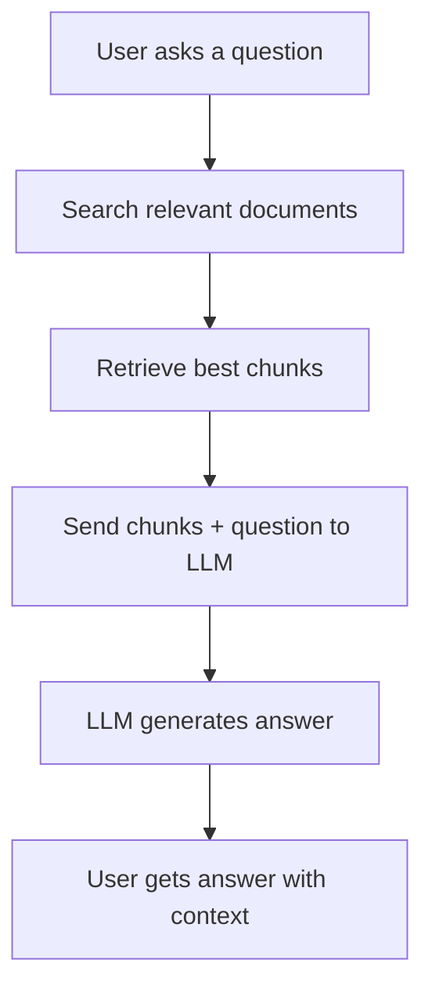
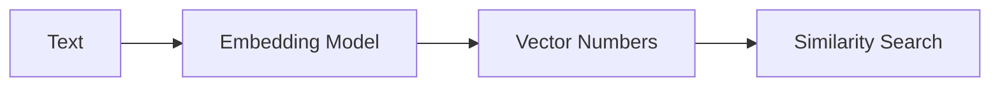
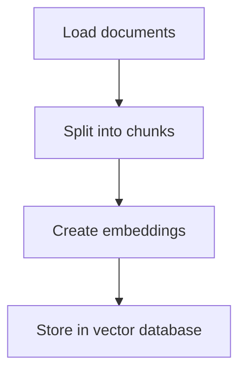
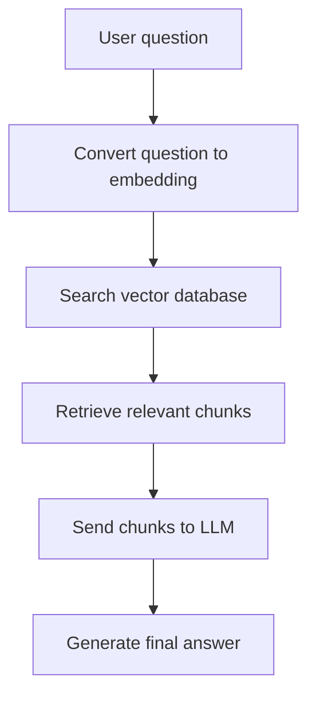
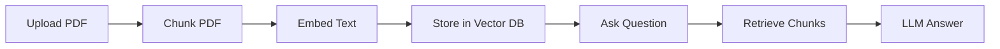

# RAG Basics - Documents, Chunks, Embeddings, and Vector Databases

**RAG** means **Retrieval-Augmented Generation**.

In simple words, RAG allows an LLM to answer questions using your own data, such as PDFs, websites, documents, databases, or company files.

Instead of depending only on the model’s memory, RAG gives the model relevant information before it answers.

## 1. Why Do We Need RAG?

LLMs are powerful, but they have problems:

|Problem|Explanation|How RAG Helps|
|---|---|---|
|Outdated knowledge|The model may not know recent information|RAG retrieves updated documents|
|Hallucination|The model may invent answers|RAG gives real source content|
|Private data|The model does not know your files|RAG connects your files to the LLM|
|Long documents|A full PDF may be too large for the prompt|RAG retrieves only relevant parts|

## 2. Simple RAG Flow



Example:

```text
User: What is the refund policy in this PDF?
```

Instead of guessing, the system searches the PDF, finds the refund section, and gives it to the LLM.

## 3. Main Parts of RAG

|Part|Meaning|Example|
|---|---|---|
|Document loader|Loads your files|PDF, DOCX, webpage|
|Chunking|Splits documents into smaller parts|Paragraphs or sections|
|Embeddings|Converts text into numbers|Vector representation|
|Vector database|Stores searchable embeddings|ChromaDB, FAISS, Pinecone|
|Retriever|Finds relevant chunks|Top 3 matching sections|
|Generator|LLM creates final answer|ChatGPT-style response|

## 4. What is Chunking?

LLMs cannot always read a full document at once. So we split documents into smaller pieces called **chunks**.

Example document:

```text
Company Policy:
Employees can work remotely two days per week.
Vacation requests must be submitted 14 days in advance.
Refunds are available within 30 days of purchase.
```

Possible chunks:

```text
Chunk 1: Employees can work remotely two days per week.

Chunk 2: Vacation requests must be submitted 14 days in advance.

Chunk 3: Refunds are available within 30 days of purchase.
```

Good chunking matters because bad chunks can lead to bad answers.

|Chunk Size|Advantage|Problem|
|---|---|---|
|Too small|Easy to search|Missing context|
|Too large|More context|Harder to match accurately|
|Balanced|Best for most RAG apps|Needs testing|

## 5. What are Embeddings?

An **embedding** is a numerical representation of text.

The goal is to convert meaning into numbers so a computer can compare similarity.

Example:

```text
"Refunds are available within 30 days"
```

Could become something like:

```text
[0.21, -0.43, 0.88, 0.15, ...]
```

You do not read these numbers manually. The system uses them to find similar meanings.

## 6. Similar Meaning Example

These two sentences are different, but their meaning is similar:

```text
Can I get my money back?
```

```text
What is the refund policy?
```

A keyword search may miss the connection, but embeddings can understand that both are related to refunds.



## 7. What is a Vector Database?

A **vector database** stores embeddings and allows fast similarity search.

|Vector Database|Common Use|
|---|---|
|FAISS|Local experiments|
|ChromaDB|Beginner-friendly local RAG|
|Pinecone|Cloud vector database|
|Weaviate|Scalable semantic search|
|Qdrant|Open-source vector search|

The vector database answers this question:

```text
Which chunks are most similar to the user's question?
```

## 8. RAG Pipeline

A full RAG system has two stages:

## Stage 1: Indexing

This happens before the user asks questions.



## Stage 2: Querying

This happens when the user asks a question.



## 9. Simple RAG Code Example

This is a simplified example using Python-like logic:

```python
# 1. Load documents
documents = load_pdf("company_policy.pdf")

# 2. Split into chunks
chunks = split_text(documents, chunk_size=500, overlap=50)

# 3. Create embeddings
embeddings = embedding_model.embed(chunks)

# 4. Store in vector database
vector_db.add(chunks, embeddings)

# 5. User asks a question
question = "What is the refund policy?"

# 6. Retrieve relevant chunks
relevant_chunks = vector_db.search(question, top_k=3)

# 7. Send question + chunks to LLM
answer = llm.generate(
    question=question,
    context=relevant_chunks
)

print(answer)
```

## 10. Example Prompt Used in RAG

```text
You are an assistant that answers only using the provided context.

Context:
{retrieved_chunks}

Question:
{user_question}

Instructions:
- Answer clearly.
- If the answer is not in the context, say you do not know.
- Do not invent information.
```

This kind of prompt helps reduce hallucinations.

## 11. RAG vs Normal LLM

|Feature|Normal LLM|RAG|
|---|---|---|
|Uses private documents|No|Yes|
|Can cite sources|Usually no|Yes|
|Better for updated data|No|Yes|
|Reduces hallucination|Limited|Better|
|Needs document processing|No|Yes|
|More complex to build|No|Yes|

## 12. Common RAG Mistakes

|Mistake|Result|Fix|
|---|---|---|
|Bad chunking|Missing or confusing answers|Test different chunk sizes|
|Too many chunks|Long and noisy context|Use top-k retrieval carefully|
|Weak prompt|Model may hallucinate|Add strict instructions|
|No source tracking|Hard to verify answers|Store metadata|
|Poor documents|Bad output|Clean the input data|

## 13. Mini Project

Build a simple **PDF Question Answering App**.

Features:

|Feature|Description|
|---|---|
|Upload PDF|User uploads a document|
|Chunk text|Split PDF into sections|
|Embed chunks|Convert chunks into vectors|
|Store vectors|Save in ChromaDB or FAISS|
|Ask question|User asks about the PDF|
|Generate answer|LLM answers using retrieved chunks|

Simple project flow:



## 14. Key Takeaway

RAG is the bridge between **LLMs** and **your own knowledge**.

The most important idea is:

```text
RAG = Search first, answer second.
```

Before the LLM answers, the system retrieves relevant information from your documents.

To understand RAG well, focus on:

| Concept          | Importance                       |
| ---------------- | -------------------------------- |
| Chunking         | Controls how documents are split |
| Embeddings       | Convert meaning into numbers     |
| Vector databases | Store and search knowledge       |
| Retrieval        | Finds the most useful context    |
| Prompting        | Guides the final answer          |