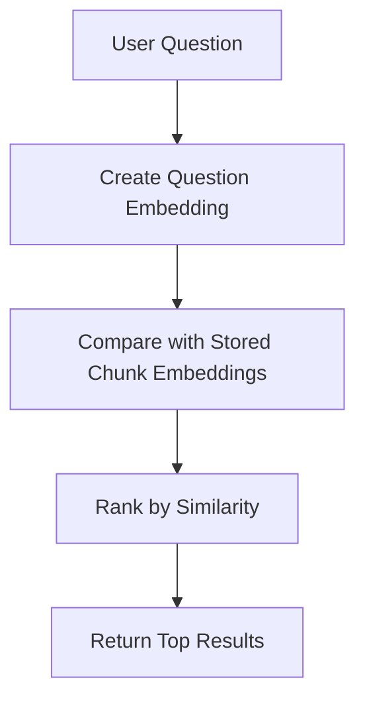
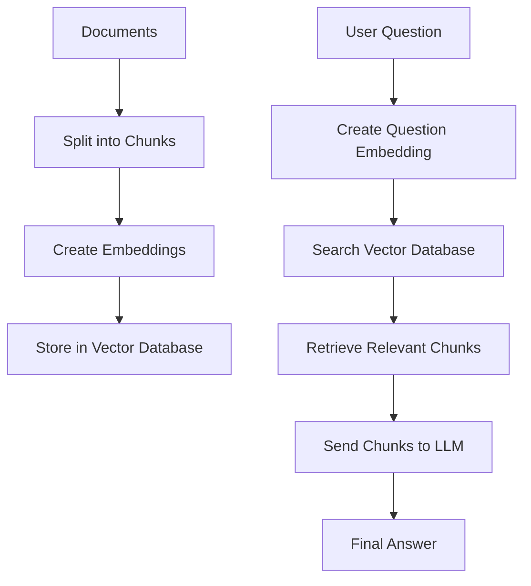
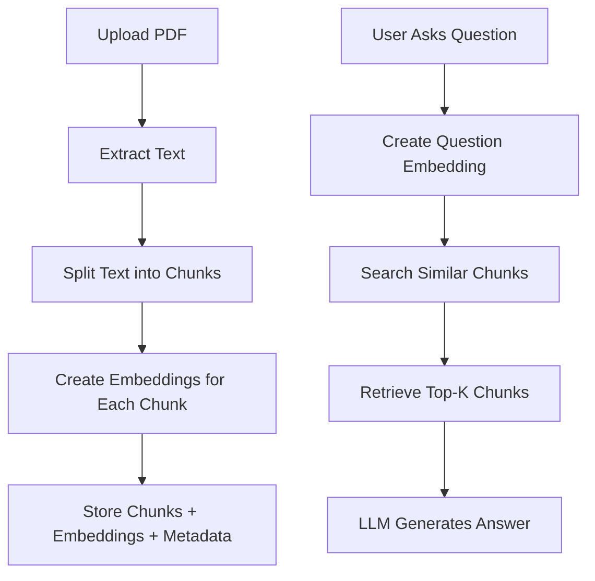

# Embeddings and Vector Databases

## 1. Introduction

In RAG systems, two important concepts are **embeddings** and **vector databases**.

They help the AI system search documents by **meaning**, not only by exact words.

For example, if a user asks:

```text
Can I get my money back?
```

A normal keyword search may look for words like:

```text
money
back
```

But a RAG system using embeddings can understand that this question is related to:

```text
refund policy
return policy
reimbursement
cancellation
```

This is why embeddings are very important in modern AI applications.

---

## 2. What Are Embeddings?

An **embedding** is a way to convert text into numbers.

The numbers represent the meaning of the text.

Example text:

```text
Refunds are available within 30 days.
```

Embedding representation:

```text
[0.21, -0.45, 0.88, 0.13, -0.09, ...]
```

You do not need to understand each number manually. The computer uses these numbers to compare text meanings.

---

## 3. Why Do We Convert Text Into Numbers?

Computers cannot directly understand meaning like humans.

So we convert text into vectors, which are lists of numbers.

Then the computer can compare those vectors mathematically.

|Text|Meaning|
|---|---|
|“What is the refund policy?”|Asking about refunds|
|“Can I get my money back?”|Asking about refunds|
|“How many vacation days do I have?”|Asking about leave policy|

The first two are semantically similar, even though they use different words.

---

## 4. Embedding Flow


Example:

```text
Input text:
"What is the refund policy?"

Embedding model output:
[0.12, -0.34, 0.91, 0.08, ...]
```

The embedding model converts the sentence into a vector.

---

## 5. What Is a Vector?

A **vector** is simply a list of numbers.

Example:

```python
vector = [0.12, -0.34, 0.91, 0.08]
```

In real AI systems, vectors can have hundreds or thousands of numbers.

For example:

|Model Type|Possible Vector Size|
|---|--:|
|Small embedding model|384 dimensions|
|Medium embedding model|768 dimensions|
|Large embedding model|1536+ dimensions|

A **dimension** means one number inside the vector.

---

## 6. Simple Similarity Example

Imagine we have these three chunks:

```text
Chunk 1: Refunds are allowed within 30 days.
Chunk 2: Employees can work remotely twice a week.
Chunk 3: Vacation requests must be submitted early.
```

User asks:

```text
Can I get my money back?
```

The embedding search may find:

|Chunk|Similarity Score|
|---|--:|
|Chunk 1: Refunds are allowed within 30 days.|0.91|
|Chunk 3: Vacation requests must be submitted early.|0.30|
|Chunk 2: Employees can work remotely twice a week.|0.21|

The system selects **Chunk 1** because it is most similar in meaning.

---

## 7. What Is Similarity Search?

**Similarity search** means finding the text chunks that are closest in meaning to the user’s question.

The system compares:

```text
User question embedding
```

with:

```text
Stored document chunk embeddings
```

Then it returns the closest matches.



---

## 8. Common Similarity Methods

|Method|Simple Explanation|
|---|---|
|Cosine similarity|Measures angle between vectors|
|Dot product|Measures vector alignment|
|Euclidean distance|Measures physical distance between vectors|

For beginners, the most important one is **cosine similarity**.

Cosine similarity checks whether two vectors point in a similar direction.

High similarity means the text meanings are close.

---

## 9. What Is a Vector Database?

A **vector database** stores embeddings and allows fast similarity search.

It stores:

|Stored Item|Example|
|---|---|
|Text chunk|“Refunds are available within 30 days.”|
|Embedding|`[0.21, -0.45, 0.88, ...]`|
|Metadata|Page number, file name, document title|

The vector database helps answer this question:

```text
Which stored chunks are most similar to the user’s question?
```

---

## 10. Why Not Use a Normal Database?

A normal database is good for exact matches.

Example SQL search:

```sql
SELECT * FROM documents
WHERE text LIKE '%refund%';
```

This works only if the word **refund** exists.

But what if the user asks:

```text
Can I get my money back?
```

The word **refund** may not be in the question.

A vector database can still understand the meaning.

|Search Type|Finds Exact Words?|Understands Meaning?|
|---|--:|--:|
|Keyword search|Yes|Limited|
|SQL search|Yes|Limited|
|Vector search|No exact word needed|Yes|
|Hybrid search|Yes|Yes|

---

## 11. Vector Database Flow in RAG



This is the core of RAG retrieval.

---

## 12. Popular Vector Databases

|Tool|Type|Good For|
|---|---|---|
|FAISS|Local library|Experiments and local search|
|ChromaDB|Local/simple database|Beginner RAG projects|
|Pinecone|Cloud vector database|Production apps|
|Weaviate|Vector database|Scalable semantic search|
|Qdrant|Vector database|Open-source production use|
|Milvus|Vector database|Large-scale enterprise use|

For beginners, start with:

```text
ChromaDB or FAISS
```

They are easier to use locally.

---

## 13. FAISS vs ChromaDB vs Pinecone

|Feature|FAISS|ChromaDB|Pinecone|
|---|---|---|---|
|Type|Library|Vector database|Cloud vector database|
|Beginner-friendly|Medium|High|High|
|Runs locally|Yes|Yes|No, mainly cloud|
|Good for experiments|Yes|Yes|Yes|
|Good for production|Limited alone|Medium|High|
|Requires account|No|No|Yes|
|Best use|Fast local search|Beginner RAG apps|Scalable production apps|

Recommended path:

```text
Start with ChromaDB → Learn FAISS → Try Pinecone later
```

---

## 14. Simple Python Example

This is a simplified example of how embeddings and vector search work.

```python
# Example chunks
chunks = [
    "Refunds are available within 30 days.",
    "Employees can work remotely two days per week.",
    "Vacation requests must be submitted 14 days in advance."
]

# User question
question = "Can I get my money back?"

# Step 1: Convert chunks into embeddings
chunk_embeddings = embedding_model.embed(chunks)

# Step 2: Convert question into embedding
question_embedding = embedding_model.embed(question)

# Step 3: Search for most similar chunks
results = vector_database.search(
    query_embedding=question_embedding,
    top_k=2
)

# Step 4: Send results to LLM
answer = llm.generate(
    question=question,
    context=results
)

print(answer)
```

This is not full production code, but it shows the main idea.

---

## 15. Example With ChromaDB-Style Logic

```python
import chromadb

# Create Chroma client
client = chromadb.Client()

# Create collection
collection = client.create_collection(name="company_docs")

# Add chunks
collection.add(
    documents=[
        "Refunds are available within 30 days.",
        "Employees can work remotely two days per week.",
        "Vacation requests must be submitted 14 days in advance."
    ],
    ids=["chunk1", "chunk2", "chunk3"]
)

# Ask a question
results = collection.query(
    query_texts=["Can I get my money back?"],
    n_results=2
)

print(results)
```

Expected result:

```text
The system should return the refund-related chunk first.
```

---

## 16. Metadata in Vector Databases

Metadata gives extra information about each chunk.

Example:

```json
{
  "text": "Refunds are available within 30 days.",
  "metadata": {
    "file_name": "company_policy.pdf",
    "page": 4,
    "section": "Refund Policy"
  }
}
```

Metadata is useful because it helps you show sources.

Example final answer:

```text
Refunds are available within 30 days.

Source: company_policy.pdf, page 4
```

This makes the answer more trustworthy.

---

## 17. What Is Top-K Retrieval?

**Top-k** means how many chunks the system retrieves.

Example:

```python
top_k = 3
```

This means:

```text
Return the 3 most relevant chunks.
```

|Top-K Value|Result|
|---|---|
|Too low|May miss useful information|
|Too high|May include noisy information|
|Balanced|Better answers|

Common starting values:

```text
top_k = 3 to 5
```

---

## 18. What Is Chunk Overlap?

When splitting documents, some text can overlap between chunks.

Example:

```text
Chunk 1:
RAG uses retrieval to find relevant information. This helps reduce hallucinations.

Chunk 2:
This helps reduce hallucinations. The LLM then uses the retrieved content to answer.
```

The repeated sentence is the overlap.

Overlap helps prevent important context from being cut off.

|Setting|Meaning|
|---|---|
|chunk_size|How large each chunk is|
|chunk_overlap|How much text repeats between chunks|

Example:

```python
chunk_size = 500
chunk_overlap = 50
```

---

## 19. Embeddings in RAG: Full Process



---

## 20. Common Problems With Embeddings

|Problem|Explanation|Fix|
|---|---|---|
|Bad chunks|Chunks do not contain complete meaning|Improve chunking|
|Wrong top-k|Too few or too many results|Test values from 3 to 10|
|No metadata|Cannot show sources|Store file name and page|
|Poor embedding model|Bad similarity results|Use a better embedding model|
|Dirty documents|Bad input creates bad results|Clean text before embedding|
|Duplicate chunks|Repeated answers|Remove duplicates|

---

## 21. Embeddings vs Keywords

|Feature|Keyword Search|Embedding Search|
|---|---|---|
|Searches exact words|Yes|Not required|
|Understands meaning|Limited|Yes|
|Good for IDs/names|Yes|Sometimes|
|Good for concepts|Limited|Yes|
|Example query|“refund”|“Can I get my money back?”|

In real systems, many teams use **hybrid search**.

Hybrid search combines:

```text
Keyword search + Vector search
```

This gives better results in many cases.

---

## 22. Mini Practice

Try this exercise.

You have these chunks:

```text
Chunk A: Employees receive 21 vacation days every year.
Chunk B: Refunds are processed within 10 business days.
Chunk C: Remote work is allowed on Mondays and Fridays.
```

Question:

```text
How long does it take to get my money returned?
```

Best matching chunk:

```text
Chunk B
```

Why?

Because “money returned” is semantically related to “refunds processed.”

---

## 23. Mini Project

Build a simple semantic search system.

### Project Name

```text
Document Search with Embeddings
```

### Features

|Feature|Description|
|---|---|
|Add documents|Store text chunks|
|Create embeddings|Convert chunks into vectors|
|Search by meaning|Ask natural language questions|
|Return top results|Show most relevant chunks|
|Show metadata|Display file name or page number|

### Project Flow


---

## 24. Simple Folder Structure

```text
embedding-search-project/
│
├── data/
│   └── company_policy.txt
│
├── app.py
├── requirements.txt
└── README.md
```

Example `requirements.txt`:

```text
chromadb
openai
python-dotenv
```

---

## 25. Key Terms to Remember

|Term|Meaning|
|---|---|
|Embedding|Text converted into numbers|
|Vector|A list of numbers|
|Dimension|One number inside a vector|
|Similarity search|Finding text with similar meaning|
|Vector database|Stores and searches embeddings|
|Metadata|Extra information about each chunk|
|Top-k|Number of results to retrieve|
|Chunk overlap|Repeated text between chunks|
|Hybrid search|Keyword search + vector search|

---

## 26. Key Takeaway

Embeddings allow AI systems to understand text by meaning.

Vector databases store these embeddings and make them searchable.

In RAG, embeddings and vector databases are used to find the most relevant information before the LLM writes the final answer.

The simple formula is:

```text
Text → Embedding → Vector Database → Similarity Search → Relevant Context → LLM Answer
```

Once you understand embeddings and vector databases, you can build stronger RAG applications.