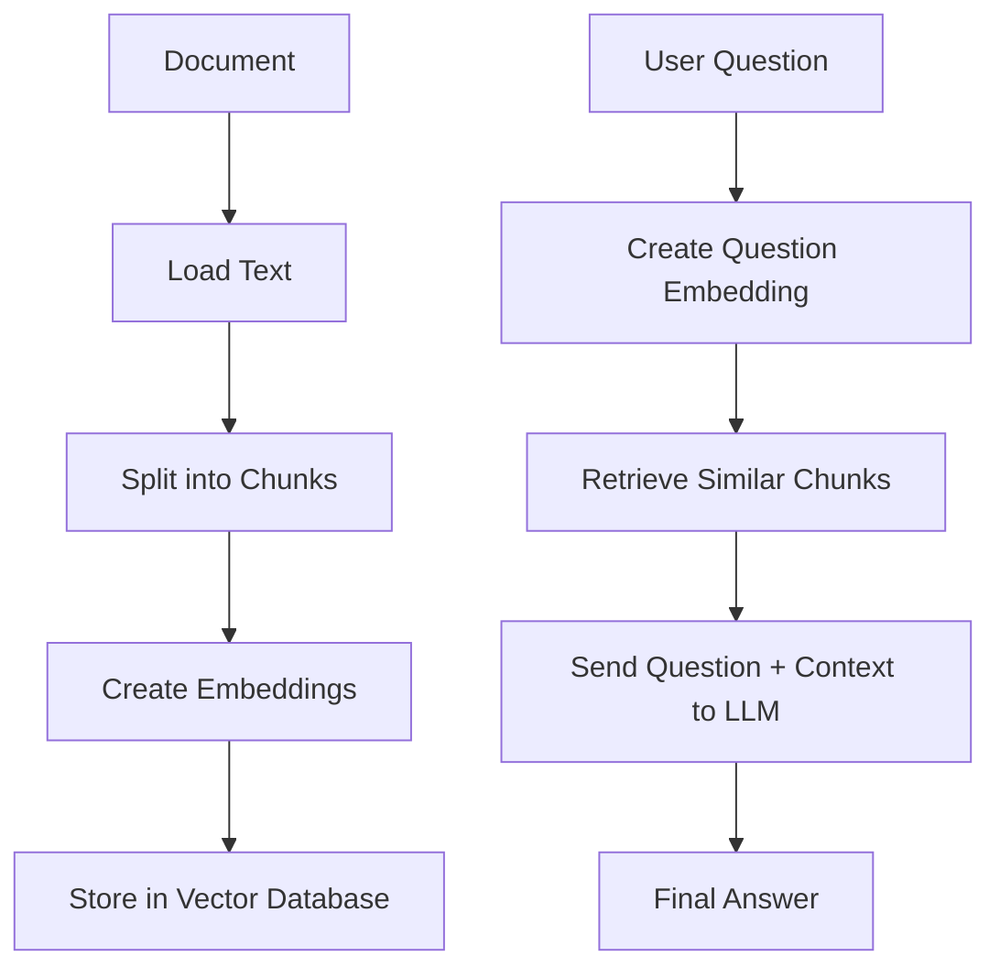
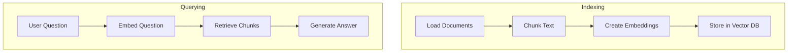
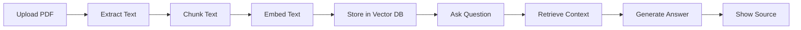

# Building a Simple RAG Pipeline Step by Step

## 1. Introduction

Now that you understand **LLMs**, **RAG**, **embeddings**, and **vector databases**, the next step is learning how to build a simple RAG pipeline.

A RAG pipeline is the full process that allows an AI system to answer questions using your documents.

The basic idea is:

```text
RAG = Retrieve useful information first, then generate the answer.
```

---

## 2. What We Are Building

We will build a simple system that can answer questions from a document.

Example:

```text
Document:
Company refunds are available within 30 days of purchase.

User question:
Can I get my money back?

AI answer:
Yes. According to the document, refunds are available within 30 days of purchase.
```

---

## 3. Full RAG Pipeline Overview



---

## 4. Main Steps

|Step|Name|Purpose|
|---|---|---|
|1|Load document|Read text from files|
|2|Chunk text|Split long text into smaller pieces|
|3|Create embeddings|Convert chunks into vectors|
|4|Store vectors|Save embeddings in a vector database|
|5|Ask question|User sends a query|
|6|Retrieve context|Find relevant chunks|
|7|Generate answer|LLM answers using retrieved context|

---

## 5. Step 1: Load the Document

First, we need a document.

Example file:

```text
company_policy.txt
```

Content:

```text
Employees can work remotely two days per week.
Vacation requests must be submitted 14 days in advance.
Refunds are available within 30 days of purchase.
Customer support is available from Monday to Friday.
```

Simple Python example:

```python
with open("company_policy.txt", "r", encoding="utf-8") as file:
    document_text = file.read()

print(document_text)
```

---

## 6. Step 2: Split Text Into Chunks

Large documents should be split into smaller chunks.

Simple chunking example:

```python
def split_text(text, chunk_size=100, overlap=20):
    chunks = []
    start = 0

    while start < len(text):
        end = start + chunk_size
        chunk = text[start:end]
        chunks.append(chunk)
        start = end - overlap

    return chunks


chunks = split_text(document_text)

for i, chunk in enumerate(chunks):
    print(f"Chunk {i+1}:")
    print(chunk)
```

Why overlap matters:

|Setting|Meaning|
|---|---|
|chunk_size|Maximum size of each chunk|
|overlap|Repeated text between chunks|
|bigger chunks|More context but less precise|
|smaller chunks|More precise but may lose context|

---

## 7. Step 3: Create Embeddings

Now convert each chunk into an embedding.

Conceptually:

```text
Text chunk → Embedding model → Vector numbers
```

Example pseudo-code:

```python
chunk_embeddings = embedding_model.embed(chunks)
```

Real systems use embedding models such as:

|Provider/Tool|Example|
|---|---|
|OpenAI|text-embedding models|
|Hugging Face|sentence-transformers|
|Cohere|embed models|
|Local models|all-MiniLM, BGE, E5|

---

## 8. Step 4: Store Chunks in a Vector Database

The vector database stores:

|Item|Example|
|---|---|
|chunk text|“Refunds are available within 30 days.”|
|embedding|`[0.12, -0.45, 0.77, ...]`|
|metadata|file name, page, section|

Example pseudo-code:

```python
vector_db.add(
    documents=chunks,
    embeddings=chunk_embeddings,
    metadata={"source": "company_policy.txt"}
)
```

---

## 9. Step 5: Ask a Question

Now the user asks a question:

```text
Can I get my money back?
```

The question is also converted into an embedding:

```python
question = "Can I get my money back?"
question_embedding = embedding_model.embed(question)
```

---

## 10. Step 6: Retrieve Relevant Chunks

The vector database compares the question embedding with stored chunk embeddings.

Then it returns the most similar chunks.

```python
retrieved_chunks = vector_db.search(
    query_embedding=question_embedding,
    top_k=3
)
```

Example result:

```text
Refunds are available within 30 days of purchase.
```

This is the “retrieval” part of RAG.

---

## 11. Step 7: Generate the Final Answer

Now send the user question and retrieved chunks to the LLM.

Prompt example:

```text
You are a helpful assistant. Answer only using the provided context.

Context:
Refunds are available within 30 days of purchase.

Question:
Can I get my money back?

Answer:
```

Expected answer:

```text
Yes. Refunds are available within 30 days of purchase.
```

---

## 12. RAG Prompt Template

A good RAG prompt reduces hallucination.

```text
You are a document question-answering assistant.

Use only the context below to answer the question.

Context:
{context}

Question:
{question}

Rules:
- If the answer is in the context, answer clearly.
- If the answer is not in the context, say: "I do not know based on the provided document."
- Do not invent information.
- Keep the answer short and useful.
```

---

## 13. Simple End-to-End Pseudo-Code

```python
# Step 1: Load document
document_text = load_text("company_policy.txt")

# Step 2: Split document
chunks = split_text(document_text, chunk_size=500, overlap=50)

# Step 3: Embed chunks
chunk_embeddings = embedding_model.embed(chunks)

# Step 4: Store chunks
vector_db.add(
    documents=chunks,
    embeddings=chunk_embeddings,
    metadata={"source": "company_policy.txt"}
)

# Step 5: User question
question = "Can I get my money back?"

# Step 6: Embed question
question_embedding = embedding_model.embed(question)

# Step 7: Retrieve relevant chunks
retrieved_chunks = vector_db.search(
    query_embedding=question_embedding,
    top_k=3
)

# Step 8: Generate answer
answer = llm.generate(
    prompt=rag_prompt_template,
    question=question,
    context=retrieved_chunks
)

print(answer)
```

---

## 14. RAG Pipeline With ChromaDB-Style Example

This is a beginner-friendly example using ChromaDB-style logic.

```python
import chromadb

# Create client
client = chromadb.Client()

# Create collection
collection = client.create_collection(name="company_policy")

# Add documents
collection.add(
    documents=[
        "Employees can work remotely two days per week.",
        "Vacation requests must be submitted 14 days in advance.",
        "Refunds are available within 30 days of purchase.",
        "Customer support is available from Monday to Friday."
    ],
    ids=["chunk1", "chunk2", "chunk3", "chunk4"],
    metadatas=[
        {"source": "company_policy.txt", "section": "Remote Work"},
        {"source": "company_policy.txt", "section": "Vacation"},
        {"source": "company_policy.txt", "section": "Refunds"},
        {"source": "company_policy.txt", "section": "Support"}
    ]
)

# Query the collection
results = collection.query(
    query_texts=["Can I get my money back?"],
    n_results=2
)

print(results)
```

Expected best result:

```text
Refunds are available within 30 days of purchase.
```

---

## 15. RAG With LLM Generation

After retrieval, we pass the result into an LLM.

```python
question = "Can I get my money back?"

context = """
Refunds are available within 30 days of purchase.
"""

prompt = f"""
You are a document assistant.

Use only the context below to answer.

Context:
{context}

Question:
{question}

Answer:
"""

answer = llm.generate(prompt)

print(answer)
```

Expected output:

```text
Yes. Refunds are available within 30 days of purchase.
```

---

## 16. Indexing vs Querying

A RAG system has two major phases.

|Phase|Happens When?|What It Does|
|---|---|---|
|Indexing|Before users ask questions|Loads, chunks, embeds, and stores documents|
|Querying|When user asks a question|Retrieves relevant chunks and generates answer|



---

## 17. Common Settings

|Setting|Common Starting Value|Notes|
|---|--:|---|
|chunk_size|500–1000 characters|Start simple|
|chunk_overlap|50–150 characters|Helps preserve context|
|top_k|3–5 chunks|Controls retrieved context|
|temperature|0–0.3|Better for factual answers|
|max answer length|Short/medium|Avoid long hallucinated answers|

---

## 18. Common Mistakes

|Mistake|Problem|Fix|
|---|---|---|
|No chunk overlap|Important context gets split|Add overlap|
|Very large chunks|Retrieval becomes less precise|Reduce chunk size|
|Too many retrieved chunks|Noisy prompt|Lower top_k|
|No metadata|Cannot cite sources|Store file/page/section|
|Weak prompt|Model may invent|Add strict context rules|
|No evaluation|You do not know if it works|Test with sample questions|

---

## 19. How to Evaluate a RAG Pipeline

Ask test questions and compare the answer with the source document.

|Test Question|Expected Source|
|---|---|
|Can employees work remotely?|Remote work section|
|How early should vacation requests be submitted?|Vacation section|
|Can I get a refund?|Refund section|
|When is support available?|Support section|

Evaluation checklist:

```text
Did the system retrieve the correct chunk?
Did the answer use only the context?
Did the answer avoid hallucination?
Did it cite the source?
Was the answer clear?
```

---

## 20. Mini Project

Build this small app:

```text
PDF Q&A Assistant
```

Features:

|Feature|Description|
|---|---|
|Upload file|Add a PDF or text file|
|Extract text|Read the file content|
|Chunk text|Split into useful sections|
|Embed chunks|Convert text into vectors|
|Store chunks|Save to ChromaDB|
|Ask questions|User asks about the document|
|Return answer|LLM answers using retrieved context|
|Show source|Display page or section|

Project flow:



---

## 21. Final Mental Model

Think of RAG as a smart open-book exam.

|Part|Open-Book Exam Example|RAG Example|
|---|---|---|
|Book|Your documents|PDFs, websites, database|
|Index|Table of contents|Vector database|
|Search|Finding the right page|Retriever|
|Student|Person answering|LLM|
|Final answer|Written response|Generated answer|

The LLM should not guess. It should first look at the relevant document section, then answer.

---

## 22. Key Takeaway

A RAG pipeline has two important jobs:

```text
1. Store knowledge properly.
2. Retrieve the right knowledge before answering.
```

Simple formula:

```text
Documents → Chunks → Embeddings → Vector DB → Retrieval → LLM Answer
```

Once you understand this pipeline, you can start building real RAG applications.