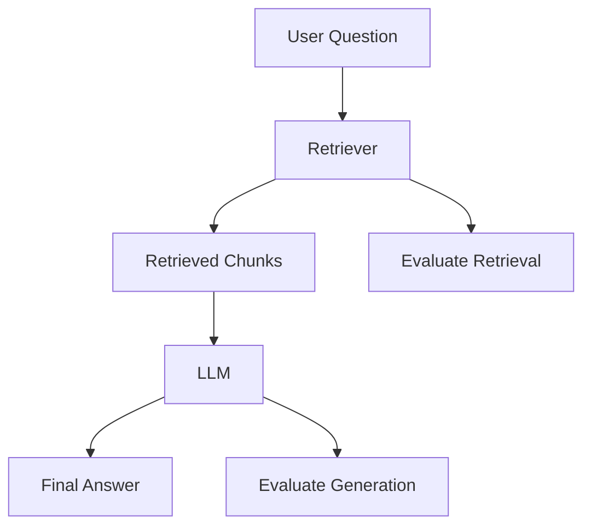
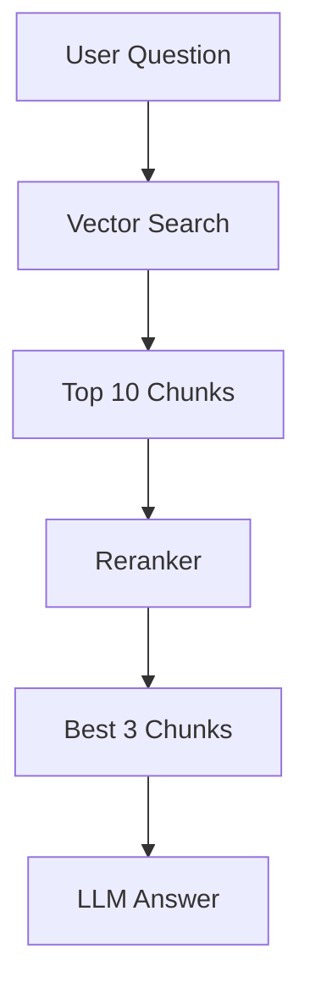
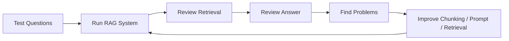
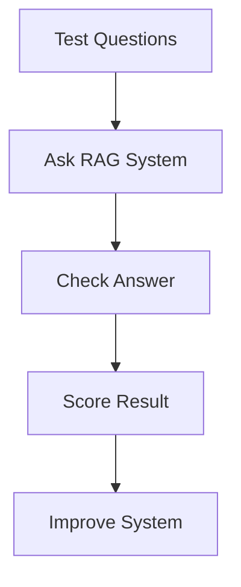

# RAG Evaluation and Improving Answer Quality

## 1. Introduction

Building a RAG pipeline is not enough.

A RAG system must also be tested to make sure it gives correct, useful, and grounded answers.

RAG evaluation means checking whether the system:

```text
Retrieved the right information
Used the retrieved information correctly
Avoided hallucination
Gave a clear answer
Showed reliable sources
```

A simple rule:

```text
Good RAG = good retrieval + good generation
```

---

## 2. Why RAG Evaluation Matters

A RAG system can fail even if the code runs correctly.

Example:

```text
User question:
What is the refund policy?

Retrieved chunk:
Employees can work remotely two days per week.

Generated answer:
The document says employees can work remotely two days per week.
```

The system did not crash, but it retrieved the wrong information.

That means the answer is not useful.

|Problem|What Happens|
|---|---|
|Wrong retrieval|The LLM receives irrelevant context|
|Missing context|The LLM cannot answer properly|
|Too much context|The LLM may get confused|
|Weak prompt|The LLM may hallucinate|
|No citations|User cannot verify the answer|

---

## 3. The Two Main Parts of RAG Evaluation

RAG evaluation has two main areas:

|Evaluation Area|Question to Ask|
|---|---|
|Retrieval evaluation|Did we retrieve the right chunks?|
|Generation evaluation|Did the LLM answer correctly using those chunks?|



---

## 4. Retrieval Evaluation

Retrieval evaluation checks if the system found the correct document chunks.

Example:

```text
Question:
Can I get my money back?

Correct chunk:
Refunds are available within 30 days of purchase.
```

If the system retrieves the refund chunk, retrieval is good.

If it retrieves remote work or vacation policy, retrieval is bad.

|Metric|Simple Meaning|
|---|---|
|Relevance|Are the retrieved chunks related to the question?|
|Recall|Did we retrieve all important chunks?|
|Precision|Are the retrieved chunks mostly useful?|
|Ranking quality|Are the best chunks near the top?|

---

## 5. Generation Evaluation

Generation evaluation checks the final answer.

A good answer should be:

|Quality|Meaning|
|---|---|
|Correct|The answer matches the document|
|Grounded|The answer uses only retrieved context|
|Clear|The answer is easy to understand|
|Complete|The answer covers the question|
|Cited|The answer points to the source|

Example good answer:

```text
Yes. Refunds are available within 30 days of purchase.

Source: company_policy.txt, Refunds section
```

Example bad answer:

```text
Yes, you can get a refund within 60 days.
```

Why bad?

The document said **30 days**, not **60 days**.

---

## 6. RAG Failure Types

|Failure Type|Example|Fix|
|---|---|---|
|Wrong retrieval|Gets vacation policy for refund question|Improve embeddings, chunking, or search|
|Missing retrieval|Does not find the correct chunk|Increase top_k or improve chunk size|
|Hallucination|Invents answer not in context|Use stricter prompt|
|Bad citation|Shows wrong source|Track metadata carefully|
|Too much context|LLM gets confused|Reduce top_k or rerank results|
|Poor document quality|Extracted text is messy|Clean documents before indexing|

---

## 7. Basic Evaluation Checklist

Use this checklist for every test question.

```text
1. Did the retriever find the right chunk?
2. Was the correct chunk ranked near the top?
3. Did the LLM answer using only the retrieved context?
4. Did the answer avoid unsupported claims?
5. Did the answer cite the correct source?
6. Was the answer clear and useful?
```

Simple scoring:

|Score|Meaning|
|--:|---|
|5|Excellent answer|
|4|Mostly correct|
|3|Partially correct|
|2|Mostly wrong|
|1|Completely wrong|

---

## 8. Example Evaluation Table

|Test Question|Expected Source|Retrieved Correctly?|Answer Correct?|Notes|
|---|---|--:|--:|---|
|Can I get a refund?|Refund section|Yes|Yes|Good|
|How many remote days are allowed?|Remote work section|Yes|Yes|Good|
|When should I request vacation?|Vacation section|Yes|No|Answer missed 14 days|
|Is support available on Sunday?|Support section|Yes|Yes|Good|
|What is the dress code?|Not in document|No|Yes|Correctly said unknown|

---

## 9. Golden Dataset

A **golden dataset** is a small set of test questions with expected answers.

Example:

```json
[
  {
    "question": "Can I get a refund?",
    "expected_answer": "Refunds are available within 30 days of purchase.",
    "expected_source": "Refund section"
  },
  {
    "question": "How many days before vacation should I submit a request?",
    "expected_answer": "Vacation requests must be submitted 14 days in advance.",
    "expected_source": "Vacation section"
  }
]
```

This helps you test your RAG system again and again after changes.

---

## 10. Manual Evaluation

At the beginner stage, manual evaluation is enough.

You can create a table like this:

|Question|Expected Answer|Actual Answer|Score|Problem|
|---|---|---|--:|---|
|Can I get a refund?|30 days|30 days|5|None|
|Can I work remotely?|2 days/week|3 days/week|2|Hallucination|
|Is support open Sunday?|No|Not mentioned|4|Acceptable|

Manual evaluation helps you understand what is going wrong.

---

## 11. Improving Retrieval Quality

If retrieval is weak, improve these areas:

|Method|Explanation|
|---|---|
|Better chunking|Split documents into meaningful sections|
|Chunk overlap|Prevent context from being cut off|
|Better embeddings|Use a stronger embedding model|
|Hybrid search|Combine keyword and vector search|
|Metadata filtering|Search only specific documents or sections|
|Reranking|Reorder retrieved chunks by relevance|

---

## 12. Chunking Improvements

Bad chunking example:

```text
Refunds are available
```

This is too short and lacks context.

Better chunk:

```text
Refund Policy:
Refunds are available within 30 days of purchase. Customers must provide a receipt.
```

|Chunking Strategy|Best For|
|---|---|
|Fixed-size chunks|Simple experiments|
|Paragraph chunks|Articles and policies|
|Section-based chunks|Manuals and reports|
|Page-based chunks|PDFs with clear pages|
|Semantic chunks|Advanced RAG systems|

---

## 13. Top-K Tuning

**top_k** controls how many chunks are retrieved.

Example:

```python
top_k = 3
```

|Top-K|Possible Result|
|--:|---|
|1|Very focused but may miss context|
|3|Good beginner default|
|5|More context but more noise|
|10|Can confuse the LLM if not reranked|

Start with:

```python
top_k = 3
```

Then test with:

```python
top_k = 5
```

Choose the setting that gives the best answers.

---

## 14. Using Reranking

A retriever may return several chunks, but not always in the best order.

A **reranker** checks the retrieved chunks again and sorts them by relevance.



Simple idea:

```text
Retriever finds possible answers.
Reranker chooses the best ones.
```

Reranking can improve answer quality, especially for large document collections.

---

## 15. Improving Generation Quality

If retrieval is correct but the final answer is bad, improve the generation step.

|Method|Explanation|
|---|---|
|Better prompt|Tell the model exactly how to answer|
|Lower temperature|Makes answers more stable|
|Source-only rule|Force the model to use only context|
|Structured output|Ask for answer + source|
|Refusal rule|Say unknown when context is missing|

---

## 16. Strong RAG Prompt Template

```text
You are a document question-answering assistant.

Use only the provided context to answer the question.

Context:
{context}

Question:
{question}

Rules:
- Answer only from the context.
- If the answer is not in the context, say:
  "I do not know based on the provided documents."
- Do not guess.
- Keep the answer clear and concise.
- Include the source if available.

Answer:
```

This prompt helps reduce hallucinations.

---

## 17. Example: Good vs Bad Prompt

Bad prompt:

```text
Answer the question.
```

Better prompt:

```text
Answer the question using only the provided context.
If the answer is not in the context, say you do not know.
Include the source section.
```

|Prompt Type|Risk|
|---|---|
|Vague prompt|More hallucination|
|Clear prompt|More reliable answer|
|Source-based prompt|Easier to verify|

---

## 18. Source Citation

Good RAG systems show where the answer came from.

Example:

```text
Refunds are available within 30 days of purchase.

Source: company_policy.txt, page 4
```

To support citations, store metadata during indexing.

Example metadata:

```json
{
  "source": "company_policy.pdf",
  "page": 4,
  "section": "Refund Policy"
}
```

---

## 19. Handling “I Don’t Know”

A good RAG system should not answer when the document does not contain the answer.

Example:

```text
Question:
What is the company dress code?

Retrieved context:
Employees can work remotely two days per week.

Good answer:
I do not know based on the provided documents.
```

This is better than inventing an answer.

---

## 20. Simple Evaluation Code Example

This is simple pseudo-code for testing RAG answers.

```python
test_questions = [
    {
        "question": "Can I get a refund?",
        "expected_keyword": "30 days"
    },
    {
        "question": "Can employees work remotely?",
        "expected_keyword": "two days"
    }
]

for test in test_questions:
    answer = rag_system.ask(test["question"])

    if test["expected_keyword"] in answer:
        print("PASS:", test["question"])
    else:
        print("FAIL:", test["question"])
        print("Answer:", answer)
```

This is basic, but useful for beginners.

---

## 21. Better Evaluation Structure

A stronger evaluation record might look like this:

```json
{
  "question": "Can I get a refund?",
  "expected_answer": "Refunds are available within 30 days of purchase.",
  "expected_source": "Refund Policy",
  "retrieved_chunks": [
    "Refunds are available within 30 days of purchase."
  ],
  "actual_answer": "Yes, refunds are available within 30 days.",
  "score": 5
}
```

This lets you track retrieval and generation together.

---

## 22. RAG Quality Improvement Loop



RAG improvement is an iterative process.

You test, find mistakes, improve, and test again.

---

## 23. Beginner RAG Debugging Guide

|Symptom|Likely Cause|What To Try|
|---|---|---|
|Answer is wrong|Wrong chunk retrieved|Improve retrieval|
|Answer is invented|Prompt too weak|Add source-only rule|
|Answer misses detail|top_k too low|Increase top_k|
|Answer is messy|Too much context|Reduce top_k|
|No source shown|Missing metadata|Store file/page/section|
|Slow response|Too many chunks|Use fewer retrieved chunks|

---

## 24. Evaluation Tools to Know Later

For now, manual testing is enough.

Later, you can explore tools like:

|Tool|Use|
|---|---|
|RAGAS|RAG evaluation metrics|
|TruLens|LLM app evaluation|
|LangSmith|Tracing and evaluation for LangChain apps|
|LlamaIndex Evaluation|Testing LlamaIndex RAG systems|
|DeepEval|LLM and RAG evaluation framework|

Do not start with these immediately. First understand manual evaluation.

---

## 25. Mini Project

Create a small RAG evaluation notebook.

### Goal

Test whether your RAG system answers correctly.

### Files

```text
rag-evaluation-project/
│
├── data/
│   └── company_policy.txt
│
├── test_questions.json
├── evaluate.py
└── README.md
```

### Example `test_questions.json`

```json
[
  {
    "question": "Can I get a refund?",
    "expected_keyword": "30 days"
  },
  {
    "question": "How many remote work days are allowed?",
    "expected_keyword": "two days"
  },
  {
    "question": "Is support available on Sunday?",
    "expected_keyword": "Monday to Friday"
  }
]
```

### Evaluation Flow



---

## 26. Key Takeaway

RAG quality depends on both retrieval and generation.

The most important questions are:

```text
Did we retrieve the right information?
Did the LLM answer only from that information?
```

Simple formula:

```text
Better chunks + better retrieval + better prompt + better evaluation = better RAG
```

Once you can evaluate and improve RAG quality, you are ready to learn **Agentic AI basics**.