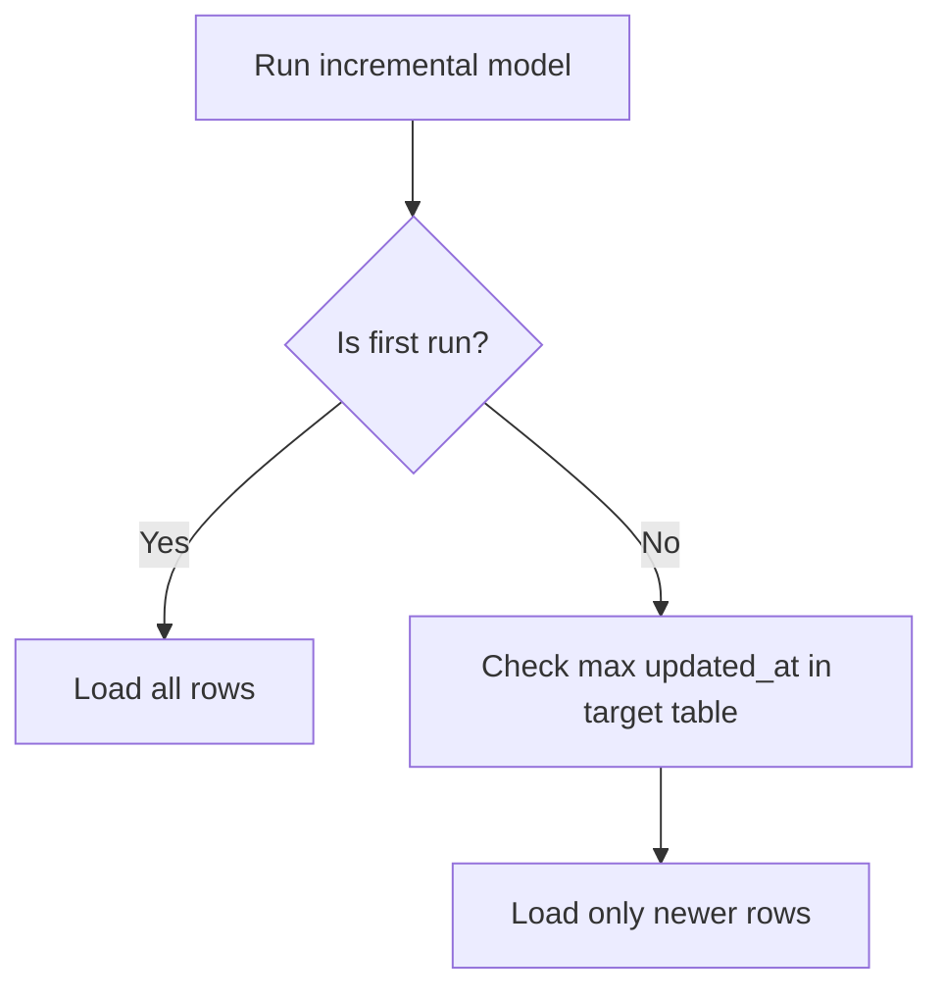
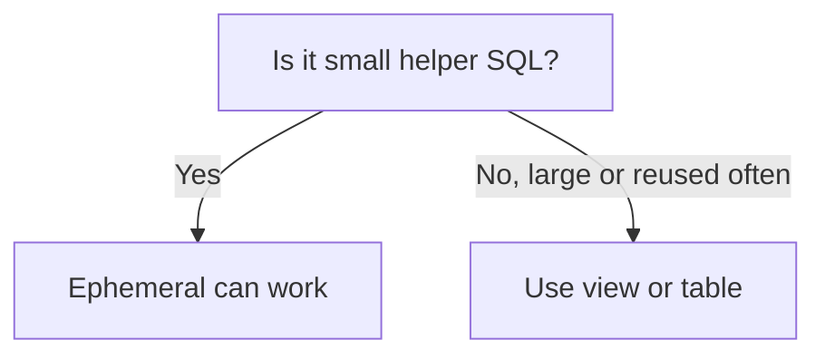
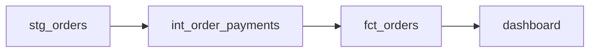
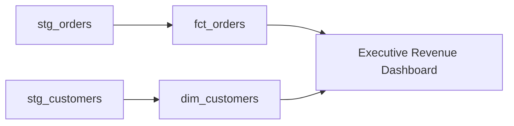
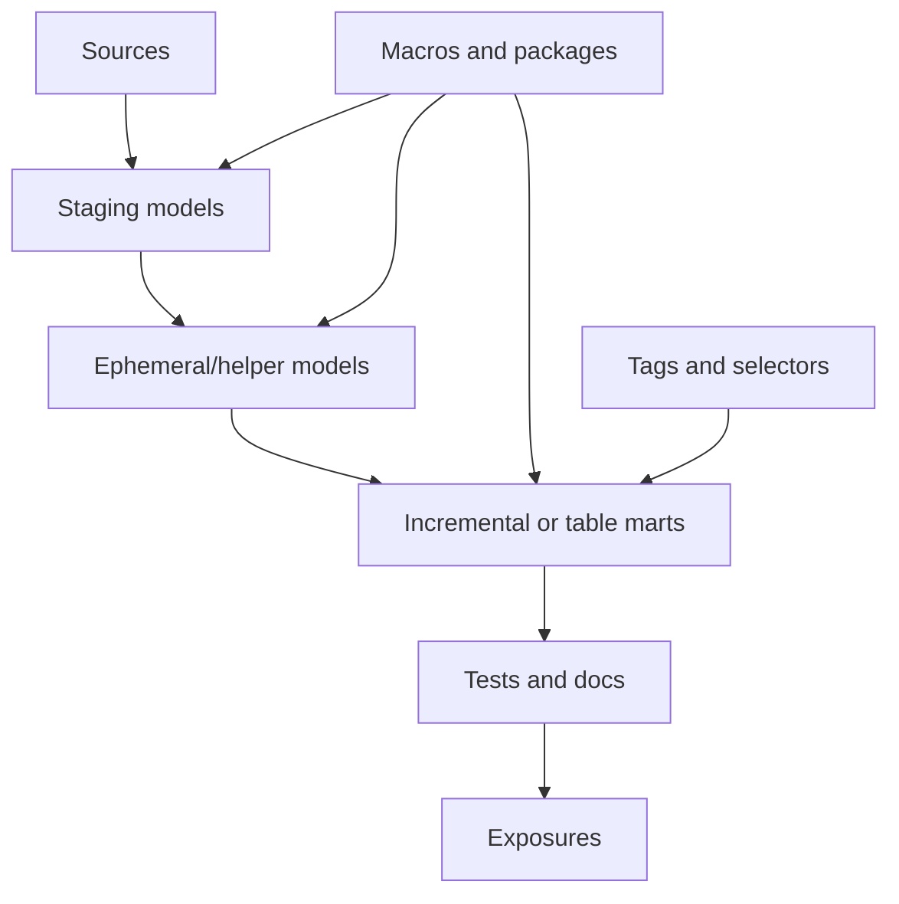
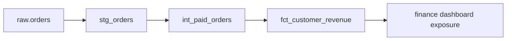

# Making Your dbt Project Job-Ready

At this point, you can build a small dbt project. Now the goal is to make your project **faster, cleaner, reusable, and easier to run in real work**.

This section covers:

| Topic                    | Why it matters                    |
| ------------------------ | --------------------------------- |
| Incremental models       | Process only new data             |
| `is_incremental()`       | Write logic for incremental runs  |
| Ephemeral models         | Use temporary helper logic        |
| Tags and selectors       | Run specific parts of the project |
| Dev / staging / prod     | Separate environments safely      |
| Packages and `dbt_utils` | Reuse community code              |
| Jinja basics             | Make SQL more dynamic             |
| Macros                   | Create reusable SQL logic         |
| Exposures                | Connect dbt models to dashboards  |
| Naming conventions       | Make the project professional     |

---

# 1. Incremental models: building only new data

Normally, when you run a table model, dbt rebuilds the full table.

That is fine for small data.

But imagine a table with:

|Table|Rows|
|---|--:|
|Orders|10 million|
|Events|500 million|
|Page views|2 billion|

Rebuilding everything every time can be slow and expensive.

An **incremental model** lets dbt process only new or changed rows after the first run. dbt’s incremental model materialization is designed to help transform large datasets efficiently by limiting the amount of data processed on later runs. ([dbt Developer Hub](https://docs.getdbt.com/docs/build/incremental-models?utm_source=chatgpt.com "Configure incremental models | dbt Developer Hub"))

---

## Normal table vs incremental table

|Type|What happens on each run|
|---|---|
|Table|Rebuilds everything|
|Incremental|Builds new/changed rows only|

---

## Example use case

You have raw orders:

|order_id|order_date|amount|
|--:|---|--:|
|1|2026-01-01|100|
|2|2026-01-02|50|
|3|2026-01-03|75|

First run:

```text
dbt builds all rows
```

Next day, new order arrives:

|order_id|order_date|amount|
|--:|---|--:|
|4|2026-01-04|200|

Second run:

```text
dbt only processes order_id = 4
```

---

## Basic incremental model

File:

```text
models/marts/fct_orders.sql
```

Code:

```sql
{{
    config(
        materialized='incremental',
        unique_key='order_id'
    )
}}

select
    order_id,
    customer_id,
    order_date,
    amount,
    updated_at
from {{ ref('stg_orders') }}
```

---

## Important config

|Config|Meaning|
|---|---|
|`materialized='incremental'`|Tell dbt this is incremental|
|`unique_key='order_id'`|Used to identify existing rows|
|`updated_at`|Often used to detect new/changed records|

---

## When to use incremental models

| Use incremental when         | Avoid incremental when    |
| ---------------------------- | ------------------------- |
| Table is large               | Table is small            |
| Data grows daily             | Logic changes often       |
| Full refresh is expensive    | Full rebuild is fast      |
| You have reliable timestamps | You cannot detect changes |

---

# 2. `is_incremental()`: different logic for first run and later runs

An incremental model needs to behave differently depending on the run.

|Run type|What should happen|
|---|---|
|First run|Build all rows|
|Later runs|Build only new/changed rows|

dbt provides `is_incremental()` to help you write this logic. It returns true only during an incremental run when the target table already exists and dbt is not running a full refresh. ([dbt Developer Hub](https://docs.getdbt.com/docs/build/incremental-models?utm_source=chatgpt.com "Configure incremental models | dbt Developer Hub"))

---

## Example with `is_incremental()`

```sql
{{
    config(
        materialized='incremental',
        unique_key='order_id'
    )
}}

select
    order_id,
    customer_id,
    order_date,
    amount,
    updated_at
from {{ ref('stg_orders') }}


where updated_at > (
    select max(updated_at)
    from {{ this }}
)

```

---

## What is `{{ this }}`?

`{{ this }}` means:

> The current model table in the warehouse.

So this part:

```sql
select max(updated_at)
from {{ this }}
```

means:

> Find the latest `updated_at` already loaded in this model.

---

## Flow



---

## Full refresh

Sometimes you want to rebuild everything from zero.

Use:

```bash
dbt run --select fct_orders --full-refresh
```

This ignores the incremental filter and rebuilds the full table.

---

## What to remember

| Concept            | Meaning                              |
| ------------------ | ------------------------------------ |
| `is_incremental()` | Checks if current run is incremental |
| `{{ this }}`       | Refers to current model table        |
| `--full-refresh`   | Rebuilds everything                  |
| `unique_key`       | Helps update existing rows           |

---

# 3. Ephemeral models: helper models that do not become tables

An **ephemeral model** is a dbt model that does not create a table or view in the warehouse.

Instead, dbt injects its SQL into the downstream model.

Think of it as:

> A reusable SQL helper.

---

## Example

File:

```text
models/intermediate/int_paid_orders.sql
```

```sql
{{ config(materialized='ephemeral') }}

select
    order_id,
    customer_id,
    amount
from {{ ref('stg_orders') }}
where status = 'paid'
```

Then use it:

```sql
select
    customer_id,
    sum(amount) as total_paid_amount
from {{ ref('int_paid_orders') }}
group by customer_id
```

dbt will not create `int_paid_orders` as a real table or view.

---

## When to use ephemeral

| Good for                | Not good for                   |
| ----------------------- | ------------------------------ |
| Small helper logic      | Large transformations          |
| Reused simple CTEs      | Expensive joins                |
| Keeping project clean   | Debugging in warehouse         |
| Avoiding too many views | Models used by many dashboards |

---

## Simple rule



---

# 4. Tags and selectors: running only what you need

As your project grows, you may not want to run everything every time.

You may want to run:

| Need                 | Example         |
| -------------------- | --------------- |
| Only finance models  | `finance`       |
| Only nightly models  | `nightly`       |
| Only models with PII | `contains_pii`  |
| Only one folder      | `marts.finance` |

dbt supports selecting resources using methods like model names, paths, tags, and graph operators. Tags can be configured in project files, YAML properties, or SQL files, and then used to run specific parts of a project. ([dbt Developer Hub](https://docs.getdbt.com/reference/node-selection/syntax?utm_source=chatgpt.com "Syntax overview | dbt Developer Hub"))

---

## Add tag in model SQL

```sql
{{ config(tags=['finance']) }}

select *
from {{ ref('stg_orders') }}
```

Run all finance-tagged models:

```bash
dbt run --select tag:finance
```

---

## Add tag in `dbt_project.yml`

```yaml
models:
  my_project:
    marts:
      finance:
        +tags: ['finance', 'nightly']
```

Run nightly models:

```bash
dbt build --select tag:nightly
```

---

## Useful selection examples

| Command                              | Meaning                |
| ------------------------------------ | ---------------------- |
| `dbt run --select stg_orders`        | Run one model          |
| `dbt run --select stg_orders+`       | Run model and children |
| `dbt run --select +fct_orders`       | Run parents and model  |
| `dbt run --select tag:finance`       | Run tagged models      |
| `dbt run --select path:models/marts` | Run folder             |
| `dbt run --exclude tag:slow`         | Skip slow models       |

---

## Selector graph symbols



| Selector               | Runs                                 |
| ---------------------- | ------------------------------------ |
| `int_order_payments`   | Only intermediate model              |
| `int_order_payments+`  | Intermediate + downstream            |
| `+int_order_payments`  | Upstream + intermediate              |
| `+int_order_payments+` | Upstream + intermediate + downstream |

---

# 5. Dev, staging, and production environments

In real projects, you should not develop directly in production.

You usually have:

|Environment|Purpose|
|---|---|
|Dev|Personal development|
|Staging|Testing before production|
|Prod|Trusted business data|

---

## Why environments matter

| Problem                           | Environment solution      |
| --------------------------------- | ------------------------- |
| Developer breaks a model          | It breaks only dev        |
| Need to test new logic            | Use staging               |
| Business users need stable tables | Use production            |
| Multiple developers work together | Each uses separate schema |

---

## Example `profiles.yml`

```yaml
my_profile:
  target: dev

  outputs:
    dev:
      type: postgres
      host: localhost
      user: dev_user
      password: dev_password
      dbname: analytics
      schema: dbt_dev
      threads: 4

    prod:
      type: postgres
      host: prod_host
      user: prod_user
      password: prod_password
      dbname: analytics
      schema: analytics_prod
      threads: 8
```

Run dev:

```bash
dbt build --target dev
```

Run production:

```bash
dbt build --target prod
```

---

## Better schema idea

For developers:

```text
dbt_sara
dbt_ahmed
dbt_mona
```

For production:

```text
analytics
```

This prevents people from overwriting each other’s work.

---

# 6. Packages and `dbt_utils`

A package is reusable dbt code.

Packages can share:

|Package content|Example|
|---|---|
|Macros|Reusable SQL functions|
|Models|Prebuilt transformations|
|Tests|Reusable validations|

dbt packages are commonly used to share models and macros across projects, and they can be public or private. ([dbt Developer Hub](https://docs.getdbt.com/docs/build/packages?utm_source=chatgpt.com "Packages | dbt Developer Hub"))

---

## Common package: `dbt_utils`

`dbt_utils` is one of the most common packages. It gives you useful macros and tests so you do not have to write everything from scratch.

Example uses:

| Macro/Test               | Use                         |
| ------------------------ | --------------------------- |
| `generate_surrogate_key` | Create stable unique keys   |
| `date_spine`             | Generate date tables        |
| `star`                   | Select many columns quickly |
| `accepted_range`         | Test numeric ranges         |

---

## Add a package

File:

```text
packages.yml
```

Example:

```yaml
packages:
  - package: dbt-labs/dbt_utils
    version: 1.3.0
```

Install:

```bash
dbt deps
```

Use:

```sql
select
    {{ dbt_utils.generate_surrogate_key(['customer_id', 'order_id']) }} as customer_order_key,
    customer_id,
    order_id
from {{ ref('stg_orders') }}
```

---

## What to remember

| Concept        | Meaning                |
| -------------- | ---------------------- |
| Package        | Reusable dbt code      |
| `packages.yml` | Defines packages       |
| `dbt deps`     | Installs packages      |
| `dbt_utils`    | Popular helper package |

---

# 7. Jinja basics: making SQL dynamic

dbt lets you combine SQL with **Jinja**, a templating language. This makes your SQL more dynamic and reusable. dbt’s docs describe Jinja as what turns a dbt project into a programming environment for SQL. ([dbt Developer Hub](https://docs.getdbt.com/docs/build/jinja-macros?utm_source=chatgpt.com "Jinja and macros | dbt Developer Hub"))

You already used Jinja here:

```sql
{{ ref('stg_orders') }}
```

and:

```sql
{{ source('raw', 'orders') }}
```

---

## Jinja expressions

Jinja expressions use:

```text
{{ ... }}
```

Example:

```sql
select *
from {{ ref('stg_orders') }}
```

---

## Jinja logic

Jinja logic uses:

```text

```

Example:

```sql

where updated_at > (select max(updated_at) from {{ this }})

```

---

## Jinja loop example

Instead of writing this manually:

```sql
sum(case when status = 'paid' then amount else 0 end) as paid_amount,
sum(case when status = 'cancelled' then amount else 0 end) as cancelled_amount,
sum(case when status = 'pending' then amount else 0 end) as pending_amount
```

You can write:

```sql


select
    customer_id,

    
    sum(case when status = '{{ status }}' then amount else 0 end) as {{ status }}_amount
    ,
    

from {{ ref('stg_orders') }}
group by customer_id
```

---

## What to remember

| Syntax          | Meaning              |
| --------------- | -------------------- |
| `{{ ... }}`     | Print value into SQL |
| ``     | Run logic            |
| `` | Create variable      |
| `` | Loop                 |
| ``  | Conditional logic    |

---

# 8. Macros: reusable SQL functions

A macro is reusable Jinja/SQL code.

Use macros when you repeat the same logic many times.

---

## Example problem

You often need to clean text:

```sql
lower(trim(email))
```

Instead of repeating it everywhere, create a macro.

File:

```text
macros/clean_text.sql
```

Code:

```sql

    lower(trim({{ column_name }}))

```

Use it:

```sql
select
    customer_id,
    {{ clean_text('email') }} as email
from {{ ref('stg_customers') }}
```

Compiled idea:

```sql
select
    customer_id,
    lower(trim(email)) as email
from analytics.stg_customers
```

---

## Another macro: cents to dollars

```sql

    round({{ column_name }} / 100.0, 2)

```

Use:

```sql
select
    order_id,
    {{ cents_to_dollars('amount_cents') }} as amount_usd
from {{ ref('stg_payments') }}
```

---

## When to create a macro

|Create macro when|Do not create macro when|
|---|---|
|Logic repeats many times|Logic appears once|
|Business rule is shared|SQL becomes harder to read|
|You need consistency|Simple SQL is clearer|
|Logic may change later|Macro hides important logic|

---

# 9. Exposures: connecting dbt to dashboards

An exposure tells dbt:

> “This dashboard, application, or report depends on these dbt models.”

Exposures define and describe downstream uses of your dbt project, such as dashboards, apps, or data science pipelines. They also help populate dbt documentation with context for data consumers. ([dbt Developer Hub](https://docs.getdbt.com/docs/build/exposures?utm_source=chatgpt.com "Add Exposures to your DAG | dbt Developer Hub"))

---

## Why exposures are useful

| Use case          | Example                                   |
| ----------------- | ----------------------------------------- |
| Dashboard lineage | Revenue dashboard depends on `fct_orders` |
| Impact analysis   | Before changing model, see who uses it    |
| Documentation     | Explain important business outputs        |
| Ownership         | Know who owns a dashboard                 |

---

## Example exposure

File:

```text
models/exposures.yml
```

Code:

```yaml
version: 2

exposures:
  - name: executive_revenue_dashboard
    label: Executive Revenue Dashboard
    type: dashboard
    maturity: high
    url: https://bi-tool.example.com/dashboard/123

    depends_on:
      - ref('fct_orders')
      - ref('dim_customers')

    owner:
      name: Analytics Team
      email: analytics@example.com
```

---

## Exposure flow



---

# 10. Naming conventions and clean structure

Professional dbt projects are easy to read.

Good naming helps everyone understand the project quickly.

---

## Recommended model prefixes

|Prefix|Meaning|Example|
|---|---|---|
|`stg_`|Staging model|`stg_orders`|
|`int_`|Intermediate model|`int_order_payments`|
|`fct_`|Fact table|`fct_orders`|
|`dim_`|Dimension table|`dim_customers`|
|`mart_`|Business mart|`mart_finance_revenue`|

---

## Good file organization

```text
models/
├── staging/
│   ├── sources.yml
│   ├── stg_orders.sql
│   ├── stg_customers.sql
│   └── schema.yml
│
├── intermediate/
│   └── int_order_payments.sql
│
└── marts/
    ├── finance/
    │   ├── fct_orders.sql
    │   └── schema.yml
    │
    └── marketing/
        ├── fct_campaign_performance.sql
        └── schema.yml
```

---

## SQL style tips

|Tip|Example|
|---|---|
|Use clear aliases|`customer_id`, not `cid`|
|Avoid `select *` in final models|Choose needed columns|
|Keep one model purpose|Do not mix many business questions|
|Use CTEs for readability|Break SQL into steps|
|Add tests to important columns|IDs, dates, statuses, amounts|

---

## Clean model example

```sql
with orders as (

    select *
    from {{ ref('stg_orders') }}

),

paid_orders as (

    select *
    from orders
    where status = 'paid'

),

final as (

    select
        customer_id,
        count(order_id) as total_paid_orders,
        sum(amount) as total_paid_amount
    from paid_orders
    group by customer_id

)

select *
from final
```

This structure is easy to read because each CTE has one purpose.

---

# Mini project: make the previous project job-ready

Now upgrade the previous customer revenue project.

## New goal

Build a reliable customer revenue mart that:

|Requirement|Feature|
|---|---|
|Handles growing orders table|Incremental model|
|Has reusable cleaning logic|Macro|
|Can run finance models only|Tags|
|Uses packages|`dbt_utils`|
|Tracks dashboard dependency|Exposure|
|Separates dev/prod|Targets|

---

## Project structure

```text
models/
├── staging/
│   ├── sources.yml
│   ├── stg_orders.sql
│   ├── stg_customers.sql
│   └── schema.yml
│
├── intermediate/
│   └── int_paid_orders.sql
│
└── marts/
    └── finance/
        ├── fct_customer_revenue.sql
        └── schema.yml

macros/
└── clean_text.sql

packages.yml
```

---

## `packages.yml`

```yaml
packages:
  - package: dbt-labs/dbt_utils
    version: 1.3.0
```

Install:

```bash
dbt deps
```

---

## Macro

File:

```text
macros/clean_text.sql
```

```sql

    lower(trim({{ column_name }}))

```

---

## Staging customers

```sql
select
    id as customer_id,
    {{ clean_text('email') }} as email,
    first_name,
    last_name,
    updated_at
from {{ source('raw', 'customers') }}
```

---

## Intermediate paid orders

```sql
{{ config(materialized='ephemeral') }}

select
    order_id,
    customer_id,
    order_date,
    amount,
    updated_at
from {{ ref('stg_orders') }}
where status = 'paid'
```

---

## Incremental finance model

```sql
{{
    config(
        materialized='incremental',
        unique_key='customer_id',
        tags=['finance', 'nightly']
    )
}}

select
    customer_id,
    count(order_id) as total_paid_orders,
    sum(amount) as total_paid_amount,
    max(updated_at) as last_order_updated_at
from {{ ref('int_paid_orders') }}


where updated_at > (
    select max(last_order_updated_at)
    from {{ this }}
)


group by customer_id
```

---

## Important warning

This example is good for learning, but customer-level incremental aggregations need careful design in real projects.

Why?

If customer `101` had old orders and then gets one new order, you need to make sure the final total includes **all** customer orders, not only the new order.

A safer beginner approach is:

|Model|Materialization|
|---|---|
|`int_paid_orders`|Incremental|
|`fct_customer_revenue`|Table|

So the raw event/order table is optimized, while the final aggregation is rebuilt cleanly.

---

## Safer version

```sql
{{ config(materialized='table', tags=['finance', 'nightly']) }}

select
    customer_id,
    count(order_id) as total_paid_orders,
    sum(amount) as total_paid_amount
from {{ ref('int_paid_orders') }}
group by customer_id
```

---

## Exposure

```yaml
version: 2

exposures:
  - name: finance_revenue_dashboard
    label: Finance Revenue Dashboard
    type: dashboard
    maturity: high

    depends_on:
      - ref('fct_customer_revenue')

    owner:
      name: Finance Analytics
      email: finance_analytics@example.com
```

---

## Useful commands

```bash
dbt deps
dbt build --select tag:finance
dbt build --select +fct_customer_revenue
dbt run --select fct_customer_revenue --full-refresh
dbt docs generate
dbt docs serve
```

---

# Final mental model



---

# Quick cheat sheet

| Feature            | Best use                          |
| ------------------ | --------------------------------- |
| Incremental model  | Large growing tables              |
| `is_incremental()` | Filter only new records           |
| `{{ this }}`       | Refer to current model table      |
| Ephemeral          | Small helper SQL                  |
| Tags               | Run grouped models                |
| Selectors          | Run model dependencies            |
| Targets            | Separate dev/prod                 |
| Packages           | Reuse dbt code                    |
| Jinja              | Dynamic SQL                       |
| Macros             | Reusable SQL logic                |
| Exposures          | Connect dashboards to dbt lineage |

---

# What to practice

Build this:



Add:

|Practice item|What to do|
|---|---|
|Incremental|Make `int_paid_orders` incremental|
|Macro|Clean email or text columns|
|Package|Install `dbt_utils`|
|Tag|Add `finance` and `nightly`|
|Selector|Run only finance models|
|Exposure|Add dashboard dependency|
|Target|Run once in dev and once in prod|

This section is what moves you from “I know dbt” to “I can work on a real dbt project.”