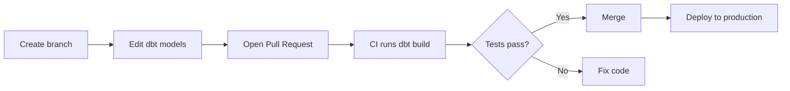
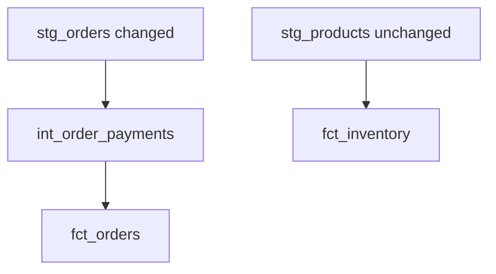
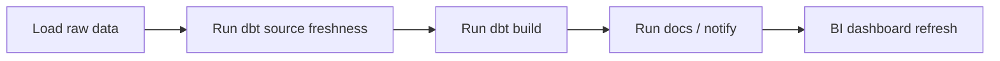
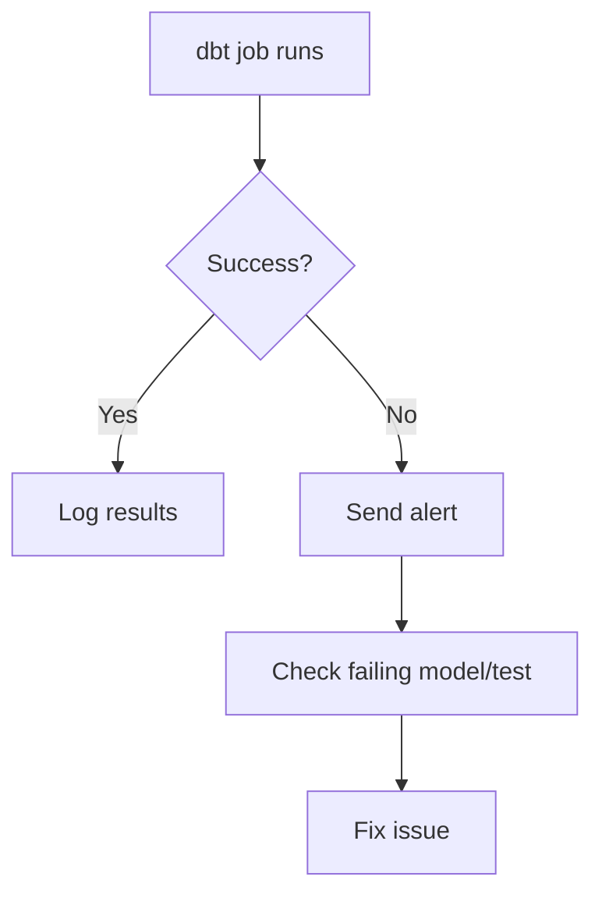
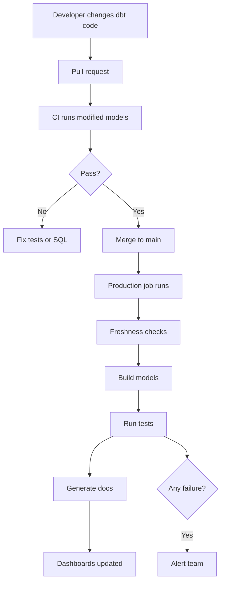
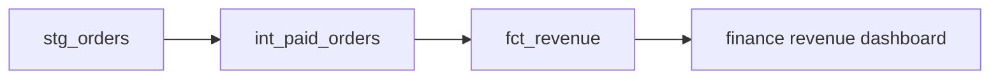

# Running dbt Like a Production Project

Now we move from “I can build models” to:

> “I can make dbt safe, tested, automated, monitored, and production-ready.”

This section is about how teams use dbt in real companies.

---

# 1. Data contracts: protecting model structure

A **data contract** defines what a model is allowed to return.

It answers:

|Question|Example|
|---|---|
|Which columns should exist?|`customer_id`, `email`, `lifetime_value`|
|What data type should each column have?|integer, string, numeric|
|Can some columns be constrained?|not null, primary key, etc.|

When contracts are enforced, dbt checks that the model output matches the columns and data types defined in YAML. ([dbt Developer Hub](https://docs.getdbt.com/reference/resource-configs/contract?utm_source=chatgpt.com "contract | dbt Developer Hub"))

---

## Why contracts matter

Without contracts, someone may change a model like this:

```sql
select
    customer_id,
    email,
    lifetime_value
from {{ ref('dim_customers') }}
```

to this:

```sql
select
    customer_id,
    lifetime_value
from {{ ref('dim_customers') }}
```

Now the `email` column is gone.

A dashboard, report, or downstream model may break.

A contract helps catch this before it becomes a production problem.

---

## Contract example

File:

```text
models/marts/schema.yml
```

Code:

```yaml
version: 2

models:
  - name: dim_customers
    config:
      contract:
        enforced: true

    columns:
      - name: customer_id
        data_type: integer
        constraints:
          - type: not_null

      - name: email
        data_type: varchar

      - name: lifetime_value
        data_type: numeric
```

---

## What to remember

|Concept|Meaning|
|---|---|
|Contract|Agreement about model columns and types|
|Best for|Important final models|
|Protects|Dashboards, reports, downstream models|
|Defined in|YAML|
|Enforced by|dbt during build|

---

# 2. Unit tests: testing SQL logic with small examples

Before, we used **data tests**.

Data tests check real data after a model is built.

Example:

```yaml
tests:
  - unique
  - not_null
```

But sometimes you want to test the **logic** of a model using tiny fake input data.

That is what **unit tests** do.

dbt unit tests validate SQL model logic with small static inputs before the full model is materialized in production. They are available from dbt v1.8 or dbt’s Latest release track. ([dbt Developer Hub](https://docs.getdbt.com/docs/build/unit-tests?utm_source=chatgpt.com "Unit tests | dbt Developer Hub"))

---

## Data test vs unit test

|Type|Checks|Example|
|---|---|---|
|Data test|Actual built data|`order_id` is not null|
|Unit test|SQL logic|paid orders are counted correctly|

---

## Example model

File:

```text
models/marts/fct_customer_revenue.sql
```

```sql
select
    customer_id,
    count(order_id) as total_orders,
    sum(amount) as total_amount
from {{ ref('stg_orders') }}
where status = 'paid'
group by customer_id
```

We want to test this logic:

> Only paid orders should be counted.

---

## Unit test example

```yaml
version: 2

unit_tests:
  - name: test_fct_customer_revenue_paid_only
    model: fct_customer_revenue

    given:
      - input: ref('stg_orders')
        rows:
          - {order_id: 1, customer_id: 101, status: 'paid', amount: 100}
          - {order_id: 2, customer_id: 101, status: 'cancelled', amount: 50}
          - {order_id: 3, customer_id: 102, status: 'paid', amount: 75}

    expect:
      rows:
        - {customer_id: 101, total_orders: 1, total_amount: 100}
        - {customer_id: 102, total_orders: 1, total_amount: 75}
```

Run:

```bash
dbt test --select fct_customer_revenue
```

---

## When to use unit tests

|Good use case|Example|
|---|---|
|Important business logic|Revenue calculation|
|Complex CASE logic|Customer segmentation|
|Bug prevention|Testing a fixed bug|
|Refactoring|Changing SQL safely|

---

## What to remember

|Concept|Meaning|
|---|---|
|Data test|Tests real data|
|Unit test|Tests model logic|
|Uses fake rows|Yes|
|Best for|Critical SQL rules|

---

# 3. CI/CD: testing dbt before production

In a professional team, you should not push dbt changes directly to production.

The usual workflow is:



---

## What is CI?

**CI = Continuous Integration**

It tests your code before merging.

In dbt, CI jobs can run when a pull request is opened or updated. dbt can build and test only modified assets and their downstream dependencies in a temporary staging schema. ([dbt Developer Hub](https://docs.getdbt.com/docs/deploy/continuous-integration?utm_source=chatgpt.com "Continuous integration in dbt | dbt Developer Hub - dbt Labs"))

---

## What is CD?

**CD = Continuous Deployment**

It deploys approved changes to production.

|Term|Meaning|
|---|---|
|CI|Test before merge|
|CD|Deploy after merge|

---

## Simple CI command

A common CI command is:

```bash
dbt build --select state:modified+
```

This means:

|Part|Meaning|
|---|---|
|`dbt build`|Build and test|
|`state:modified`|Only changed resources|
|`+`|Also include downstream dependencies|

dbt’s CI guide uses `dbt build --select state:modified+` as a preset command for CI jobs. ([dbt Developer Hub](https://docs.getdbt.com/guides/set-up-ci?utm_source=chatgpt.com "Get started with Continuous Integration tests | dbt Developer Hub"))

---

## Why not run everything?

For small projects, running everything is fine.

For large projects, it can be expensive.

| Project size   | CI strategy                          |
| -------------- | ------------------------------------ |
| Small          | `dbt build`                          |
| Medium / large | `dbt build --select state:modified+` |

---

# 4. Slim CI and state comparison

**Slim CI** means:

> Only run the dbt models affected by your change.

Example:

You changed:

```text
stg_orders
```

dbt should run:

```text
stg_orders
int_order_payments
fct_orders
```

But not unrelated models like:

```text
stg_products
fct_inventory
```

---

## Example graph



Slim CI runs the left side only.

---

## State comparison

State comparison lets dbt compare your current code to a previous production state.

It helps answer:

|Question|Meaning|
|---|---|
|What changed?|Modified models, tests, seeds|
|What depends on it?|Downstream models|
|What should CI run?|Only affected resources|

Advanced CI can also compare differences between production and pull-request changes, including data changes caused by code changes, depending on dbt account/features and platform support. ([dbt Developer Hub](https://docs.getdbt.com/docs/deploy/advanced-ci?utm_source=chatgpt.com "Advanced CI | dbt Developer Hub"))

---

## What to remember

|Concept|Meaning|
|---|---|
|Slim CI|Run only changed models and dependencies|
|State|Previous project metadata|
|`state:modified+`|Modified resources plus children|
|Benefit|Faster and cheaper CI|

---

# 5. Orchestration: running dbt automatically

In learning, you run dbt manually:

```bash
dbt build
```

In production, dbt runs automatically.

This is called **orchestration**.

---

## Common orchestrators

|Tool|Use|
|---|---|
|dbt Cloud jobs / dbt platform jobs|Native dbt scheduling|
|Airflow|Complex pipelines|
|Dagster|Data orchestration with assets|
|Prefect|Python-friendly workflows|
|Cron|Simple scheduled command|

---

## Example daily workflow



---

## Simple scheduled command

```bash
dbt source freshness
dbt build --select tag:nightly
```

---

## Good production order

|Step|Command|
|---|---|
|Install packages|`dbt deps`|
|Load seeds|`dbt seed`|
|Check sources|`dbt source freshness`|
|Build models and tests|`dbt build`|
|Generate docs|`dbt docs generate`|

---

# 6. Monitoring and alerting

A production dbt project needs monitoring.

You need to know:

|Question|Why|
|---|---|
|Did the job fail?|Models may be missing or stale|
|Did source freshness fail?|Raw data may be late|
|Did tests fail?|Data quality issue|
|Did runtime increase?|Performance or cost issue|
|Did row counts change suddenly?|Possible upstream issue|

---

## Common alerts

|Alert|Example|
|---|---|
|Job failed|`dbt build` failed|
|Freshness failed|`raw.orders` is older than 24 hours|
|Test failed|Duplicate `order_id` found|
|Runtime increased|Model went from 5 min to 40 min|
|Row count anomaly|Daily revenue table has 90% fewer rows|

---

## Monitoring flow



---

## What to monitor first

Start simple:

|Priority|Monitor|
|---|---|
|1|Job success/failure|
|2|Source freshness|
|3|Critical tests|
|4|Runtime|
|5|Row counts|

---

# 7. Performance optimization

As your dbt project grows, some models become slow.

Slow models usually happen because of:

|Cause|Example|
|---|---|
|Large full-refresh tables|Rebuilding billions of rows|
|Too many joins|Joining huge tables repeatedly|
|Bad materialization choice|Using view for expensive model|
|No filtering|Processing old data every run|
|Warehouse issues|Wrong clustering/partitioning|

---

## Optimization choices

|Problem|Fix|
|---|---|
|Large growing table|Use incremental model|
|Expensive dashboard query|Materialize as table|
|Repeated complex logic|Create intermediate table|
|Too many unused columns|Select only needed columns|
|Slow date filtering|Use partitions/clustering where supported|
|Huge dependency chain|Run only selected models|

---

## Example: bad pattern

```sql
select *
from {{ ref('very_large_events') }}
```

Better:

```sql
select
    event_id,
    user_id,
    event_type,
    event_timestamp
from {{ ref('very_large_events') }}
where event_timestamp >= current_date - interval '30 days'
```

---

## Materialization strategy

|Model type|Good default|
|---|---|
|Simple staging|View|
|Expensive staging|Table|
|Large event/order models|Incremental|
|Final dashboards|Table|
|Small helper CTE|Ephemeral|

---

# 8. Cost optimization

In cloud warehouses, performance and cost are connected.

Slow or repeated queries can cost money.

---

## Common cost problems

|Problem|Why expensive|
|---|---|
|Full rebuilding huge tables|Processes too much data|
|Running all models in CI|Unnecessary compute|
|Too many unused columns|Reads more data|
|Views over huge joins|Recalculates every query|
|No environment control|Dev work uses production resources|

---

## Cost-saving practices

|Practice|Why it helps|
|---|---|
|Use Slim CI|Run only changed models|
|Use incremental models|Process less data|
|Use tags/selectors|Run only needed areas|
|Avoid unnecessary `select *`|Read fewer columns|
|Separate dev/prod warehouses|Control compute|
|Materialize heavy logic|Avoid repeated recalculation|

---

# 9. Managing large dbt projects

Small projects are easy.

Large projects need rules.

---

## Large-project problems

|Problem|Example|
|---|---|
|Too many models|Hard to find the right one|
|Duplicate logic|Same revenue calculation in 5 places|
|Weak ownership|Nobody knows who owns a model|
|No tests|People do not trust the data|
|Poor naming|Model names are unclear|
|Slow CI|Pull requests take too long|

---

## Large-project practices

|Practice|Benefit|
|---|---|
|Clear folder structure|Easier navigation|
|Owners in YAML|Clear responsibility|
|Contracts on key models|Safer interfaces|
|Exposures|Know dashboard dependencies|
|Tags|Run domains separately|
|Model naming rules|Easy understanding|
|CI checks|Safer merges|
|Docs|Better onboarding|

---

## Example large structure

```text
models/
├── staging/
│   ├── salesforce/
│   ├── stripe/
│   └── shopify/
│
├── intermediate/
│   ├── finance/
│   └── marketing/
│
└── marts/
    ├── finance/
    │   ├── fct_revenue.sql
    │   ├── dim_customers.sql
    │   └── schema.yml
    │
    ├── marketing/
    │   ├── fct_campaign_performance.sql
    │   └── schema.yml
    │
    └── product/
        ├── fct_product_usage.sql
        └── schema.yml
```

---

# 10. Production checklist

Before a dbt model becomes production-ready, check this:

|Check|Question|
|---|---|
|Naming|Is the model name clear?|
|Layer|Is it in the correct folder?|
|Tests|Are key columns tested?|
|Docs|Does the model have descriptions?|
|Contract|Does it need a protected schema?|
|Materialization|Is view/table/incremental chosen correctly?|
|Performance|Is it efficient enough?|
|Ownership|Does someone own it?|
|Exposure|Is it used by a dashboard/report?|
|CI|Does it pass before merge?|

---

# Mini production example

Let’s upgrade a finance mart.

## Goal

Create a production-safe revenue model.

---

## Model

File:

```text
models/marts/finance/fct_revenue.sql
```

```sql
{{
    config(
        materialized='table',
        tags=['finance', 'nightly']
    )
}}

with paid_orders as (

    select
        order_id,
        customer_id,
        order_date,
        amount
    from {{ ref('int_paid_orders') }}

),

final as (

    select
        order_date,
        count(order_id) as total_orders,
        sum(amount) as revenue
    from paid_orders
    group by order_date

)

select *
from final
```

---

## Contract, tests, and docs

File:

```text
models/marts/finance/schema.yml
```

```yaml
version: 2

models:
  - name: fct_revenue
    description: Daily paid revenue summarized from paid orders.

    config:
      contract:
        enforced: true

    columns:
      - name: order_date
        data_type: date
        description: Date when the order was placed.
        tests:
          - not_null

      - name: total_orders
        data_type: integer
        description: Number of paid orders on this date.
        tests:
          - not_null

      - name: revenue
        data_type: numeric
        description: Total paid order amount for this date.
        tests:
          - not_null
          - not_negative
```

---

## Exposure

```yaml
version: 2

exposures:
  - name: finance_daily_revenue_dashboard
    label: Finance Daily Revenue Dashboard
    type: dashboard
    maturity: high

    depends_on:
      - ref('fct_revenue')

    owner:
      name: Finance Analytics
      email: finance_analytics@example.com
```

---

## CI command

```bash
dbt build --select state:modified+
```

---

## Production command

```bash
dbt deps
dbt source freshness
dbt build --select tag:nightly
dbt docs generate
```

---

# Final mental model



---

# Quick cheat sheet

|Topic|Main idea|
|---|---|
|Data contracts|Protect model columns and types|
|Unit tests|Test SQL logic with small examples|
|CI|Test changes before merge|
|CD|Deploy approved changes|
|Slim CI|Run only modified models and children|
|Orchestration|Schedule dbt automatically|
|Monitoring|Alert on failures or stale data|
|Performance|Make models faster|
|Cost optimization|Avoid unnecessary compute|
|Large projects|Use ownership, docs, tags, contracts|

---

# What to practice

Build one production-style model with:

|Item|Practice|
|---|---|
|Contract|Enforce column names and types|
|Unit test|Test one business logic rule|
|Data tests|Add `not_null`, `unique`, or custom tests|
|Tags|Add `finance` and `nightly`|
|Exposure|Connect it to a dashboard|
|CI command|Practice `state:modified+`|
|Monitoring idea|Define what should alert|

A good practice target:



This is the point where your dbt project starts to look like something a real data team can trust.