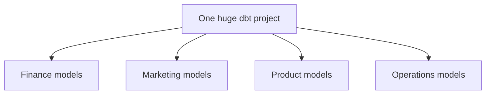
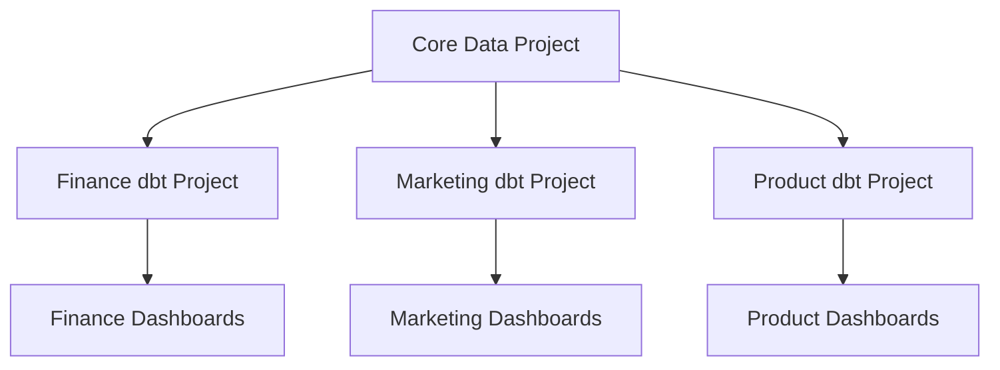
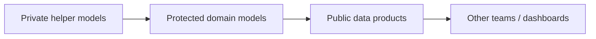
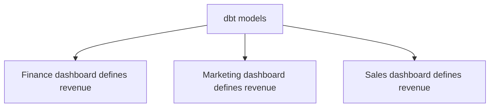
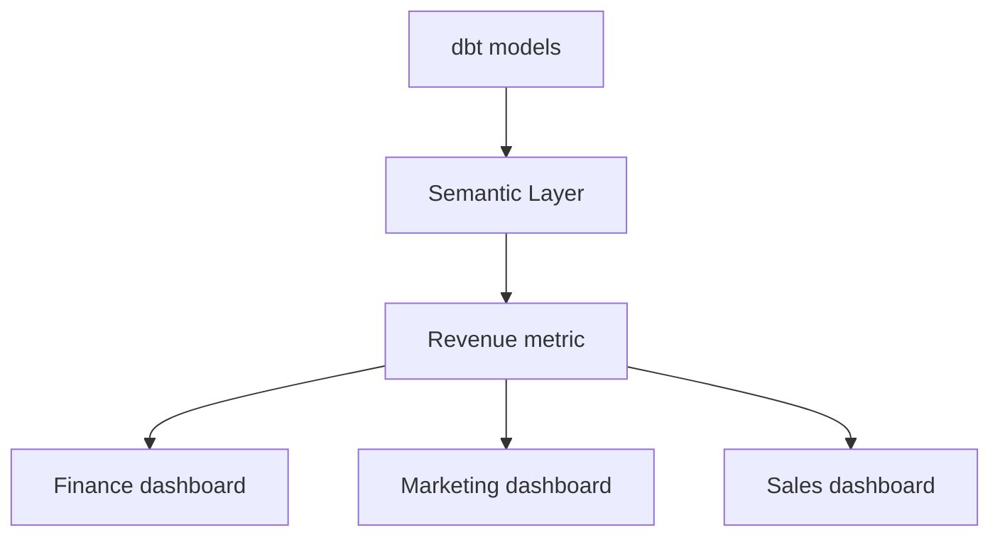
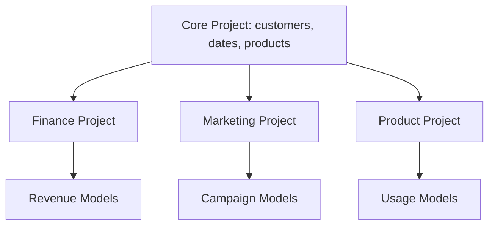
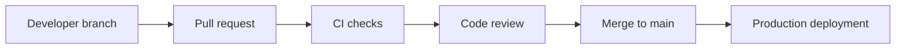
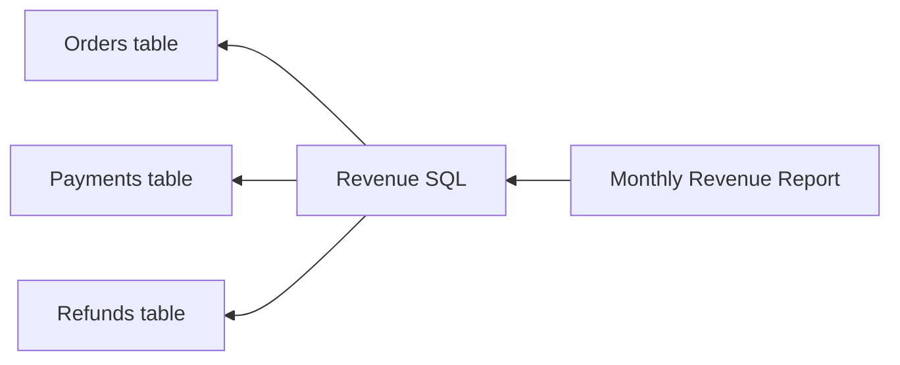
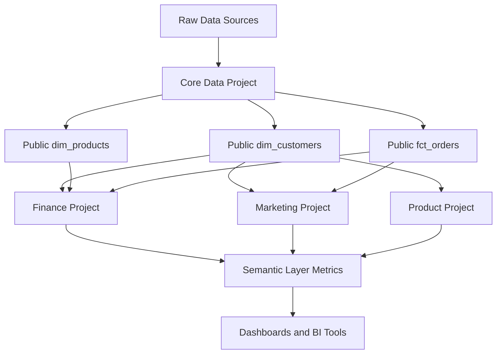
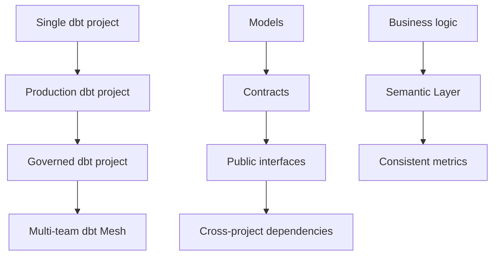

# Designing dbt for Teams and Bigger Systems

Now we move from production dbt to **advanced dbt architecture**.

The goal here is not only to build models, but to design a dbt system that can work for:

|Situation|Example|
|---|---|
|Multiple teams|Finance, marketing, product, operations|
|Many models|Hundreds or thousands of dbt models|
|Shared business metrics|Revenue, churn, active users|
|Sensitive data|Emails, phone numbers, salaries|
|Long-term maintainability|Clear ownership and stable interfaces|

---

# 1. dbt Mesh: splitting one big project into owned projects

When a company starts with dbt, it often has one project:

```text
company_dbt_project/
```

At first, this is fine.

But later, the project may grow:

```text
models/
├── finance/
├── marketing/
├── product/
├── sales/
├── operations/
├── support/
└── data_science/
```

Now the problem is:

|Problem|Example|
|---|---|
|Too many owners|Nobody knows who owns what|
|Too many models|Hard to navigate|
|Slow development|Any change affects many teams|
|Broken dependencies|One team changes a model used by another|
|Weak governance|Private logic becomes accidentally reused|

**dbt Mesh** helps solve this by splitting a large dbt setup into multiple connected dbt projects. dbt describes Mesh as a framework for scaling teams and data assets by breaking large projects into manageable sections with governance practices. ([dbt Developer Hub](https://docs.getdbt.com/guides/mesh-qs?utm_source=chatgpt.com "Quickstart with dbt Mesh | dbt Developer Hub - dbt Labs"))

---

## Before Mesh: one monolithic project



---

## With Mesh: multiple connected projects



---

## Simple idea

Instead of:

> One team owns one huge dbt project.

You move toward:

> Each domain owns its own dbt project and publishes trusted models for others.

---

## Example ownership

|Project|Owner|Publishes|
|---|---|---|
|`core_data`|Data platform team|`dim_customers`, `dim_dates`|
|`finance_analytics`|Finance data team|`fct_revenue`, `fct_refunds`|
|`marketing_analytics`|Marketing data team|`fct_campaign_performance`|
|`product_analytics`|Product data team|`fct_user_events`|

---

## What to remember

|Concept|Meaning|
|---|---|
|dbt Mesh|Multi-project dbt architecture|
|Best for|Large teams and large projects|
|Main benefit|Ownership and scalability|
|Not needed for|Small beginner projects|

---

# 2. Public, protected, and private models

In bigger projects, not every model should be used by everyone.

Some models are final and stable.

Some are internal helper models.

Some are still changing.

dbt model governance uses access settings to control who can reference models, and dbt’s model access docs explain that users outside a project can depend on public models but not private implementation details. ([dbt Developer Hub](https://docs.getdbt.com/docs/mesh/govern/model-access?utm_source=chatgpt.com "Model access | dbt Developer Hub"))

---

## Access levels

|Access level|Meaning|Example|
|---|---|---|
|Private|Internal to one project/group|`int_order_payment_cleanup`|
|Protected|Shared carefully inside a boundary|`dim_customers_enriched`|
|Public|Stable interface for other projects|`fct_revenue`|

---

## Example

```yaml
version: 2

models:
  - name: fct_revenue
    access: public
    description: Trusted revenue fact table used by finance and executive dashboards.

  - name: int_revenue_adjustments
    access: private
    description: Internal helper model for revenue calculation.
```

---

## Mental model



---

## Good rule

|Model type|Recommended access|
|---|---|
|Staging model|Private|
|Intermediate model|Private|
|Final mart used inside team|Protected|
|Final mart used by other teams|Public|

---

# 3. Groups and ownership

A **group** is a collection of dbt nodes with a shared owner. dbt groups help organize the DAG and support intentional collaboration across teams. ([dbt Developer Hub](https://docs.getdbt.com/docs/build/groups?utm_source=chatgpt.com "Add groups to your DAG | dbt Developer Hub"))

This matters because in professional projects, every important model should have an owner.

---

## Example group file

```yaml
version: 2

groups:
  - name: finance
    owner:
      name: Finance Analytics
      email: finance_analytics@example.com

  - name: marketing
    owner:
      name: Marketing Analytics
      email: marketing_analytics@example.com
```

---

## Assign model to a group

```yaml
version: 2

models:
  - name: fct_revenue
    group: finance
    access: public
    description: Daily revenue fact table.
```

---

## Why groups help

|Without groups|With groups|
|---|---|
|Unknown owner|Clear owner|
|Hard to ask questions|Contact responsible team|
|Hard to govern access|Access tied to ownership|
|Messy project|Organized by domain|

---

# 4. Semantic Layer and metrics

A big problem in companies is that different teams define the same metric differently.

Example: **Revenue**

|Team|Revenue definition|
|---|---|
|Finance|Paid orders minus refunds|
|Marketing|Paid orders before refunds|
|Sales|Closed-won contract value|
|Product|Revenue from active users|

Now dashboards disagree.

The **dbt Semantic Layer** helps by centralizing metric definitions in dbt, so downstream tools can use the same metric logic. dbt’s Semantic Layer is powered by MetricFlow and is designed to define critical business metrics like revenue in the modeling layer. ([dbt Developer Hub](https://docs.getdbt.com/docs/use-dbt-semantic-layer/dbt-sl?utm_source=chatgpt.com "dbt Semantic Layer | dbt Developer Hub - dbt Labs"))

---

## Without Semantic Layer



Problem:

```text
Three dashboards. Three revenue numbers.
```

---

## With Semantic Layer



Result:

```text
One metric definition. Many tools use it.
```

---

## Important pieces

|Piece|Meaning|
|---|---|
|Semantic model|Describes entities, dimensions, and measures|
|Entity|Business object, like customer or order|
|Dimension|Attribute, like order date or country|
|Measure|Aggregation base, like sum of amount|
|Metric|Business definition, like revenue|

MetricFlow uses semantic models and metrics to avoid duplicate coding and keep company metrics consistent for data consumers. ([dbt Developer Hub](https://docs.getdbt.com/docs/build/build-metrics-intro?utm_source=chatgpt.com "Build your metrics | dbt Developer Hub"))

---

## Example semantic model

```yaml
semantic_models:
  - name: orders
    model: ref('fct_orders')

    entities:
      - name: order_id
        type: primary

      - name: customer_id
        type: foreign

    dimensions:
      - name: order_date
        type: time
        type_params:
          time_granularity: day

    measures:
      - name: order_amount
        agg: sum
        expr: amount
```

---

## Example metric

```yaml
metrics:
  - name: revenue
    description: Total paid order amount.
    type: simple
    label: Revenue

    type_params:
      measure: order_amount
```

---

## What to remember

|Concept|Meaning|
|---|---|
|Semantic Layer|Central place for metric logic|
|Metric|Business calculation|
|Measure|Aggregation input|
|Dimension|Way to slice the metric|
|Benefit|Consistent numbers across tools|

---

# 5. Governance: keeping dbt safe and trusted

Governance means creating rules so your dbt project stays reliable.

This includes:

|Governance area|Example|
|---|---|
|Ownership|Every important model has an owner|
|Access|Only public models are shared|
|Contracts|Final models have stable columns|
|Tests|Key assumptions are validated|
|Documentation|Users understand tables|
|Reviews|Changes go through pull requests|
|Monitoring|Failures trigger alerts|

dbt notes that governance features such as model access, contracts, and versions can strengthen trust and stability, but they should be introduced when the project is mature enough because they add structure and maintenance. ([dbt Developer Hub](https://docs.getdbt.com/docs/mesh/govern/about-model-governance?utm_source=chatgpt.com "About model governance | dbt Developer Hub"))

---

## Governance maturity

|Level|What it looks like|
|---|---|
|Beginner|Models exist, few tests|
|Developing|Tests and docs added|
|Professional|CI/CD, owners, exposures|
|Advanced|Contracts, access, versions, mesh|
|Mature|Data products and semantic metrics|

---

## Governance checklist

|Check|Good question|
|---|---|
|Owner|Who is responsible for this model?|
|Access|Should other teams use this model?|
|Contract|Can columns change safely?|
|Tests|Are important assumptions checked?|
|Docs|Can a business user understand it?|
|Exposure|What dashboard/report depends on it?|

---

# 6. Multi-team project structure

There is no single perfect structure.

But the idea is:

> Organize dbt around domains and ownership.

dbt’s project-structure guide emphasizes that structure matters because analytics engineering is about helping groups collaborate on better decisions at scale. ([dbt Developer Hub](https://docs.getdbt.com/best-practices/how-we-structure/1-guide-overview?utm_source=chatgpt.com "How we structure our dbt projects | dbt Developer Hub - dbt Labs"))

---

## Small company structure

One project is usually enough:

```text
models/
├── staging/
├── intermediate/
└── marts/
    ├── finance/
    ├── marketing/
    └── product/
```

---

## Bigger company structure

Multiple projects may be better:

```text
core_data_project/
finance_dbt_project/
marketing_dbt_project/
product_dbt_project/
```

---

## Choosing the structure

|Situation|Better structure|
|---|---|
|Small team|One dbt project|
|One central analytics team|One project with domains|
|Many independent data teams|Multiple projects|
|Strong domain ownership|dbt Mesh|
|Shared core models|Core project + domain projects|

---

## Example Mesh structure



---

# 7. Model versioning

Sometimes a public model needs to change.

Example:

Current public model:

```text
fct_revenue
```

Columns:

```text
order_date
revenue
```

New requirement:

```text
revenue should exclude refunds
```

If you change it directly, dashboards may suddenly show different numbers.

A safer approach is versioning.

---

## Simple versioning idea

|Version|Meaning|
|---|---|
|`v1`|Old revenue logic|
|`v2`|New revenue logic|

---

## Example YAML

```yaml
version: 2

models:
  - name: fct_revenue
    latest_version: 2

    versions:
      - v: 1
        config:
          alias: fct_revenue_v1

      - v: 2
        config:
          alias: fct_revenue_v2
```

---

## Why versioning helps

|Without versioning|With versioning|
|---|---|
|Breaking changes happen suddenly|Teams migrate safely|
|Dashboards may break|Old version still exists|
|Hard to communicate changes|Clear upgrade path|
|Risky public models|Stable public interface|

---

# 8. Access control and sensitive data

Not all data should be available to everyone.

Examples of sensitive data:

|Data type|Example|
|---|---|
|PII|Email, phone number, address|
|Financial|Salary, bank details|
|Health|Medical information|
|Security|Login history, IP addresses|

---

## dbt-side practices

dbt is not a replacement for warehouse security, but it helps organize sensitive logic.

|Practice|Example|
|---|---|
|Separate sensitive models|`models/marts/hr/`|
|Tag sensitive models|`tags: ['pii']`|
|Mask columns|Hash email|
|Limit public models|Do not expose raw PII|
|Document sensitivity|Column descriptions|
|Use warehouse permissions|Grant access carefully|

---

## Example PII tag

```yaml
models:
  - name: dim_customers
    config:
      tags: ['pii']
    columns:
      - name: email
        description: Customer email address. Contains PII.
```

Run only PII-tagged models:

```bash
dbt ls --select tag:pii
```

---

## Hashing example

```sql
select
    customer_id,
    md5(lower(trim(email))) as email_hash,
    country
from {{ ref('stg_customers') }}
```

---

## Good rule

|Model|Should contain PII?|
|---|---|
|Raw source|Maybe|
|Staging|Maybe, controlled|
|Intermediate|Avoid if not needed|
|Public marts|Usually no|
|Dashboards|Only if required|

---

# 9. Deployment strategy

Deployment is how code moves from development to production.

A professional flow looks like this:



---

## Environment strategy

|Environment|Purpose|
|---|---|
|Dev|Personal work|
|CI|Temporary test builds|
|Staging|Pre-production validation|
|Prod|Trusted business data|

---

## Safe deployment checklist

|Step|Purpose|
|---|---|
|Create branch|Isolate work|
|Run locally|Catch simple errors|
|Open PR|Review changes|
|CI build|Test automatically|
|Use Slim CI|Save time and cost|
|Merge|Approve change|
|Production job|Build trusted models|
|Monitor|Catch failures|

---

# 10. Migrating legacy SQL into dbt

Many companies already have old SQL scripts before dbt.

Examples:

|Legacy source|Problem|
|---|---|
|Stored procedures|Hard to test|
|BI tool SQL|Logic hidden in dashboards|
|Excel exports|Manual and risky|
|Long SQL files|Hard to maintain|
|Cron scripts|Weak documentation|

---

## Migration approach

Do not migrate everything at once.

Start with one important business output.

Example:

```text
Monthly Revenue Report
```

Then trace backwards:



---

## Migration steps

|Step|What to do|
|---|---|
|1|Pick one important report|
|2|Find its SQL logic|
|3|Identify raw inputs|
|4|Create staging models|
|5|Create intermediate logic|
|6|Create final mart|
|7|Add tests|
|8|Compare old vs new results|
|9|Switch dashboard to dbt model|
|10|Retire old SQL|

---

## Example migration structure

```text
models/
├── staging/
│   ├── stg_orders.sql
│   ├── stg_payments.sql
│   └── stg_refunds.sql
│
├── intermediate/
│   └── int_net_revenue.sql
│
└── marts/
    └── finance/
        └── fct_monthly_revenue.sql
```

---

# 11. Advanced architecture mini example

Let’s design a company-level dbt architecture.

## Company situation

An e-commerce company has:

|Team|Needs|
|---|---|
|Core data|Clean customers, orders, products|
|Finance|Revenue, refunds, profit|
|Marketing|Campaign performance|
|Product|User behavior|
|Executives|Trusted company metrics|

---

## Architecture



---

## Example public model

```yaml
version: 2

models:
  - name: fct_orders
    group: core
    access: public
    description: Trusted order fact table shared across teams.

    config:
      contract:
        enforced: true

    columns:
      - name: order_id
        data_type: integer
        tests:
          - unique
          - not_null

      - name: customer_id
        data_type: integer
        tests:
          - not_null

      - name: order_amount
        data_type: numeric
```

---

## Example finance metric

```yaml
metrics:
  - name: gross_revenue
    description: Total order revenue before refunds.
    type: simple
    label: Gross Revenue

    type_params:
      measure: order_amount
```

---

# Final mental model



---

# Quick cheat sheet

|Topic|Main idea|
|---|---|
|dbt Mesh|Multiple connected dbt projects|
|Public models|Stable models other teams can use|
|Private models|Internal helper logic|
|Groups|Ownership inside dbt|
|Semantic Layer|Central metric definitions|
|Governance|Rules for trust and stability|
|Model versioning|Safe changes to public models|
|Access control|Protect sensitive data|
|Deployment strategy|Move safely from dev to prod|
|Legacy migration|Convert old SQL into clean dbt models|

---

# What to practice

Design this on paper first:

```text
Core Project
Finance Project
Marketing Project
Product Project
```

Then define:

|Item|Practice|
|---|---|
|Public models|`dim_customers`, `fct_orders`|
|Private models|`int_order_cleanup`|
|Groups|`core`, `finance`, `marketing`|
|Contracts|Add to public models|
|Metrics|Define `revenue`|
|Access|Mark stable shared models as public|
|PII|Tag sensitive models|
|Migration|Convert one old SQL report|

This is the point where you stop thinking only as a dbt developer and start thinking like a **data platform / analytics architecture designer**.