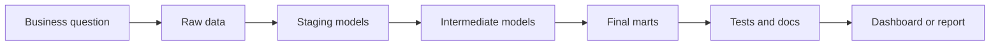
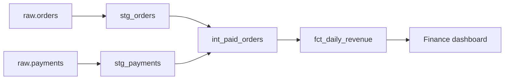
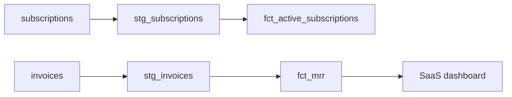
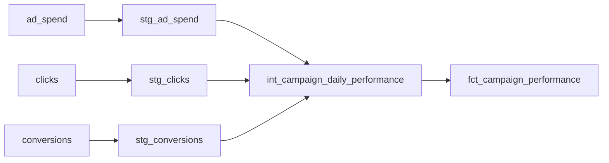
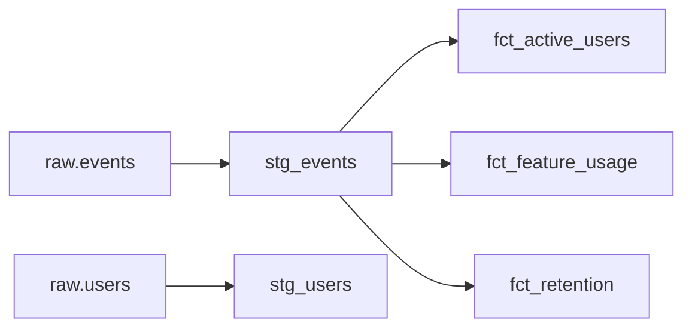
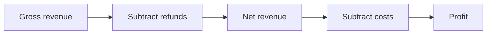
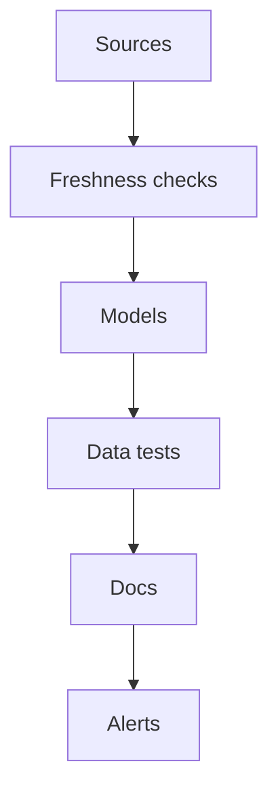
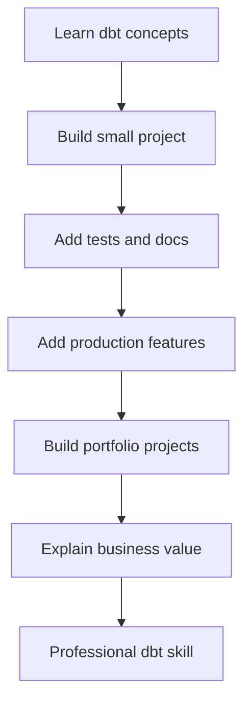

# Practicing dbt Through Real Projects

Now we move from learning concepts to building experience.

This is where you become stronger, because dbt is best learned by building real analytics projects.

The goal is:

> Build small projects that feel like real company work.

You do not need huge projects. You need focused projects that practice the right skills.

---

# 1. How to practice dbt the right way

Do not practice by only reading.

Practice like this:



Every dbt project should start with a business question.

Examples:

|Weak practice|Better practice|
|---|---|
|“I will create random models”|“I will calculate daily revenue”|
|“I will test dbt commands”|“I will validate order IDs and payment amounts”|
|“I will build tables”|“I will create a trusted finance mart”|

---

# 2. Project idea: E-commerce analytics

This is the best first real project.

## Business questions

|Question|Final model|
|---|---|
|How much revenue did we make daily?|`fct_daily_revenue`|
|Who are our best customers?|`dim_customers`|
|Which products sell most?|`fct_product_sales`|
|How many orders are cancelled?|`fct_orders`|

---

## Source tables

|Source table|Meaning|
|---|---|
|`raw.orders`|Order records|
|`raw.customers`|Customer data|
|`raw.payments`|Payment transactions|
|`raw.products`|Product catalog|
|`raw.order_items`|Items inside each order|

---

## Project structure

```text
models/
├── staging/
│   ├── sources.yml
│   ├── stg_orders.sql
│   ├── stg_customers.sql
│   ├── stg_payments.sql
│   ├── stg_products.sql
│   ├── stg_order_items.sql
│   └── schema.yml
│
├── intermediate/
│   ├── int_paid_orders.sql
│   └── int_order_items_enriched.sql
│
└── marts/
    ├── finance/
    │   ├── fct_daily_revenue.sql
    │   └── schema.yml
    │
    └── sales/
        ├── dim_customers.sql
        ├── fct_product_sales.sql
        └── schema.yml
```

---

## Example source definition

```yaml
version: 2

sources:
  - name: raw
    schema: raw

    tables:
      - name: orders
      - name: customers
      - name: payments
      - name: products
      - name: order_items
```

---

## Staging example

File:

```text
models/staging/stg_orders.sql
```

```sql
select
    id as order_id,
    customer_id,
    cast(order_date as date) as order_date,
    lower(status) as order_status,
    updated_at
from {{ source('raw', 'orders') }}
```

File:

```text
models/staging/stg_payments.sql
```

```sql
select
    id as payment_id,
    order_id,
    lower(payment_status) as payment_status,
    amount as payment_amount,
    payment_date
from {{ source('raw', 'payments') }}
```

---

## Intermediate model

File:

```text
models/intermediate/int_paid_orders.sql
```

```sql
with orders as (

    select *
    from {{ ref('stg_orders') }}

),

payments as (

    select *
    from {{ ref('stg_payments') }}

),

paid_orders as (

    select
        orders.order_id,
        orders.customer_id,
        orders.order_date,
        payments.payment_amount
    from orders
    inner join payments
        on orders.order_id = payments.order_id
    where orders.order_status = 'paid'
      and payments.payment_status = 'successful'

)

select *
from paid_orders
```

---

## Final revenue model

File:

```text
models/marts/finance/fct_daily_revenue.sql
```

```sql
{{ config(materialized='table', tags=['finance', 'daily']) }}

select
    order_date,
    count(order_id) as total_orders,
    sum(payment_amount) as revenue
from {{ ref('int_paid_orders') }}
group by order_date
```

---

## Tests and documentation

```yaml
version: 2

models:
  - name: fct_daily_revenue
    description: Daily revenue from successful paid orders.

    columns:
      - name: order_date
        description: Date of the order.
        tests:
          - not_null
          - unique

      - name: total_orders
        description: Number of successful paid orders.

      - name: revenue
        description: Total successful payment amount for the day.
        tests:
          - not_null
          - not_negative
```

---

## Project flow



---

## What this project teaches

|Skill|Practiced through|
|---|---|
|Sources|Raw e-commerce tables|
|Staging|Cleaning orders/payments|
|Intermediate models|Joining orders and payments|
|Marts|Revenue and customer models|
|Tests|IDs, dates, amounts|
|Tags|Finance/daily runs|
|Docs|Business descriptions|

---

# 3. Project idea: Subscription SaaS analytics

This project is excellent for learning recurring revenue logic.

## Business questions

|Question|Final model|
|---|---|
|What is monthly recurring revenue?|`fct_mrr`|
|Which customers churned?|`fct_churn`|
|How many active subscriptions do we have?|`fct_active_subscriptions`|
|What is expansion revenue?|`fct_mrr_movements`|

---

## Source tables

|Source table|Meaning|
|---|---|
|`raw.customers`|Customer records|
|`raw.subscriptions`|Subscription contracts|
|`raw.invoices`|Billing records|
|`raw.plans`|Plan definitions|
|`raw.payments`|Payment transactions|

---

## Important SaaS metrics

|Metric|Meaning|
|---|---|
|MRR|Monthly recurring revenue|
|Churn|Customers or revenue lost|
|Expansion|Customers paying more|
|Contraction|Customers paying less|
|Active customers|Customers with active subscription|

---

## Example model: active subscriptions

```sql
select
    subscription_id,
    customer_id,
    plan_id,
    start_date,
    end_date,
    monthly_amount
from {{ ref('stg_subscriptions') }}
where status = 'active'
```

---

## Example model: monthly MRR

```sql
select
    date_trunc('month', invoice_date) as month,
    sum(invoice_amount) as mrr
from {{ ref('stg_invoices') }}
where invoice_status = 'paid'
group by 1
```

---

## Flow



---

## What this project teaches

|Skill|Practiced through|
|---|---|
|Date logic|Monthly metrics|
|Business rules|Active/churned definitions|
|Intermediate models|Subscription status logic|
|Testing|Valid dates and amounts|
|Documentation|Metric definitions|

---

# 4. Project idea: Marketing analytics

This project teaches campaign and cost analysis.

## Business questions

|Question|Final model|
|---|---|
|Which campaigns drive most revenue?|`fct_campaign_revenue`|
|What is cost per acquisition?|`fct_campaign_performance`|
|Which channel performs best?|`dim_campaigns`|
|What is ROAS?|`fct_marketing_roas`|

---

## Source tables

|Source table|Meaning|
|---|---|
|`raw.ad_spend`|Spend by campaign|
|`raw.campaigns`|Campaign metadata|
|`raw.clicks`|Ad clicks|
|`raw.conversions`|Leads or purchases|
|`raw.orders`|Revenue from customers|

---

## Important metrics

|Metric|Meaning|
|---|---|
|CAC|Customer acquisition cost|
|CPA|Cost per acquisition|
|ROAS|Revenue / ad spend|
|CTR|Clicks / impressions|
|Conversion rate|Conversions / clicks|

---

## Example model

```sql
select
    campaign_id,
    campaign_date,
    sum(spend) as total_spend,
    sum(clicks) as total_clicks,
    sum(conversions) as total_conversions,
    sum(revenue) as total_revenue,
    sum(revenue) / nullif(sum(spend), 0) as roas
from {{ ref('int_campaign_daily_performance') }}
group by
    campaign_id,
    campaign_date
```

---

## Flow



---

## What this project teaches

|Skill|Practiced through|
|---|---|
|Aggregation|Campaign daily performance|
|Metrics|ROAS, CPA, conversion rate|
|Joins|Spend + clicks + conversions|
|Testing|No negative spend, valid campaigns|
|Docs|Metric definitions|

---

# 5. Project idea: Product analytics

This project teaches event data, user behavior, and retention.

## Business questions

|Question|Final model|
|---|---|
|How many active users do we have?|`fct_active_users`|
|What features are used most?|`fct_feature_usage`|
|What is user retention?|`fct_retention`|
|What is the conversion funnel?|`fct_user_funnel`|

---

## Source tables

|Source table|Meaning|
|---|---|
|`raw.events`|User activity events|
|`raw.users`|User records|
|`raw.sessions`|User sessions|
|`raw.features`|Feature metadata|

---

## Important product metrics

|Metric|Meaning|
|---|---|
|DAU|Daily active users|
|WAU|Weekly active users|
|MAU|Monthly active users|
|Retention|Users returning after signup|
|Funnel conversion|Users completing a path|

---

## Example event staging

```sql
select
    event_id,
    user_id,
    lower(event_name) as event_name,
    cast(event_timestamp as timestamp) as event_timestamp,
    session_id
from {{ source('raw', 'events') }}
```

---

## Example active users model

```sql
select
    cast(event_timestamp as date) as activity_date,
    count(distinct user_id) as daily_active_users
from {{ ref('stg_events') }}
group by 1
```

---

## Flow



---

## What this project teaches

|Skill|Practiced through|
|---|---|
|Large data|Event tables|
|Incremental models|Growing event data|
|Date logic|DAU, WAU, MAU|
|Funnels|Step-by-step user behavior|
|Performance|Avoid expensive full rebuilds|

---

# 6. Project idea: Finance reporting

This is a good advanced practical project because finance data needs high trust.

## Business questions

|Question|Final model|
|---|---|
|What is daily revenue?|`fct_daily_revenue`|
|What is net revenue?|`fct_net_revenue`|
|How much was refunded?|`fct_refunds`|
|What is monthly profit?|`fct_profit`|

---

## Source tables

|Source table|Meaning|
|---|---|
|`raw.orders`|Orders|
|`raw.payments`|Payments|
|`raw.refunds`|Refunds|
|`raw.costs`|Costs|
|`raw.products`|Product data|

---

## Revenue logic



---

## Example model: net revenue

```sql
select
    revenue_date,
    gross_revenue,
    refunds,
    gross_revenue - refunds as net_revenue
from {{ ref('int_revenue_and_refunds') }}
```

---

## Important tests

|Column|Test|
|---|---|
|`revenue_date`|not null, unique|
|`gross_revenue`|not negative|
|`refunds`|not negative|
|`net_revenue`|accepted range depending on business|
|`order_id`|unique, not null|

---

## What this project teaches

|Skill|Practiced through|
|---|---|
|Accuracy|Finance logic|
|Contracts|Stable reporting models|
|Tests|Strong validation|
|Docs|Clear business definitions|
|Exposures|Finance dashboard dependencies|

---

# 7. Project idea: Data quality framework

This project is about making dbt more professional.

Instead of only building models, you build a quality system.

## Goal

Create a repeatable data quality framework for all projects.

---

## What to include

|Area|Example|
|---|---|
|Source freshness|Raw data should arrive daily|
|Primary key tests|IDs are unique and not null|
|Foreign key tests|Orders connect to customers|
|Accepted values|Status values are valid|
|Range tests|Amounts cannot be negative|
|Row count checks|Daily volume does not drop suddenly|
|Documentation|Important models documented|
|Ownership|Each mart has owner|

---

## Example quality checklist

```yaml
models:
  - name: fct_orders
    description: One row per order with payment and customer information.

    columns:
      - name: order_id
        tests:
          - unique
          - not_null

      - name: customer_id
        tests:
          - not_null
          - relationships:
              to: ref('dim_customers')
              field: customer_id

      - name: order_amount
        tests:
          - not_negative
```

---

## Quality flow



---

## What this project teaches

|Skill|Practiced through|
|---|---|
|Testing standards|Common checks|
|Governance|Owners and docs|
|Monitoring|Alerts and failures|
|Reusability|Custom tests/macros|
|Production thinking|Trust and reliability|

---

# 8. Project idea: Legacy SQL migration

This is one of the most realistic professional projects.

Many companies have old SQL logic hidden in:

|Place|Problem|
|---|---|
|BI dashboards|Logic repeated everywhere|
|Stored procedures|Hard to test|
|Excel files|Manual errors|
|Python scripts|Hidden transformations|
|Cron jobs|Weak visibility|

---

## Goal

Move old SQL into dbt.

---

## Migration example

Old SQL:

```sql
select
    date(order_date) as day,
    sum(amount) as revenue
from raw.orders
where status = 'paid'
group by 1
```

New dbt structure:

```text
models/
├── staging/
│   └── stg_orders.sql
├── intermediate/
│   └── int_paid_orders.sql
└── marts/
    └── finance/
        └── fct_daily_revenue.sql
```

---

## Step 1: staging

```sql
select
    id as order_id,
    cast(order_date as date) as order_date,
    status,
    amount
from {{ source('raw', 'orders') }}
```

---

## Step 2: intermediate

```sql
select
    order_id,
    order_date,
    amount
from {{ ref('stg_orders') }}
where status = 'paid'
```

---

## Step 3: mart

```sql
select
    order_date,
    sum(amount) as revenue
from {{ ref('int_paid_orders') }}
group by order_date
```

---

## Migration validation

Compare old and new results:

|Check|Purpose|
|---|---|
|Row count|Same number of dates|
|Revenue total|Same total amount|
|Date range|Same min/max date|
|Sample dates|Same daily values|
|Nulls|No unexpected nulls|

---

## What this project teaches

|Skill|Practiced through|
|---|---|
|Refactoring|Splitting old SQL|
|Validation|Comparing old vs new|
|Documentation|Explaining migrated logic|
|Testing|Protecting new models|
|Communication|Safely replacing old reports|

---

# 9. Suggested project order

Do not build all projects at once.

Use this order:

|Order|Project|Difficulty|
|--:|---|---|
|1|E-commerce analytics|Beginner-friendly|
|2|Finance reporting|Practical and trusted|
|3|Subscription SaaS analytics|Business logic heavy|
|4|Marketing analytics|Metrics and joins|
|5|Product analytics|Large event data|
|6|Data quality framework|Professional practice|
|7|Legacy SQL migration|Real-world advanced|

---

# 10. Portfolio structure

If you want to show this as a portfolio, organize it clearly.

```text
dbt-portfolio/
├── ecommerce_analytics/
├── finance_reporting/
├── saas_metrics/
├── marketing_analytics/
├── product_analytics/
└── data_quality_framework/
```

Each project should include:

|File/Folder|Purpose|
|---|---|
|`README.md`|Explain business goal|
|`models/`|dbt models|
|`seeds/`|Small CSV reference data|
|`snapshots/`|Historical tracking if needed|
|`macros/`|Reusable logic|
|`tests/`|Custom tests|
|`packages.yml`|Packages used|
|`dbt_project.yml`|Project config|

---

# 11. What each project README should contain

Use this simple README format:

```text
# Project Name

## Business Goal
What business question does this project answer?

## Data Sources
Which raw tables are used?

## dbt Models
Explain staging, intermediate, and marts.

## Tests
What data quality checks are included?

## Documentation
What is documented?

## Final Outputs
Which final tables or dashboards are produced?
```

---

# 12. Final practice checklist

For every project, try to include:

|Feature|Include?|
|---|---|
|Sources|Yes|
|Staging models|Yes|
|Intermediate models|Yes|
|Final marts|Yes|
|Tests|Yes|
|Documentation|Yes|
|Tags|Yes|
|At least one macro|Recommended|
|At least one seed|Recommended|
|Snapshot|When history matters|
|Incremental model|When data grows|
|Exposure|If there is a dashboard/report|
|Contract|For final trusted models|

---

# Final mental model



---

# Quick cheat sheet

|Project|Best thing it teaches|
|---|---|
|E-commerce|Core analytics modeling|
|SaaS|Subscription metrics|
|Marketing|Campaign performance|
|Product|Event analytics|
|Finance|Trusted reporting|
|Data quality|Testing and monitoring|
|Legacy migration|Real company transformation work|

---

# Best project to start with

Start with **E-commerce analytics**.

Build these final models:

|Model|Purpose|
|---|---|
|`fct_daily_revenue`|Daily revenue|
|`dim_customers`|Customer summary|
|`fct_product_sales`|Product performance|
|`fct_orders`|Order-level analytics|

This gives you the best full dbt practice with a manageable scope.